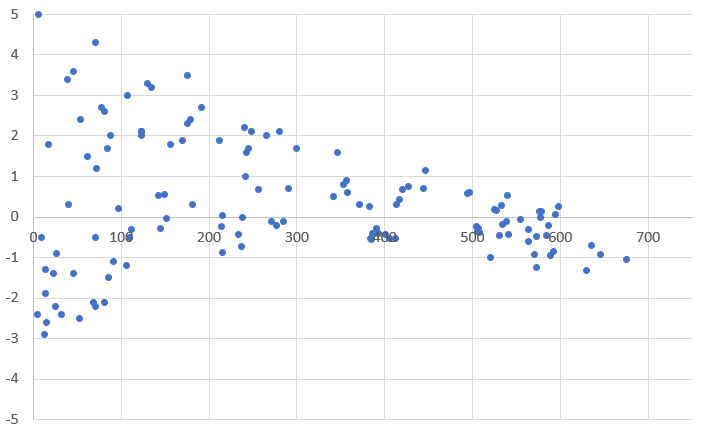
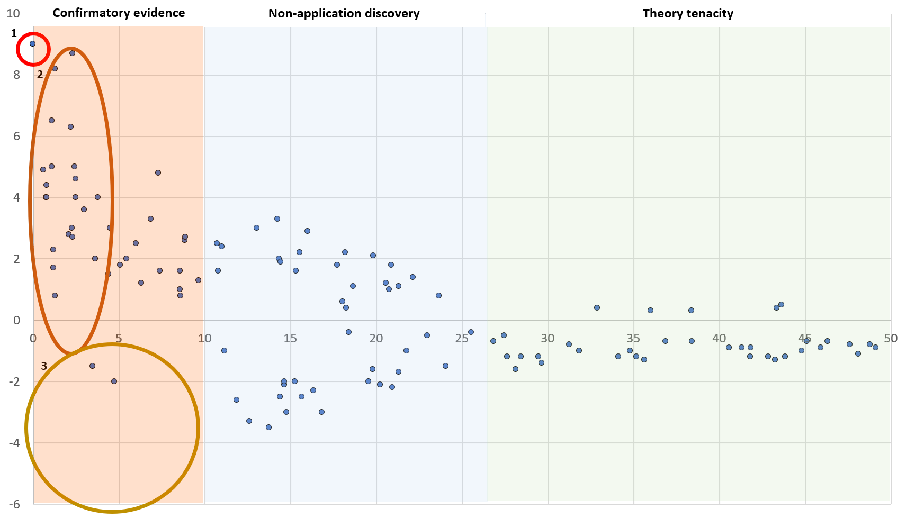

# Publication Bias {#pubbias}

The scientific method works by building on work and ideas generated by previous studies present in the published literature. You may be familiar with the term "[Standing on the shoulders of giants](https://howtowriteaphd.org/citations.html)" immortalised on the [Google Scholar](https://www.scholar.google.com) homepage. In this process, novel ideas attract a lot of attention and are then tested as working [hypotheses](https://howtowriteaphd.org/hypothesis.html#whathypothesis) by a number of other workers whose work will ultimately add up to a collective assessment of whether the initial idea was valid or not. This iterative process for moving from ideas to hypotheses to theories is in the foundation of science, and relies on the abilities of scientists in different areas to replicate previous work and test the same hypotheses under different conditions. In the biological sciences, conditions under which organisms live are so variable that exact replication of studies is difficult, but still necessary to build our understanding of the world around us.

**But what if those initial ideas are wrong?** Shouldn't we quickly find out when they are replicated in different laboratories? Ideally, this would be the case. But one of the issues that stands in the way of the scientific validation process is **publication bias**. The phenomenon of publication bias refers to all levels of the way in which studies are presented in the literature: 

 - the way in which prominent literature prompts scientists to test ideas
 - the interest of journals to publish new and positive results
    - the culture of highly impacting journals to accept high effect sizes from low sample sizes
    - the potential for negative results to go unsubmitted or rejected for publication, especially if the sample size is small
 - the influence of prominent scientists over their peers
 - the dissemination of science through self-promotion or prominence in traditional media
 - the positive feedback loop that results for researchers who have their ideas promoted
    - from their employers providing promotion
    - from funders supplying increased funding
    - to other scientists who are more likely to follow and cite them

Ultimately, the current reward system in science, particularly associated with publication bias leads to the natural selection of [bad science](#badscience), a phenomenon that has legacy effects across generations of scientists [@smaldino2016natural]. In recent decades, we have lived in a scientific culture that encourages publication bias with decreasing effect sizes inversely correlated with journal [Impact Factor](#impactfactor), and diminishing effect sizes that ripple through lower impact factor journals [@munafo2007association; @brembs2013deep; @smaldino2016natural], while negative results disappear almost entirely [@fanelli2012negative]. We know that given the statistical treatments involved in accepting or rejecting hypotheses that both [Type I and Type II errors](https://howtowriteaphd.org/TypeI.html) must occur. But our human preference for positive results [@trivers2011folly], leads us to poor publication and citation choices. This book advocates for a [change in this culture](#transparency2), but before we can change we need to be aware of the problems that the current system promotes, and why it is problematic.

One of the earliest studies to use a meta-analyses looked across many different studies in ecology and evolution and found a consistent effect of publication year, such that effect sizes decreased over time. Jennions and Møller [-@jennions2002publication] concluded that this was due to publication bias with journals less willing to publish insignificant results, especially for studies with small sample sizes. The power of meta-analyses to look at many different studies that cover a topic is now widely recognised such that most of the studies cited in this chapter are meta-analyses that review topics. For insights into how to use meta-analyses to check for publication bias in the biological sciences, see Jennions et al. [-@jennions201314] and Nagakawa and Santos [@nakagawa2012methodological]. It is important to remember that while meta-analyses may be able to show different kinds of publication bias, it does not mean that individual studies within these reviews are wrong, just that the influence of publication bias means they need to be treated with caution. 

The phenomenon of publication bias is often reported as a single entity, but it is now recognised that it is made up of four discrete parts ([Small study size](#small), [the decline effect](#decline), [confirmation bias](#confirmation) and [citation bias](#citebias)), each of which are covered below. Although these four types of publication bias are recognised, they often act in synergy and it can be hard to tease them apart in individual cases. All of these types of publication bias require published material, but there is also the [file drawer effect](#filedrawer) where critical publications, especially those showing negative results, are absent.


## Small Study {#small}
The small study effect suggests that non-significant studies with small sample sizes are under represented in the literature. This phenomenon can be represented graphically during a meta-analysis when the effect size and sample size of studies are plotted (Figure \@ref(fig:funnel)), they should represent a funnel shape [@sterne2004funnel].  

(ref:funnel) **A funnel plot showing the difference between expected changes in effect size for unbiased (A) and studies with small study size removed**. In this plot with randomly generated data, the y-axis represents effect size while the y-axis shows sample size. Each point represents a published study. In B, we see that studies small studies non-significant results are underrepresented in the published literature (red oval), while they are present in the expected null set of studies (A). 

```{r funnel, echo=FALSE, out.width = '95%',  fig.cap="(ref:funnel)"}
knitr::include_graphics('figures/Funnel.png')
```

Although the effect size declines in Figure \@ref(fig:funnel)A, it is not sloped. This simply shows the difference between an expected distribution of studies (Figure \@ref(fig:funnel)A), and when those with small sample sizes and non-significant results are not published (Figure \@ref(fig:funnel)B - _cf_ [file drawer effect](#filedrawer)).

The absence of publications of small studies with non-significant results is explained either (i) by the decisions of editors and reviewers, especially in journals with higher impact factors, not to accept studies that cannot replicate prior results without a boosted sample size, or (ii) the bias in what is expected by the researchers who decline to submit a small sample size for publication.

### Blue tit plumage colour 
Blue tits (_Cyanistes caeruleus_) are one of the most common songbirds in Europe. Their bright plumage has been studies extensively for evidence of its impact on sexual selection. Parker [-@parker2013what] conducted a meta-analyses on published studies to determine the potential for publication bias relating to plumage colour and sexual selection in blue tits. Parker [-@parker2013what] showed using funnel plots that there may be missing (unpublished) data for relationships between plumage colour and age and quality of blue tits. He also suggested that there was theory tenacity in the literature with researchers having likely committed [Type I errors](https://howtowriteaphd.org/TypeI.html) to obtain positive results, with _ad hoc_ explanations of why non-confirmatory results occurred.


## Decline effect {#decline}

Decline effect is characterised by the phenomenon of decreasing effect sizes over time. The effect size in any type of study might not be exactly replicable with an increase in effect size heterogeneity, but over time similar studies should not present trends in effect sizes. We would only expect the effect size to significantly increase or decrease if there was a genuine reason. Examples of real changes in effect size might include the effect size on use of antibiotics given increasing antibiotic resistance, or growth rates of plants given an increase in atmospheric CO~2~. Other reasons for real changes in effect size may include changes in methodological approaches and equipment.

Often, studies with large effect sizes are characterized by low sample sizes, are often first published as ground breaking studies in high impact factor journals. They then gather disproportionate numbers of citations and consequently are highly influential in their field. If these studies are repeated with larger sample sizes, we would still expect them to be significant (Figure \@ref(fig:funnel)), but we would not expect that trend in significance to be anything but flat. If it showed a decline (Figure \@ref(fig:funnel-ve)), then we would question whether there was any effect in any of the studies with smaller sample sizes.


(ref:funnel-ve) **A funnel plot showing that as sample size is increased effect size reduces and eventually becomes negative**. In this plot with randomly generated data, the y-axis represents effect size while the y-axis shows sample size. Each point represents a published study. 

```{r funnel-ve, echo=FALSE, out.width = '95%',  fig.cap="(ref:funnel-ve)"}

```

### The influence of parasites on their hosts' behaviour
One of the first studies to question whether an accepted paradigm was correct by studying the cumulative change of effect size over time looked at the changes in host behaviour that parasites cause [@poulin2000manipulation]. Poulin [-@poulin2000manipulation] examined publications to determine whether the year in which they were published correlated negatively with the estimated relative influence of the parasite on the hosts' behaviour. If no publication bias existed, then the year of publication should show no relationship with the effect size of the study. However, Poulin [-@poulin2000manipulation] found a very strong negative relationship suggesting that there was a real decline effect in the effect size of studies over time.

### House sparrow black bib size and dominance
The size of the small black patch on the throat of a house sparrow (_Passer domesticus_) has been suggested to signal conspecific dominance status. The hypothesis has been studied so much, that it became prominent as the text book example of patch ornamentation as a signal of status. Sánchez-Tójar and colleagues [-@sanchez-tojar2018metaanalysis] conducted a meta-analysis on studies that had investigated this phenomenon. They found that the overall effect size was not significant, and therefore questioned the validity of this text book example. 

### The impacts of oceanic acidification on fish behaviour
Climate change is associated with an increase in the quantity of CO~2~ in the atmosphere, which in turn has increased the acidity of sea surface waters. Research into the impacts of pH on sea creatures became one of the fastest growing topics in marine biology in the 2000s. During this time, papers were published in high impact journals showing that low pH impacted fish behaviour [e.g., @munday2009ocean]. As is typical with the first movement of hypotheses, the first set of observations were published with small effect sizes in high impact journals (see [below](#theorymaturation)). More and more studies were conducted following these ideas, but were unable to find such large effect sizes. Clements et al. [-@clements2022metaanalysis] published a meta-analysis on fish behaviour and ocean acidification showing that effect sizes decreased over time, often becoming indistinguishable from null findings. They questioned whether the initial studies had any value. Munday [-@munday2022reanalysis], the author of some of the initial findings, responded that the reanalysis was flawed. Note that this is not the only controversy associated with his research [see Part IV](#PruittData). It is also noteworthy that Clements et al. [-@clements2022metaanalysis] do not dismiss the possibility that there is an effect of oceanic acidification on fish behaviour, simply that it is not the large effect first shown in the initial research published, but that it might instead be negligible. They were also able to dismiss several of the potential variables associated with this behaviour: cold-water species, non-olfactory associated behaviours and non-larval life stages. 


### Sexual selection on male body size in _Gambusia_ species

The impact of male body size on male-male competition and female choice in fish in the genus _Gambusia_ has been studied extensively. Large males are thought to have an advantage in both sets of interactions, but researchers also found that small males are better sneaky mating which appears to occur at higher frequency. Taken together, these results suggest that there should not be selection for larger males in the genus _Gambusia_, despite the many reports to the contrary. Kim et al. [@kim2021male] conducted a meta-analysis on male body size across species in the genus _Gambusia_ to test for selection on male body-size. These authors found some evidence for a diminishing effect of effect size with study sample size (see Figure \@ref(fig:funnel-ve)).


## Confirmation Bias {#confirmation}

The failure to replicate previous findings are often thought to be uninteresting and may therefore not be selected for publication. This effect could be exasperated by disingenuous reviewers or editors who have a vested interest in seeing their own results confirmed, a type of [Conflict of Interest](#conflicts).

### Theory maturation {#theorymaturation}
A particular aspect of confirmation bias is concept of theory maturation (Figure  \@ref(fig:TheoryMaturation)). 
Awareness of the importance of theory tenacity, confirmation bias and data quality are important for biologists when considering which paper to cite [@barto2012dissemination]. Well cited papers that proposed new theories that were later disproved can continue to gather [**zombie citations**](#citebias). Theory maturation is considered to occur in three parts [@leimu2005what]:

(ref:TheoryMaturation) **A funnel plot demonstrating the three phases of theory maturation: confirmatory evidence, non-application discovery, and theory tenacity**. In this plot, created with fictional data, the y-axis represents effect size while the x-axis shows time (in years) since an idea is first published (1). Each point represents a published study. In the first phase (**confirmatory evidence**), following the initial publication (1) we see a plethora of studies with [large effect sizes](#small) (2) published in high impact journals that have no [negative findings](#confirmation) (3). In the second phase (**non-application discovery**), we see the first negative findings, but again studies with small effect sizes are missing, and there are still positive studies so that the theory has a great deal of debate. At the beginning of the third phase (**theory tenacity**), an important meta-analysis is published showing no significant overall effect. Publications thereafter attempt to replicate earlier results but fail to show any merit in the thory.

```{r TheoryMaturation, echo=FALSE, out.width = '95%',  fig.cap="(ref:TheoryMaturation)"}

```


**Confirmatory evidence**: first studies are published (usually in high Impact Factor journals) with small effect sizes but are highly influential. These studies could represent genuine examples of false-positive studies ([Type I error](https://howtowriteaphd.org/TypeI.html#type-i-and-type-ii-errors). Next, confirmatory studies are published that confirm these new and trendy ideas, but studies that do not confirm them are either [shelved](#filedrawer) or rejected [@fanelli2010positive; @loehle1987hypothesis].

**Non-application discovery**: Situations under which the theory does not hold are discovered (e.g. [declining effect sizes](#decline))

**Theory tenacity**: the theory can live on despite the failure of subsequent studies to show significant effects [@fanelli2012negative].
 

 
This chapter has many examples of theory tenacity. Many of these have been written into textbooks are are likely still being taught in many classes. Whether or not these ideas are eventually debunked will rely, in part, on the diligence of teachers and textbook writers to update and re-write their texts over time.

Confirmation bias can occur along multiple places of the research cycle. For example, new and upcoming ideas are more likely to meet with the approval of funders and get funding. Similarly, the second or third manuscript supporting a newly published idea is more likely to be accepted by some (especially high impact) journals than the 30th or 31st. Because the research cycle time is rather long (write funding proposal, hire staff, conduct project, analyse, write-up and submit), studies that are able to shortcut part of the cycle (e.g. researchers with money from wealthy institutions) are likely to get ahead of this publishing curve on the **confirmatory evidience** part of the theory maturation scale, and have their studies published in highly impacting journals, albeit with reduced sample sizes comensurate with a quickly produced study.

### The attractiveness of facial symmetry

An example of this kind of confirmation bias driven publishing effect toward [bad science](#badscience) can be found in the literature of fluctuating asymmetry, and in particular those studies on human faces [@dongen2011associations]. Back in the 1990s, there was a flurry of high profile articles purporting preference for symmetry (and against asymmetry) in human faces. The studies were (relatively) cheap and fast to conduct as the researchers had access to hundreds of students right on their doorsteps. The studies not only hit the top journals, but were very popular in the mainstream media as scientists were apparently able to predict which faces were the most attractive. 

Stefan van Dongen [-@dongen2011associations] hypothesised that if publication bias was leading to bad science in studies of fluctuating asymmetry in human faces, there would be a negative association between effect size and sample size. However, effect sizes can also be expected to be smaller in larger studies as these may come with less accurate measurements (Figure \@ref(fig:funnel); see also @jennions2002publication). This negative association should not change depending on the stated focus of the study; i.e. if the result was the primary or secondary outcome. However, van Dongen [-@dongen2011associations] found that in studies where the relationship between fluctuating asymmetry and attractiveness was a secondary outcome (not the primary focus of the study), the overall effect size did not differ from zero and no association between effect size and sample size was found. This was in contrast to the studies where the fluctuating asymmetry-attractiveness was a primary focus, suggesting that there was important publication bias in this area of research.

## Citation Bias {#citebias}

Deciding what to cite comes with a plethora of decisions. Certainly, citing correctly is very important and not [mis-cite](https://howtowriteaphd.org/citations.html#is-it-possible-to-mis-cite) [@measey2021how]. But in making your decision about what to cite you are probably influenced by a lot of different factors. By now, you are probably already aware of citation bias and how this can inflate the importance of certain publications beyond their actual worth. If not, then start by considering journal [Impact Factor](#impactfactor) and consider what this actually means in terms of whether published papers have equal chances of being cited (sometimes referred to as **Prestige Bias**). Next consider the [Matthew Effect](#matthew), that well cited publications are likely to gather more citations. Next, think about the impacts of influential researchers in your field. Barto and Rillig [-@barto2012dissemination] considered the different kinds of **Dissemination Bias** in citations of ecological studies. They found that the papers published first that had the strongest effect sizes and those published in high Impact Factor journals produced the most extreme effects - even though there was no correlation with quality of data.


Lastly, consider your own behaviour in promoting your own research to have it cited. Something as innocent as [Tweeting](https://twitter.com/AfriHerp) your paper out to an academic audience has been shown to increase citations [@luc2021does], causing a citation bias (sometimes referred to as the **Showcase Effect**) towards academics who are active on social media. Indeed, I promote the dissemination of your work by writing a [press release](#pressrelease), a [popular article](#populararticle) and improving your [altmetrics](#altmetrics). Each of these will likely improve the citation of your publication, in the same way that those who don't do this will have less citations. 

Sloppy citing is a phenomenon that you will doubtless become familiar with during the course of your career. Many citations are simply meeting the need to have a citation, instead of providing the evidence for the statement given. The literature is so vast ([and doubleing every 12 years](#publishmore)) such that it is hard to spot citation errors. Smith and Cumberledge [-@smith2020quotation] studied 250 citations in high impact science journals (_Science_, _Science Advances_, _PNAS_, _Nature Communications_ and _Nature_) to verify whether the propositions cited could be substantiated by the contents of the cited material. Even though the number of citations was low in this study, I can attest that it does represent a significant amount of work as I did a similar exercise to test the veracity of citations given by ChatGPT and Google's Bard (see [here](https://howtowriteaphd.org/AI.html)). Their study found a citation error rate of 12.1%, and included 8.5% "unsubstantiated" and 3.6% "partially substantiated" (propositions with a minor error such as the quoted amount being inaccurate). They also included another 12.9% of citations as "impossible to substantiate" (either due to the lack of a proposition to substantiate, or that it was logically impossible to substantiate with a citation). This last, and largest, category contains citations that were not linked to propositions in the texts examined. For example, they may have been citing methodologies or further discussions. In my view, these are not mis-citations but a reality that a lot of papers cannot include unlimited text, and so need to refer readers on to other materials. My own view disagrees with Smith and Cumberledge [-@smith2020quotation] when they assert that "there is no good reason to allow this type of inexact and non-verifiable referencing to pervade scientific literature". I feel that there is no good reason to have our literature massively verbose when readers can simply 'click-on' to read the cited information. Clearly, this is an issue that there will be differences of opinion on.

I consider that many of the above citation errors and citation bias in general is caused by what I call the **zombie citation effect** where papers that have accumulated many citations over time are not actually referred to, but instead cited in a similar vein. This changes subtly over time such that they no longer (and never did) hold the information that many scientists think that they did [see @smith2020quotation]. But the citations keep coming, because so many authors are not willing to check their sources thoroughly. Bucci [-@bucci2019zombie] made a similar point about retracted **zombie papers** that continue to draw citations. Presumably, this is a similar reason why AI bots also provide erroneous citations, because they are using existing citations as a basis for their own choices [@measey2021how]. I think of these citations as zombies as they will continue to receive incorrect citations over time, and this will not die because diligent scientists who do not cite them will not prevent the [Matthew Effect](#winnertakesall).


### The file drawer effect {#filedrawer}
Meta-analysis is only able to synthesise information from published data, and there will be an unknown and potentially unknowable amount of unpublished data that would be needed to provide a truly balanced view, the so-called **file drawer effect**: when studies that do not meet the expected results, or are initially rejected from journals with or without review, are placed into a filing drawer instead of being published [@csada1996file; @fanelli2010pressures; @wood2020negative]. Most biologists have examples of such studies, and a lot of student theses will fall into this category.

There is no easy solution to the file drawer effect as studies that fail to make the grade of peer review will likely be placed in a filing drawer and forgotten about. The current culture of many journals is also daunting to many researchers who get negative results - [HARKing](https://howtowriteaphd.org/nohypothesis.html#avoid-harking) into a higher impact journal is more tempting. [Preprints](#preprints2) could form a valid place to provide an outlet for such manuscripts, as long as the data accompanies them. 


## Natural selection of bad science {#badscience}
In 2016, Smaldino and McElreath proposed that ever increasing numbers of publications not only leads to bad science, but that we should expect to see this in an academic environment where publishing is considered as a currency [@smaldino2016natural]. They argued that the most productive laboratories will be rewarded with more grant funding, larger numbers of students, and that these students will learn about the methods and benefits of prolific publications in high impact journals. When these ‘offspring’ of the prolific lab look for jobs, they are more likely to be successful as they have more publications themselves. An academic environment that rewards increasing numbers of publications eventually selects towards methodologies that produce the greatest number of publishable results. To show that this leads to a culture of ‘bad science’, Smaldino and McElreath [-@smaldino2016natural] conducted an analysis in trends over time of statistical power in behavioural science publications. Over time, better science should be shown by researchers increasing their statistical power as this will provide studies with lower error rates. However, increasing the statistical power of experiments takes more time and resources, resulting in fewer publications. Their results, from review papers in social and behavioural sciences, suggested that between 1960 and 2011 there had been no trend toward increasing statistical power. Biological systems, whether they be academics in a department or grass growing in experimental pots, will respond to the rewards generated in that system. When grant funding bodies and academic institutions reward publishing as a behaviour, it is inevitable that the behaviour of researchers inside that system will respond by increasing their publication output. Moreover, if those institutions maintain increasing numbers of researchers in temporary positions, those individuals are further incentivised to become more productive to justify their continued contracts, or the possibility of obtaining a (more permanent) position elsewhere. Eventually, this negative feedback, or gamification of publishing metrics, produces a dystopian and dysfunctional academic reality [@chapman2019games; @helmer2020what].

The story of how confirmation bias can adversely influence high flying researchers, leading to retractions and even the loss of their careers, is the subject of another chapter (see [Part IV](#pruittdata)).      

