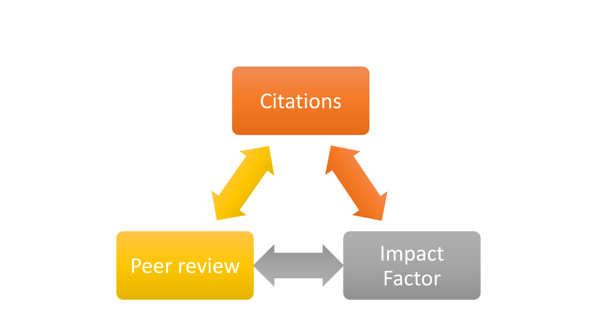
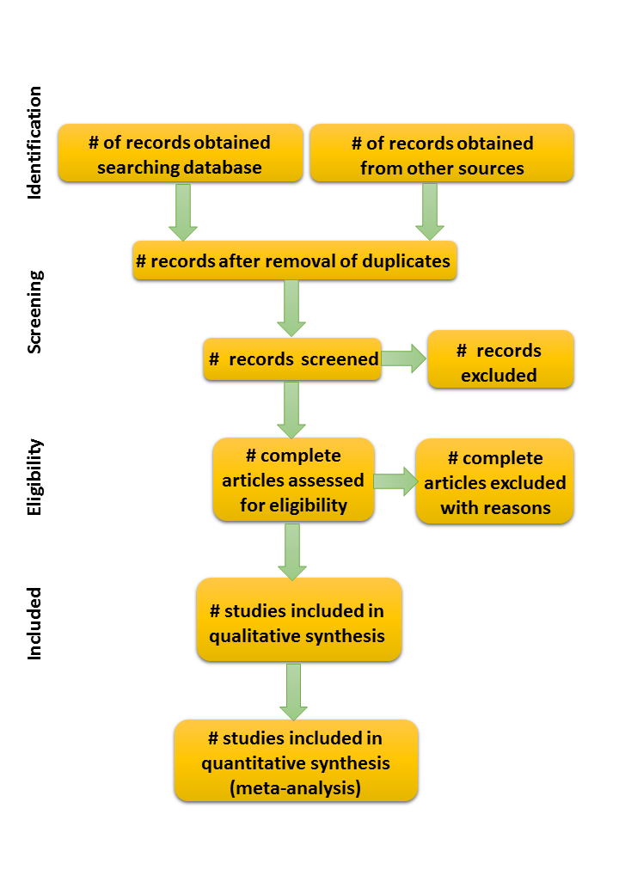
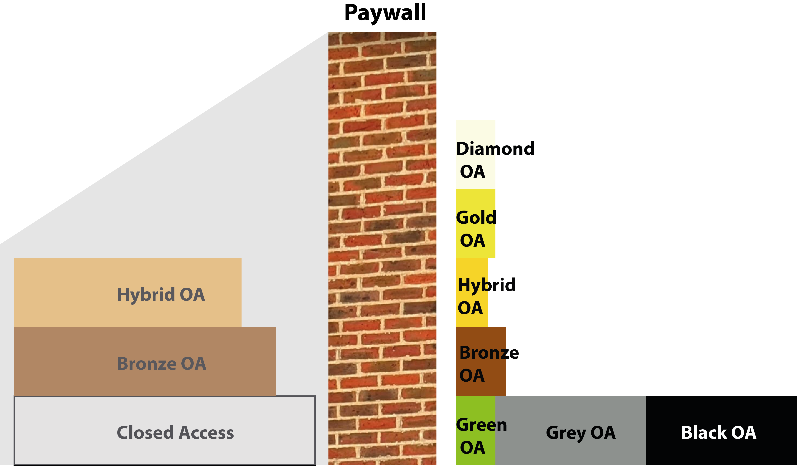

--- 
title: "How to publish in Biological Sciences: a guide for the uninitiated"
author: "John Measey"
date: "`r Sys.Date()`"
documentclass: krantz
bibliography: [book.bib, packages.bib]
biblio-style: apalike
link-citations: yes
colorlinks: yes
lot: yes
lof: yes
site: bookdown::bookdown_site
output: bookdown::gitbook
description: "Publishing has become vital for all academics, such that it is widely recognised that we inhabit a 'publish or perish' academic landscape. For some the process appears effortless, while for others publishing represents a black box leaving them outside in a highly stressful environment . This book is meant to be a guide to those uninitiated members of the academic community, postgraduate students and early career researchers, to bring them up to speed with all the background information on publishing."
github-repo: yihui/bookdown-crc
graphics: yes
cover-image: images/Cover.png
favicon: images/favicon.png
---

```{r setup, include=FALSE}
options(
  htmltools.dir.version = FALSE, formatR.indent = 2, width = 55, digits = 4
)

# install the packages needed by this book; you fill out c(), e.g. c('ggplot2', 'dplyr')
lapply(c('xfun'), function(pkg) {
  if (system.file(package = pkg) == '') install.packages(pkg)
})
```

**Cover** represented the demolition and scattering of peoples so to impair their communication. To me, it is a similar story to the attempts of modern day publishers to turn the scientific project into a business that profits only them. The collapse is coming, but can we save the scientific project?
Cover illustration: The Tower of Babel was adapted by the author from an original work by Pieter Bruegel the Elder (1563) painted to represent the demolition and scattering of peoples so as to impair their communication. In my version, a group of Early Career Researchers can be seen (bottom left) deciding how to rebuild the crumbling edifice that represents scientific publishing (centre), with a ruined entrance guarded by gatekeepers (centre right). The skies above reflect the choice open to them; to stay in a closed system or to choose a future of open science. 


# Welcome {-}


```{r fig.align='right', echo=FALSE, include=identical(knitr:::pandoc_to(), 'html'), fig.link='http://john.measey.com/'}
knitr::include_graphics('figures/Cover.png', dpi = NA)
```

Welcome to my guide on how to publish in the biological sciences. This guide is pitched at the early career researcher. It is not going to tell you what to write, but to open and examine the black box of scientific publishing, and more broadly explore how this impacts the academic context. My intention is to demystify publication in the biological sciences, so that readers become aware of what is happening once they have submitted a manuscript, and how to better interpret the decisions made by colleagues who are reviewing and editing your work.

Publishing has become vital for all academics, such that it is widely recognised that we inhabit a 'publish or perish' academic landscape. For some the process appears effortless, while for others publishing represents a black box leaving them outside in a highly stressful environment . This book is meant to be a guide to those uninitiated members of the academic community, postgraduate students and early career researchers, to bring them up to speed with all the necessary background information on publishing, providing links and references for reading and learning more.


## Why read this book {-}

Publishing a paper in an academic journal should simply consist of submitting a publication worthy manuscript. But having a working knowledge of publishing will enable you to make better decisions about what, where and how to submit manuscripts. This all comes with experience, and in this book, I try to explore the areas of assumed knowledge, and furnish them with explanations pitched at the Early Career Researcher, along with links and citations where you can read more. I explain the many choices that exist for those wishing to submit a manuscript for publication in the Biological Sciences. I explore the world of publication bias, and how this is evidenced by reviewers and editors. Impact Factors, citations and how the desire to track the performance of academics has led to unethical practices and exploitation of science and scientists. This guide provides an "everything you wanted to know about publishing but were afraid to ask" approach for anyone who still feels that submitting a manuscript is like posting it into a black box. This book is written to get you onto an even footing.

## What's not in this book {-}

Depending on just how early you are in your career, there is a lot missing from this book but that has been provided in another book [**How to write a PhD in Biological Sciences**](www.howtowriteaphd.org). That book concentrates on getting PhD students started writing data chapters, while this book concentrates on publishing manuscripts. Hence, if you want extra information about writing in the biological sciences, I would point you to the other book. If you are happy with what you have written, but want help to demystify the publishing process, then this is the right book for you.

There is common ground in both books, and I will point to important chapters relevant to publishing in the other book that are not reproduced here:
[Plagiarism](http://www.howtowriteaphd.org/plagiarise.html), [Being aware that you can get it wrong](http://www.howtowriteaphd.org/TypeI.html), [Transparency](http://www.howtowriteaphd.org/transparency.html), and many more.

## Structure of the book {-}

This book is written in four parts:

[**Part 1 - Getting your manuscript ready for submission**](#part1)
Although you may have already done your research, and written your manuscript, getting it ready for publication will require a new set of hurdles for you to jump over. In this section, I discuss what you need to know before entering into the publication arena. What are scientific journals for, and who are the gatekeepers? How does peer review work? The publishing world is at a turning point, and before you start publishing you should be aware of the current reality in Biological Sciences around the currency of citations and how these relate to other metrics such as the Impact Factor and career advancement. You also need to know potential directions for publishing, including the need for transparency in your work, whether or not you should deposit your manuscript as a preprint, and who you should invite to be an author. Tactical chapters for Early Career Researchers provide information on how to actively build and maintain a network to facilitate and support your work.

[**Part 2 - Submission, reviews and reviewing, revising and resubmitting**](#part2)
Sending a paper to a journal is like posting it into a black box where, after some time, you might simply get a rejection and have no idea what has happened. In this section, I take you through the mechanisms of submitting a manuscript from choosing the right journal for your submission, writing a letter to the editor, suggesting reviewers, entering metadata about your manuscript into the editorial management software, all the way to pressing the submit button. I explain how the editorial submission system works, and what you can expect from editors and peer reviewers. I take a practical approach to writing a rebuttal and explain how and why you should expect to revise your manuscript for the editor. The eventual goal of this section is to demystify the entire process between submission and acceptance, and to understand the process from the viewpoint of an author, editor and reviewer. 

[**Part 3 - Once your paper is published**](#part3)
Once your article is accepted, you can celebrate together with your co-authors! You will need to submit the final version of your manuscript, have this type-set and then approve the proofs before a Version of Record appears. At this point, you can start to share your paper, but there are still some key steps that you can take to improve the dissemination of the research both to the academic community, to your funders, and the public at large. Who is it best to share your research with, and what would be the best form to share it in? In this section, there are chapters that explain how to write a press release and a popular article on your paper, and how you can improve and monitor its circulation both in academia and in the general media and social-media, focussing on those stakeholders who might use your findings.

[**Part 4 - Further challenges in academia**](#part4)
The last part of this book discusses the wider challenges posed by current publication models in academia. This section deals with the growing problems driven by a 'publish or perish' culture, and what this means for Early Career Researchers. Special focus is given to the paywall erected by many publishers, Open Access publishing and predatory publishers. I also explain the problems in the current system of biases in peer review, and the confirmation bias in scientific publishing. Instead of just presenting you with problems, this section provides insight into ideas that the academic community has produced in order to get over the current problems. Other important hurdles that you might meet, such as retractions, fraud and bullying, receive in depth focus.


## Why 'A guide for the uninitiated'? {-}
Early Career Researchers are within eight years of getting their PhD or within six years of their first academic job. At this time, you will have already experienced the academic life, including publishing, but there will be far more to it than you are aware of. This book considers Early Career Researchers as colleagues who simply lack the experience of a system that has changed in many ways over the last 20 years. To those of you who know the current publishing scene in biological sciences, it offers the perspective of where things have come from. I have written this book as I feel that I would have been able to achieve more had I understood more about the publishing process early on in my own career. If I had only had a guide to tell me what it was all about, I could have saved myself so much stress, time and energy. In short, I feel that I was uninitiated, and this is the guide I wish that I had had. So, this guide is my practical attempt to help you; to get you up to speed in the world of academic publishing, specifically in the biological sciences. After reading this book, I hope that you will avoid the nightmare world of publishing of constant effort ending in dead end rejections that so many academics describe.


## Acknowledgments {-}

There are a great many people that I need to thank. First and foremost are my students, past and present, who have inspired me to put together first the blog posts and then the book. It is because you wanted more that I put this together. I have also been a student, and have been inspired by colleagues around the world who have been exemplary advisors. This book contains lots of links to blogs and articles written and posted freely on the internet by others who also aim to demystify and help. I thank this greater academic community (especially #academicTwitter) for sharing and inspiring. Thanks go to the many reviewers and editors who have taken their time to improve my writing. I am still learning. Lots of the text in this book has been improved by feedback from my students and postdocs. A special mention must go to my brother, Richard, who has hosted my lab website for more than a decade, and especially for saving blog posts from hacking attacks. Thanks also to my wife, Thalassa, who proofread many of the blog posts after I had published them late at night, so that I could correct them over breakfast in the morning. James Baxter-Gilbert, Jack Dougherty, Anthony Herrel, Allan Ellis, Rachael Lammey (CrossRef), Andrea Melotto, Lisa and Mark O’Connell, Ivan Oransky (Retraction Watch), Claire Riss (Center for Open Science), Johan Rooryck (cOAltition S), James Vonesh, Carla Wagener all read or commented on different aspects of the book. Thanks are also due to my colleagues at the Centre for Invasion Biology, the Department of Botany and Zoology, and Stellenbosch University. A special thanks to the librarians who have supported many of my more extreme rantings about publishers.

```{block2, type='flushright', html.tag='p'}
John Measey  
Cape Town
```

<!--chapter:end:index.Rmd-->

---
output:
  html_document: default
  pdf_document: default
  word_document: default
---
# About the Author {- #author}

John Measey is Associate Professor of Biological Sciences at Stellenbosch University. He has authored or co-authored more than 200 peer reviewed scientific papers and book chapters, and five books. He has been the Editor-in-Chief of an ISI journal for 9 years, and currently serves as Associate Editor for 4 other journals. He has graduated more than 20 postgraduate students, and his blog on writing and publishing in biological sciences is read by thousands globally. British born and educated, he lives and works in the beautiful Western Cape, South Africa.

```{r fig.align='right', out.width = '15%', echo=FALSE, include=identical(knitr:::pandoc_to(), 'html'), fig.link='http://john.measey.com/About-Me'}
knitr::include_graphics('figures/john.jpg', dpi = NA)
```


## Do you have something to contribute? {- #contribute}

This book is written in bookdown [@xie2016bookdown] specifically to make it a 'live project' that will be open to anyone who wants to contribute, improve, or use as the basis for your own book. The easiest way for readers to contribute content directly is through a [GitHub pull requests](https://help.github.com/articles/about-pull-requests/). At the repository for this book, you will find Rmd files for each chapter, and as a GitHub user, you can simply edit the Rmd file and submit the changes. If I am happy with the changes proposed, I will merge your content with that of the book and add your name to the [Acknowledgements](#acknowledge). 

One of the amazing potentials for [bookdown books](https://bookdown.org/) is that all the files for this book are hosted in a repository on [Github](https://github.com/johnmeasey/How-to-write-a-PhD-in-Biological-Sciences/tree/main). You have the opportunity to fork this repository and write your own version for a different discipline, a different language or for a different region of the world. It is also my hope that this guide can grow to become a community of practice for those conducting PhDs in Biological Sciences. It will not be possible to cover every aspect of writing a PhD in Biological Sciences, but it may be that I have missed out ones that are very important to you. Equally, parts of what is currently written will become obsolete as new initiatives begin, and old problems are resolved. For this reason, this guide needs to be a 'living document', and anyone who wants to provide feedback or contribute new sections is more than welcome. Please feel free to open an issue, or make a Pull Request if you spot a typo. 

## If you haven't already, read the other book {- #otherbook}

**[How to write a PhD in Biological Sciences: a guide for the uninitiated](http://www.howtowriteaphd.org/)** by John Measey 

```{r fig.align='left', out.width = '45%', echo=FALSE, include=identical(knitr:::pandoc_to(), 'html'), fig.link='http://www.howtowriteaphd.org'}
knitr::include_graphics('figures/cover.jpg', dpi = NA)
```

Embarking on a PhD is intimidating as, for most students, it will be their first experience working within the academic system. The voyage of discovery is often made very frustrating as much of what goes on in academia is assumed knowledge. Academics accumulate knowledge throughout their careers, but what can be done for those who are uninitiated? What is needed is a guide that postgraduate students can refer to before, during and while making decisions about their time within academia. Note that this is not a rulebook. There are times when the guide will be accurate and others when it will be vague, but providing some insight to point you in directions where you can explore more. The intention then is to provide you with a starting point from which you can establish your confidence in the academic writing process, and build your own creativity.

## Creative Commons License {-}
"**How to publish in Biological Sciences: A guide for the uninitiated**" is copyright to John Measey and distributed under a Creative Commons BY-NC-ND 4.0 International License. You may freely share this content for non-commercial purposes, with a source credit to www.john.measey.com

## Disclaimer {-}

Although I have tried to make the information is this book as accurate as possible, it is provided without any warranty. The author and publisher have neither liability nor responsibility to any person or entity related to any loss or damages arising from the information contained in this book.

```{r iris}
knitr::kable(
  head(iris), caption = 'We must have the iris data and some R code, otherwise it would not seem right',
  booktabs = TRUE
)
```

<!--chapter:end:00-author.Rmd-->

\mainmatter

# (PART) Part 1: Getting ready for submission {-}

# Submitting your work to a journal {- #part1}

Part 1 of this book is about the publication arena. I provide simple explanations of what scientific journals are for, and who the gatekeepers are. The publishing world is at a turning point, and before you start publishing you should be aware of the current trends and what is possible.

<!--chapter:end:1.00-Part1.Rmd-->

# The transition from closed to open {#closedtoopen}
 
There are a lot of problems in publishing in the biological sciences, but it doesn't have to be this way. The aim for this book is firstly to help you navigate the current 'closed' system (while acknowledging that parts are already open), and act as a catalyst toward a more open, transparent and equal system for the future not only of publishing science, but permeating throughout the culture of the scientific project. We have all the tools to make this transition now, and I think that this change will likely come within the time frame of the careers of you as an Early Career Researcher. But as you will see, this change needs to be driven.

While I'm going to pitch the transition from closed to open publishing as a simple process, and as a move from darkness into light, I acknowledge that there is much more to this. I hope that a lot of these complexities will come out in the book, but acknowledge that a lot will be left unsaid. A large unanswered question is what happens to all the downstream impacts of losing a lucrative academic publishing business that employs tens of thousands of people. I like to think that many of these skilled people, who themselves are not recipients of the large fees acquired by the publishers, would be absorbed into the repurposed institutional libraries. No doubt, there will be casualties. But my belief is that the importance of the [scientific project](http://howtowriteaphd.com/lifescientific.html), and the extreme problems we currently face in academic publishing, far outweigh the problems that we will see during the transition.
 
## Three fundamentals of publishing in Biological Sciences 

There are three fundamental concepts that lie at the heart of understanding of current publishing models in the Biological Sciences (Figure \@ref(fig:publishing-triangle)). In themselves, none of them should be particularly influential as they don't relate to your study, how well the study was done, or what your results were. Nevertheless, these three aspects of publishing are key in your understanding of the nuances of publishing, and your understanding will likely make the difference between publishing your work being an obstacle that is occasionally insurmountable, and finding your way with a lot more ease through the process. 

### Gatekeepers {#gatekeepers}

The journal editor is the kingpin, and sits at the centre of this triangle, and has the power, backed by their gatekeeping advisory board and associate editors, to continue the current model, or oversee the change. [Editors make decisions](#editors), not simply whether to accept or reject your manuscript, but also to implement policies that take their journals in one direction or another. In some models, they are given this power (usually democratically) by the [scholarly society](#society) that they represent, and oversight is granted by an editorial board who mediate in any dispute, but also in theory have influence over the editorial policy. Editors appoint associates that handle many of the manuscripts that are submitted, shuffling them between reviewers and authors until they feel that they are worthy of publication (or not). These associate editors are also responsible for implementing the policies of the editor, the editorial board, and the scholarly society. In models where there is only a (for-profit) publisher, the publisher appoints the editor and together they appoint the editorial board. In both models, the editorial board, editors and associate editors are thought of as being the gatekeepers to the scholarly integrity that permeates scientific publishing. There is more information on the advisory and editorial boards in [Part I](#boards).

(ref:publishing-triangle) **A simple schematic for the three fundamentals of publishing in the current Biological Sciences model**. Citations, peer review and impact factors each have direct impact on each other and your understanding of each one and how they relate to the other will be pivotal in clarifying your understanding of how to publish your work. At the heart of the process are the gatekeepers: Editorial board, associate editors and the editor.

```{r publishing-triangle, echo=FALSE, out.width = '85%', fig.cap="(ref:publishing-triangle)"}
 
```

Gatekeeping takes a lot of time and effort, and there are plenty of places where the current system lacks the transparency that is needed. In theory, there's nothing wrong with this model, were it not for the dark forces of for-profit publishers that have used the system for their own gain. Instead of the gatekeepers focussing on science, they have become distracted by metrics and hype promoted by publishers. Each of the three facets that surround the gatekeepers in the current publishing model (Figure \@ref(fig:publishing-triangle)) need to be changed to open up the system for a more equitable future, and eliminate the current biases that favour the select few. 

### How easy is it to purge the publishers

Editors don't have a complete free reign over what to do with their journal. They may be constrained by the publishers, if their journal is run on a for-profit model, or by a contract with a publisher, for most society journals. Journals which are independent of societies and publishers are very rare, but do exist. However they work, editors sit as king-pins of the system. There are examples of editors who have taken all of their associate editors and authors and moved their entire platform to a not-for-profit system. This has also meant changing the name of the journal, as the publisher often owns this. The first example, that I'm aware of, happened in 2015 in the social sciences where the editor of _Lingua_ walked away from publishers Elsevier [see @bakovic2017language]. As Elsevier owned the name, the editor, Johan Rooryck, started a new Open Access journal [_Glossa_](https://www.glossa-journal.org/). There was a fight (see [Rooryck's website](https://www.rooryck.org/interaction-with-elsevier)), but Rooryck showed that it could be done, and has therefore paved the way for others. Not only did Rooryck show proof of concept, but he formed the [Fair Open Access Alliance](https://www.fairopenaccess.org/), who have managed to pull 6 titles away from Elsevier since _Lingua_ flipped. It is important to add here that when the gatekeepers leave, the publisher simply approaches new people to take over, and the old journals remain alongside the new. It appears that there is no shortage of academics who are prepared to step into the shoes of editors who part company with the publishers. See what draws editors in [here](#boards).

All editors are answerable to their advisory board, and to the scholarly society from which they were (usually) voted into office. The society (often through the editor) signs a deal with the publisher, and this usually runs for a period of 5 years (see [Part 4](#money)). Society journals usually own their own content and title, and so can decide to leave the publisher whenever their contract expires. It just takes will power, and being prepared to say goodbye to that [income stream](#money). 

**So why do the gatekeepers stay with the publishers?**
It's mostly smoke and mirrors. Editors and gatekeepers in general are busy people. Their gatekeeping roles are not their primary jobs (for the most part), and if they are then the publishers are paying their wages. What they are most interested in is a smooth system that works with minimum effort on their part. This is what the publishers have established so well, and the principle way in which they will try to persuade gatekeepers to stay with them. Next is the [money](#money), which flows from the publishers into the accounts of the societies, with occasional small amounts to editors (and in rare cases associate editors) as expenses. Such perks used to be more substantial, like trips to conferences, hotel stays and wining and dining. But I understand that this is largely gone now. Last is the inertia on the part of gatekeepers to change, as they don't experience the pain of the authors or the libraries that pour money into the publishers. This is a reason why bringing societies into closer contact with institutions is an important step in the process.


## Peer review
Few would argue that peer review is at the heart of publishing in science today. Consequently, there are several chapters in this book concerned with the subject: [What is peer review](#peerreview); [what to expect from your peer reviewers](#peerreview2); [how to respond to peer review with a rebuttal](#rebuttal); [and how to conduct peer review](#howpeerreview). The last chapter covers [problems with peer review](#problempeerreview) and this digs into some of the real biases that occur during peer review, and with the reviewers themselves. Peer review isn't a perfect system, but in order to get the most from it we need to understand the weaknesses, both as authors and as reviewers. Only through this understanding can we reinvent the publishing system. We should not expect to do away with peer review (although this has been suggested many times in the past, and no doubt will be suggested again in the future), but by understanding the the biases that exist we will be able to make sensible choices despite the limitation.

Changes in the peer review system can make the difference between a highly biased system where editors manipulate the content for their own purposes ([networks](#networks)), or a system that is fair and equitable to all. 

## Impact factor
[Impact factor](#impactfactor) is a simple metric, and as such there is no need for it to be anything more. But the publishers have managed to use impact factor to their advantage such that it has become of overriding importance for many publishing in the biological sciences today. But it doesn't have to be this way. To make the most of the system, you will need a thorough understanding of the way in which impact factor can [control other aspects of publishing](#money), and how the behaviour of the [editor can have a profound effect on the impact factor](#increaseIF). The higher Impact Factor results in more submissions, and this in turn will mean that the editor will have more power over the content of their journal.

## Citations {#cite}
Sitting above peer review and Impact Factor in Figure \@ref(fig:publishing-triangle) are [citations](#citations). Compared to the other two parts of this problematic system, citations seem to be blameless and without the potential biases of the others. However, citations are the units of control for Impact Factor and can be manipulated by both editors and peer reviewers. [Metrics](#citations) driven by citations are also at the heart of many of the problems in todays publishing world. 

-----------------------------------------

The relationships between Citations, Peer review and Impact Factor are indicated with double headed arrows in Figure \@ref(fig:publishing-triangle). There follows an attempt to describe these subtle differences, and the way in which they impinge on the gatekeepers at the centre.

#### Citations and impact factor  
The more citations a journal gets (in the first 2 years following publication), the higher its Impact Factor. Higher Impact Factor journals will want any submissions that they choose to have a good chance of garnering as many or more citations than their current impact factor following publication. This can mean that if you have co-authors that are in active groups, publishing a lot, they are more likely to have their work accepted in higher IF journals (they are also likely to have more experience at science and publishing).

#### Impact Factor and Citations  

The relationship flows in the other direction as the higher the impact factor of the journal that you publish in, the more likely your work will be seen, read and cited. Citations garner more citations, and your work bearing your name will become better known within your discipline impacting your chances of getting a job, being invited to give talks at conferences or at visits to departments. 

#### Impact Factor and Peer Review

Your peer reviewers are likely to be directed differently depending on the Impact Factor of the journal. As the Impact Factor increases, so the Peer Reviewers will be asked about the novelty and impact (i.e. citations) of your work. 

#### Peer Review and Impact Factors

The impact factor of the journal may well influence which peer reviewers are prepared to review your work. In theory, better read (usually more senior) reviewers will provide more insight and may well refuse to review for journals that they consider do not garner sufficiently interesting (novel and impactful) work.

#### Peer Review and Citations 

Your reviewers are likely to look at the papers that you cite and this will inform them of the scholarly quality of your work. When you miss important citations, or omit contrasting viewpoints, you demonstrate a failure in your scholarly undertaking to read the literature. 

#### Citations and Peer Review

Peer reviewers may well suggest citations for you to consider in your work. These suggestions can be legitimate attempts to increase the value of your work, and through these citations its visibility. There are also reviewers who will suggest that you cite their own publications, and even editors that suggest that you cite papers in their journal. 


## Open Science - a vision of the future {#openscience}

The way I advocate in this book is toward a vision for a future of Open Science (Figure \@ref(fig:open-science)). This future is both open and transparent. The transparency means that there is no need for this book, as there will be no hidden agendas or assumed knowledge needed for Early Career Researchers. Instead, it will be a 'what you see is what you get' system.

(ref:open-science) **A simple schematic for an Open Science publishing model**. Open science relies on the open nature of publication, communication and data. The gatekeepers still lie at the heart of this model, but are principally involved in ensuring the open and free flow of scientific information. This ideal world is free of the metrics that have dogged research in the past leading it into a profit making game for private publishers, and promoting the careers of a few elite scientists.

```{r open-science, echo=FALSE, out.width = '85%', fig.cap="(ref:open-science)"}
 knitr::include_graphics("figures/open-science.png")
```

The simple schema for Open Science shown in Figure \@ref(fig:open-science) is modified from O'Carrroll et al. [-@ocarroll2017providing]. The three areas of Open Science start with Open Data, the need to share both data, the code to analyse data, and the details for open source software with which to do the analysis all within open data repositories. The sector on Open Communication replaces the current closed peer review system with an Open framework where all actors are named and any interests declared. These include any journal gatekeepers (if involved). Lastly the publishing of the work is Open Access for other scientists and the public. This includes both proposals, preprints and published articles. 

At the heart of Open Science publishing is ownership of the content. Like many aspects of changing the model from closed to open, implementation of the Rights Retention Strategy [see @janickehinchliffe2021explaining], through mechanisms such as [CC-BY](https://creativecommons.org/licenses/by/4.0/), is available today. This is something that you, as an author, must insist on [anywhere you publish](#copyright). If the journal refuses, then **think about what are they saying to you.**

In my opinion, the [Open Science framework](https://osf.io/) is incompatible with the for-profit scientific publishing model that drives the current model (Figure \@ref(fig:publishing-triangle)). It can be hoped that the transition from Figure \@ref(fig:publishing-triangle) to Figure \@ref(fig:open-science) will be swift and happen within your career. However, the actors at play in this system are not neutral, and need both bottom up challenges (from yourselves as ECRs) as well as top down pressure (especially from large funding agencies). We should acknowledge that changing our research culture within science is not an immediate process, but requires a suite of cultural changes (Figure \@ref(fig:culture-change)), that will start with early adopters and ultimately end with regulated policy [@nosek2019strategy]. These changes will be as exciting as they are challenging, and I hope that the contents of this book will equip you to participate fully.

(ref:culture-change) **Changing the prevailing culture in science will take time and effort, but is currently possible [Redrawn from @nosek2019strategy]**. This book attempts to provide information about how a change towards Open Science is currently both possible and easy (green), but requires widespread adoption among the biological sciences community in order to make it normative and rewarding (orange), until we reach ubiquity through policy (red). 

```{r culture-change, echo=FALSE, out.width = '85%', fig.cap="(ref:culture-change)"}
 knitr::include_graphics("figures/culture-change.png")
```


<!--chapter:end:1.00a-closedtoopen.Rmd-->

# What is a scientific journal for? {#whatjournalfor}

It’s worth reflecting on why we have scientific journals, and what they are for. Primarily journals are a means of communication for the academic community. The academic community here should be regarded in the broadest of interpretations. For example, some journals also serve to disseminate research to other those who draw-up and implement policy. Others are aimed at managers who want to base their actions on scientific findings. The direction and inclusivity of the audience is pivotal in both [what](#whattowrite) and how we write.

- Journals record and disseminate the findings of individuals and teams of academics from all over the world. 
- By having a date when they are published, together with the names of the authors, they record primacy; that is who came up with the finding or idea first. Also see important arguments against the need for primacy [@casadevall2012reforming].
- They attempt to register legitimacy by collating and integrating comments and concerns through [peer review](#peerreview).
- Lastly, they archive these findings so that in future people can build on the work. 


There are so many scientists in the world publishing so many papers that it's not possible for all scientists to read everything. Today annual growth in scientific papers is 5.1%, equivalent to a doubling time of 13.8 years [@bornmann2020growth]. Contrast this with the early days when there were only two journals and they published all of the studies that were being undertaken at the time. Over time there has developed a natural hierarchical system of what scientists will read. This is reflected in citations, and the simplest measure of journals is something called the [Impact Factor](#impactfactor). 

It has been said that ‘authorship’ is a relatively modern concept, emerging from the empiricism of England’s middle-ages [see @cronin2001hyperauthorship]. In our recent history, it is considered to be important for individuals to record who thought of what and when. From these authors, we give societal ‘author-ity.’ This gives credit where it's due. In the big scheme of things of course it's not important who did it. We know from historical examples like Darwin's theory of natural selection and Wallace’s very similar thoughts will merely be a product of many people who were thinking about these ideas at the time. Although certain authors may be ‘ahead of their time’, the majority of thoughts and ideas that come around today are a product of their time. However, for individuals and their institutions it can be important to claim credit as this may translate into some monetary value (e.g. with patents) or a prestige value. The regulated system of a taxonomy puts a lot of importance on the priority of who described what and when.

The system of editors and peer reviewers determining whether or not a manuscript possesses sufficient merit to be published is still regarded as the gold standard in science [@mayden2012peer]. As you will discover, it is often a very high bar to achieve. Of course both editors and peer reviewers are human and so the system is not perfect. We'll talk more about peer review in [another chapter](#peerreview). 

Archiving the findings of scientists is perhaps one of the most important roles of publishers that we should be most concerned about. In my career, I have seen the changes from strictly paper dissemination of scientific findings, as it was for the past 350 years, to primarily electronic findings many of which are never printed by the majority of readers. We should be concerned about how long these records will last. If you have never thought about the longevity of data storage, then this is something that you should give some thought to. We all need to change our perspectives on long-term thinking as this impacts almost every societal function (see the [Long Now Foundation](https://longnow.org/)).

<!--chapter:end:1.01-whatjournalfor.Rmd-->

# What is peer review? {#peerreview}

Peer review is often considered to be the 'gold standard' of science [@mayden2012peer]. Manuscripts that have passed peer review are often considered to have been scrutinised to the highest level. If one's peers in the scientific community consider that a manuscript is worthy of publication, then it meets the high standards of peer review. In theory, the review of peers acts as the gatekeeper to all that is good in science, and excludes all that is bad. A lot has been written about peer review (>23000 articles!), and there's plenty more to read out there [@eve2021reading].

While the views in the above paragraph are generally held, there is also a general acknowledgement that there are a lot of problems with peer review. That this has been widely acknowledged is probably an understatement, as most people who have experienced would likely already know. These problems will be address in a [another chapter](#problempeerreview) in the last section of this book. The myriad of failures means that peer review shouldn't ever be exulted as the 'gold standard' touted by many publishers. Peer review does provide a filter of sorts, with the result being better considered as a '[silver standard](#fixing)'. 

But peer review is here to stay and will remain as a fundamental aspect of publishing, and so there are several chapters in this book that are dedicated to different aspects. In this chapter, I attempt to explain what peer review is. Elsewhere there are descriptions:

- [what to expect from peer reviewers](#peerreview2)
- [how to respond to peer review](#rebuttal)
- [how to conduct peer review](#howpeerreview)
- [problems with peer review](#problempeerreview)

This chapter provides an overview of the topic, but you may need to refer to the other chapters first depending on what your current need is. 

## History of peer review
The history of peer review is surprisingly modern. We have already seen that journals themselves only date back to the 17th century (see chapter in [Part IV](#whatjournalfor)). These journals included a form of peer review in that letters concerning studies could be published, along with comments made at presentations. However, the type of systematic enforced peer review described in this book is very recent [@eve2021reading]. The journal Nature for example only started systematic peer review for its articles in 1973, and mainstream editor led peer review only really started in the late 1940s [see @tennant2017open]. Typical society journals have followed a similar form of evolution from newsletters to scholarly journals [@measey2011past]. 

## How high is the peer review bar?
It is difficult to emphasise how high the peer review bar is. When your manuscript is scrutinised by your peers, it is very rare (practically unheard of in the careers of most researchers) that it will get accepted without modifications. This is because the experience of academics tends to be so wide, and vary so much from individual to individual, that it is almost impossible to predict what a peer reviewer will see when they read your manuscript.

You should expect that your manuscript will not receive an easy ride through peer review. But you should also expect that it will be improved. As [we will see later](#rebuttal), this improvement might not be immediately obvious to you when you first read the comments.

It is also important to note that as the author, you are the net beneficiary of the peer review process, and that once you press the submit button (free for the vast majority of us, but see [part IV](#paywall)), a cascade of events happen, all of which are done in the name of you and your submission. It stands to reason then that you should be sure that your manuscript is as ready as it can be for submission.

## Who are your peers?
Essentially the peers in peer review are people that editors find and persuade to conduct the peer review. It can be difficult to find people to conduct a peer review. Although only two or three reviews are needed sometimes as many as 20 or 30 individuals can be approached. Perry et al. [-@perry2012peer] lamented on the increasing difficulty in persuading colleagues to conduct peer review of manuscripts.

While your 'peer' might sound like someone who is in an equivalent position to you, this may well not be the case. If you are junior, your peer reviewers may be very senior. Equally, senior authors may have peer reviewers that may be very junior. Does this make a difference? For some people it might, especially when they know the other party and assign some level of competence associated with their seniority. Of course, both junior and senior researchers are capable of getting points in peer review wrong, just as both are also capable of providing insightful feedback. The editors are those in the hotseat about what it all means. 

### Professionals
Peer reviewers are normally professionals. Academics postdocs or postgraduate students. Occasionally there are specialist amateurs who have very high academic standards and who can be contacted to conduct peer review. For journals with a special remit, industry professionals may be approached to provide feedback on applied aspects of manuscripts.

### Scholars
Peer reviews should be familiar with the subject area to a good level of scholarly achievement. Undergraduates and many postgraduate students would not be considered eligible by many editors as selection for peer review. Personally I found that many PhD students, especially those in their final stages of studying are very good peer reviewers.

### Specialists
Peer reviewers should be specialists to some degree of the area on which the manuscript is based. Often it's not possible to be a specialist in every area of a manuscript. But in the case where you are not proficient it is important to inform the editor.


## The role of the editor
The editor has an important role to play (see Figure \@ref(fig:One-round-of-peer-review)):

 - To assess your submission
   + Does it align with the journal?
   + Is it sound enough to send to peer review?
   + Whether to use a specialist associate editor
 - To choose the peer reviewers
   + Without potential conflicts of interest
   + Who can cover the content of the manuscript
   + Who agree to doing the review within the prescribed time-frame
 - To assess the reviews of the reviewers
   + Mitigate for potential bias in the reviews
   + Judge what is in the manuscript against what reviewers have found
   + Determine whether sufficient merit remains in order to undergo a decision (including more peer review)
 - Write the decision: When you bear in mind that the decision is likely to involve some arbitration between different reviewer opinions, and to direct the authors about what changes need to be made to a ms in order to make it acceptable, the decision is not a simple exercise. Making an editorial decision will require [careful reading of the manuscript](#editors), as well as looking past potential [biases of reviewers](#problempeerreview).  

 
## Who are the Gatekeepers (Advisory & Editorial Boards) {#boards}

**The Advisory Board** (sometimes referred to confusingly as the Editorial Board) together with the editor and associate editors, make up the [gatekeepers](#gatekeepers) of scientific knowledge. Through their combined influence, they determine what knowledge is published by screening submissions and allowing only a proportion of them to be published. The Advisory Board are invited academics who are often considered to be leaders in the field relating to the journal subject area, and are invited to join by the editor and/or the society. In theory, they are ambassadors for the journal, encouraging authors to submit their manuscripts (for example following talks at conferences), identifying new topics for editorials and special issues, and generally supporting the editor and associate editors. The Advisory Board are also there in the case of dispute (especially between authors and editors), or for complaints coming from third parties (against editors or published articles). In general, most issues involving a journal are dealt with by the editor. Only in exceptional circumstances are the Advisory Board consulted. Practically, the role of the Editorial Board is largely passive, and hence many think of the gatekeepers as being only the editor and associate editors.

Here, I refer to the editor and associate editors collectively as the 'Editorial Board'.

**The editorial board** are said to support orthodox views in their fields and could be thought of as representing the 'establishment' [@crane1967gatekeepers]. The argument continues that like supports like, and that editorial boards in science tend to be composed of white men at US universities. One real problem with gatekeepers is their lack of diversity [@potvin2018diversity]. In a study of 250 science journals, only one country on the African continent had gatekeepers represented at 0.16%, while the USA had 53.87% of the gatekeepers [@braun2005counting]. Increasing the geographic diversity of the editorial board leads to an increase in the diversity of the authors [@demeter2018changing; @goyanes2020how; @potvin2018diversity], something as biologists we can all appreciate a real need for. 

**Editors**, sometimes referred to as editors-in-chief (presumably to distinguish them from associate editors) are usually alone in their position at journals. Increasingly, journals with large numbers of submissions have joint editors-in-chief, or even another tier of editorial oversight under the editor-in-chief. The major part of their job is screening the submissions to the journal and assigning the most appropriate associate editor. In most journal models, they review the information provided by the associate editor and make a final decision on whether or not a manuscript is accepted to the journal (see Figure \@ref(fig:Editorial-work-flow)). Their gatekeeping role comes with the many decisions that they have influence over, for example what [kinds of articles](#scope) they will accept, the decision to amend the description of the journal on the website, which will impact how you [choose your journal](#whichjournal). This is the reason why you are always advised to look at the current content of your journal choice. There is also the important role that the editor takes [when things go wrong](#pruittdata), which can be very time consuming. 

**Associate Editors** are most likely to be tenure-track faculty in a US research intensive university, according to an illuminating study by Kelsey Poulson-Ellestad and colleagues [-@poulson-ellestad2020illuminating].Most are within 10 years of earning their PhD, and are therefore still Early Career Researchers, and have published ~20 papers and conducted >50 reviews. Rewards include a better understanding of the publication system, improved communication skills, keeping current in the journal area and giving back to the scientific community. Most of the costs involved time around finding reviewers, reading manuscripts and making difficult decisions, especially around [conflicting peer review comments](#conflict). But [editing takes time](#editors), and can be burdensome in this respect especially for Early Career Researchers who have so much else on their plate. The advice of many Associate Editors in the study was for others not to take on editing unless they are sure that they can commit enough time [@poulson-ellestad2020illuminating]. Gender equality in Associate Editors of ecological journals has been improving over time, as has the gender equality of reviewers [@fox2019gendera], although other surveys have found huge disparity of only 16% of subject editors being women in 10 environmental biology and natural resource management journals [@cho2014women]. However, women are more likely to refuse an invitation to become an Associate Editor [@fox2019gendera]. The gender imbalance in gatekeepers is indicative of the general imbalance in gender across STEM subjects (for more studies see [here](https://collections.plos.org/collection/gender-imbalance/)). 
 

(ref:One-round-of-peer-review) **A simple schematic for one round of peer review**. In this figure, you (yellow circle) start by submitting your manuscript (ms) to an editor of a journal (pink circle), who assesses it and send it out to 3 reviewers (green circles). Each reviewer independently generates an opinion in the form of a review (rev). They each pass this back to the editor, who then makes a decision on your ms. Each light grey arrow going out may be quite quick (a few days or weeks), but the dark grey return arrows might take a long time (often counted in months). Reviewers come in different flavours ([see below](#flavours)), generally at the discretion of the editor.

```{r One-round-of-peer-review, echo=FALSE, out.width = '85%', fig.cap="(ref:One-round-of-peer-review)"}
 knitr::include_graphics("figures/One-round-of-peer-review.png")
```

All of the processes in Figure \@ref(fig:One-round-of-peer-review) need to be worked around the editor's existing job, professional and research commitments (i.e. the day job), and their home life. The motivations for shouldering this additional work-load will be as individual as there are people in these roles. However, I have summarised some of the acknowledged motivations in Table \@ref(tab:motivations).

Table: (\#tab:motivations) **What are the main motivations for the various gatekeepers?** In this table, I summarise what I consider to be the main motivations of the different types of gatekeepers and reviewers of a typical biological sciences journal.

| Motivation | Editors | Associate editors | Board member | Reviewers |
| ----- | ----- | ----- | ----- | ----- |
| The prestige associated with the journal | X | X | X | - |
| Increasing their professional network | X | X | - | X |
| Increase their soft power | X | X | - | X |
| Participate in the production of knowledge | X | X | - | X |
| Give back to a system in which you've benefited | X | X | - | X |
| Part of obtaining tenure | - | X | - | X |
| Editors-in-Chief are usually selected from among the ranks of the Associate Editors | - | X | - | - |
| A better understanding of the publication system | - | X | - | - |
| Keeping current in the journal area | X | X | - | X |
| Prestige of having your name listed on the journal website | X | X | X | - |
| An opportunity to use soft power at conferences and other meetings | X | X | X | - |
| Recognition of being influential in your field | X | X | X | - |
| Another lever to use in arguing for promotion | X | X | X | - |
| Complimentary access to the journal  | - | - | X | - |


## Reviewer models {#flavours}
Reviewers themselves come in different flavours that are (mostly) predetermined by the journal regulations. 

### Blind reviewers
Blind reviewers know who the authors are, but are anonymous to the author, but known to the editor. This can be considered the 'standard model' in peer review. There are plenty of problems with this model as reviewers may use their anonymity to [hide their biases](#problempeerreview) and are even known to [become abusive](#problempeerreview). Although reviewers may be anonymous, sometimes communities are so small that authors might guess who these people are, simply by their comments and suggestions. Although this is the most common type of review format it is the least recommended. If you feel that there may be potential reviewers who bear a grudge to your laboratory, your institution or your work then it may be better to avoid this kind of review system.

### Double blind reviewers {#double}
Double blind reviewers do not know who the authors are, and are anonymous to the author, but known to the editor. The double blind model was conceived to remove some of the potential biases (particularly around gender, nationality and race) that might come about through the identification of the authors and their addresses. Again, it has been mooted, and it is my also experience, that in a small community one tends to know who authors and reviewers are simply by the subject of the manuscript and the comments [see also @eve2021reading]. However, even when groups can be identified, it is not always possible to determine the author or author combination, and so biases around gender and race may still be avoided with this model.

### Triple blind reviewers {#triple}
In theory, it is possible for the editor, after having chosen the reviewers, to be blinded from their identity once they submit their review. This may prevent the editor putting more importance to a more senior reviewer, and ignoring more junior viewpoints. 

### Open reviewers
Open reviewers know who the authors are, and are known by the authors and editor. Note that this is a simplification of a complex set of potential openness. For a thorough discussion see Ross-Hellauer [-@ross-hellauer2017what]. The open reviewer model does encourage good behaviour (or the avoidance of some of the worst problems) on the part of reviewers. However, reviewers remain brutally direct even when they are named, such that even open comments may be construed as bruising by the authors [@eve2021reading].

### Public reviewers {#publicreviewers}
Public reviewers know who the authors are, and are known by the authors and editor, and their names (and often their reviews) are made available to the public. This model is relatively recent, and comes along with the possibility of making the reviews with their own [DOIs](#DOI) available along with the accepted manuscript. It is worth noting that, to date, reviews for manuscripts that are rejected do not get posted using this or any other current publishing model. It does exist in the world of [preprints](#preprints2). 

This could be considered the most transparent system for any journal. It has also been called Open Evaluation (OE) by Kriegeskorte et al. [-@kriegeskorte2012emerging]. [PeerJ](www.peerj.com) and [ELife](www.elifesciences.org) are among a very small handful of journals that have tried to instigate this model. Nevertheless it can be very difficult to find reviewers who are prepared to reveal their names to the authors. A study that compared PeerJ publications in which reviews were made public, compared to those that authors chose to keep closed, suggested that the subsequent number of citations increased by a third for open reviews [@zong2020does]. It is only possible to speculate about why this might be. The decision at PeerJ to open reviews is made first both by reviewers (who opt not to be anonymous), and then by authors (who opt to open reviews). In studies where both groups co-operate, we might hope that this results in a higher quality product. Indeed, public reviews tend to be longer, although positive comments are more frequent in closed reviews [@bornmann2012closed]. It is equally possible that authors who choose to open their peer review are more progressive and active within research (leading to more citations).

## Learn more about peer review by doing it {#reviewit}

As an early career researcher, you may well be asked to conduct peer review of an article in your specialist field. If you have never been asked, then tell your [mentor](#mentor) to recommend you. Usually when they turn down an opportunity to conduct peer review, they have an opportunity to name someone else. If you have told them that you want some manuscripts to review, it should be straightforward for them to add your name when appropriate. 

Another option is to volunteer to conduct peer review for an independent peer review site, like [Review Commons](www.reviewcommons.org) or [Peerage of Science](www.peerageofscience.org). Here you can register your interest and then take your pick of articles that get submitted. A nice aspect is that Review Commons have Referee Cross-commenting, so that you get to see the other reviewer comments and make additional comments on these as you see fit. Review Commons and Peerage of Science are both excellent platforms on which to get some experience with reviewing. 

Similarly, you could post your reviews of [preprints](#preprints2) online. You might be shy to do this at first, so consider sitting with a lab mate and doing a review together. You can always ask your [mentor](#mentor) to take a look at your review if you are unsure whether or not it should be posted publicly. 

When you register in the editorial manager software for journals that you submit to, there is often an option to state what areas of your field you are particularly specialised in, and whether or not you are interested in conducting peer review in these areas. This is also worth doing if you want to generate requests for conducting peer review.

Another way of getting noticed to to sign up to society training programmes for peer review. These might happen at conferences, or could be through [web based courses](#onlinecourse). Although it should be noted that such courses may have little impact to improve your peer review [@schroter2004effects], you will certainly gain more insight. You will need to register to conduct such training, with the result (sometimes) that your name will be entered into the editorial management software, together with your trained status. Some courses actually have 'live' mentors who read through and critique reviews that you conduct. All of these are a good idea, but be sure to check out the time commitment required before you start.

Good reviews get noticed by editors, and it is a good way of increasing your network through soft power.

We will look in more detail about how to conduct peer review [later in this book](#howpeerreview).

### What do peer reviewers get out of participation?
Table \@ref(tab:motivations)) suggests that reviewers receive the least out of the system for their efforts. Having simplified this in the table, there are lots of exceptions, and certain journals do provide incentives for reviewers, including free access to their content. Doing a good job of peer review will generate soft power if you renounce your anonymity. Doing this for a journal where your name is displayed alongside the article will help increase your profile.

Note that what reviewers get out of participating in peer review is almost identical to editors (see Table \@ref(tab:motivations)). Editors benefit at a higher level, mostly as their names are seen more often by more people, but with the drawback that they do a lot more work than the peer reviewer.

I have heard some members of the community claim that they will continue to accept peer review requests until these cover what they are demanding of the community (i.e. reviews offered per year = submissions per year x ~2.5). Although this sounds very fair, I would suggest that the reality is more subtle. You shouldn't be accepting to conduct peer reviews for articles where you feel that you lack specialist knowledge. Neither should you be conducting peer review when you feel that you have a conflict of interest. For me, this eliminates around a third of my invitations. 

If you do have to turn down the invitation of peer review, then do it as soon as possible, and try to suggest someone else that you think could do it. 

<!--chapter:end:1.02-peerreview.Rmd-->

# Transparency in publishing {#transparency2}

There need for transparency in science stems from the fact that most societies are making the majority of their decisions based on evidence coming through the guidance of science. If scientific evidence is at the heart of decision making, then the collection of this evidence must be transparent to those who make resulting policies, together with those who challenge them in a democracy. Moreover, as public funded scientists we should be setting a community standard of transparency for the rest of society to follow. Publishing of science is currently in transition, and it is vital that the scientific community leads the way forwards, and that we are not led by for-profit publishers. One of the ways to achieve transparency is through [preregistration](#commitment) of your research project to avoid [confirmation bias](#PruittData), which is, in part, a product of commercial publishers and the [metrics they promote](#impactfactor). In order to make this effective, we need the [gatekeepers](#gatekeepers) of our journals to support the [preregistration](#commitment) of research hypotheses and methods. Right now, journals should be openly advocating and encouraging preregistration with a plan to transition their journal in future to a system embracing rigour, reproducibility, and transparency [RRT @valdez2020improving]. However, many editors are resisting this move as they feel that there is no support from the community. This may well be the case, but inequalities in science, and particularly in publishing, mean that editors can either be instruments of change or at the heart of inequality in publishing (see [Part IV](#editors)). Either our editors will lead us toward transparency, or we as a community simply need to demand that they change their practices. Currently, editors are responding to calls for transparency by making small steps [for example asking for open coding: @powers2019open], rather than adopting transparency wholesale through the badge system set up by Kidwell et al. [-@kidwell2016badges].

## Removing the prejudice around confirmatory bias
Confirmatory bias is the phenomenon increasingly seen in science that most studies published accept the alternative hypothesis, even though this is the least likely outcome of any experiment. Confirmation bias happens in publishing as editors prefer to accept papers that have a positive outcome. It has been suggested that this leads to a culture of '[bad science](#badscience)', and even [fraud](#pruittdata). One convincing set of evidence of confirmation bias is the decline of null results over time [@fanelli2012negative].


### Accepting the alternative hypothesis
At the outset of our scientific research we pose a hypothesis with the expectation that we will be able to accept or reject our null hypothesis. We often think of rejecting the null hypothesis as the only result that we are interested in, but if we only ever reported these results we would not be responsible in moving our field forwards. That is, in a world where we only report significant results (i.e. reject the null hypothesis) we would necessarily keep repeating experiments where the null hypothesis is accepted, because there would never be the evidence that the hypothesis had been previously tested in the literature. This is called confirmation bias, and it’s actually practised by the majority of scientific journals who won’t consider a null result. It’s easy to see why this is a bad policy, but it is the prevailing culture in science. 

If journals only publish manuscripts that reject the null hypothesis [_cf_ @franco2014publication], researchers are more likely to mine their data for positive results (P hacking), or re-write their hypothesis in order to reject the null (HARKing) [@measey2021how]. Deceptive practices such as p hacking, HARKing and [salami-slicing](#salami) are not in the interests of any journals, or the scientific project in general [@ioannidis2005why; @forstmeier2017detecting; @measey2021how]. 


### Inadvertent bias
But positive results don’t only come from deliberate manipulation of results. As humans we are predisposed towards positive results [@trivers2011folly], and there are plenty of reasons why researchers might inadvertently reach a false positive outcome. Forstmeier et al. [-@forstmeier2017detecting] draw attention to cryptic multiple tests during stepwise model simplification, and the two types of researcher degrees of freedom [_sensu_ @simmons2011false]: stopping rules and flexibility in analysis.

__Cryptic multiple tests during stepwise model simplification__ relates to the way in which adding predictors to models inflates the total number of models to test, making it necessary to adjust alpha accordingly (for repeated tests). However, Forstmeier and Schielzeth [-@forstmeier2017detecting] report that even with Bonferroni adjusted alpha levels, they found using random data that models with one significant effect happen around 70% of the time. The only way to keep this under control is to use sufficient sample sizes to maintain the power to distinguish between true positives and false positives. A handy rule of thumb from Field [-@field2013discovering] is that sample size needs to be eight times the number of model predictors plus 50. Better would be to run a power analysis on your study design, and to critically reassess your predictors to eliminate as many as you can before you begin your study.

__Researcher degrees of freedom__ is the way that Simmons et al. [-@simmons2011false] described ways in which researchers may inadvertently increase their chances of getting false positive results during analysis. The first is simply the way in which researchers decide to stop collecting data. Clearly, if preliminary collections showed a trend, but not a significant result, then collecting more data sounds like a good idea. However, as the collection of data is not independent (when the first set is kept) then the first test is not independent of the second, and so the chance of getting a Type I error is cumulative. Even if multiple datasets are collected, those that are insignificant should also be considered and reported in order to get an unbiased estimate. The second major way in which analyses can turn out with false positives is through potentially infinite flexibility in analyses. There are lots of ways to analyse your data and given enough trials, it is quite likely that you’ll find one that gives you significant results. Moreover, on the road to conducting the test, there are many options that can change the outcome of the analysis:

- Inclusion or exclusion of an outlier
- Inclusion or exclusion of a covariate
- Transforming dependent variables. 
- Inclusion or exclusion of baseline measures
- Controlling for sex (or another variable) as a fixed effect
- Excluding individuals with incomplete datasets

The potential list of ways in which the outcome of your analysis could change quickly grows as the number of ways in which you could analyse the data also grows. But don’t despair. Transparent help is at hand.

### Novel research
One criterion for many journals is that the research should be novel. This is increasingly practiced by journal editors as you move up the [Impact Factor](#impactfactor) levels. Novelty sells (just think of the meaning of “new” in newspaper), and that’s the basis for selling novel stories from higher Impact Factor journals. The perils of testing increasingly unlikely hypotheses and how this inflates Type II errors as well as increasing the proportion of Type I errors are widely acknowledged [@forstmeier2017detecting; @measey2021how]. Novelty also stifles repeatability. If we can never repeat studies in science, then a fundamental tenet of the methodology is repressed. Reproducibility in science has received a lot of attention recently, as attempts to reproduce the results of highly cited research have failed (cites). This has been followed by general outrage among scientists that things should change [@anderson2007normative; @munafo2017manifesto], including a majority of those in biological sciences [@baker20161500]. The irony that these reports and requests are published in exactly the journals that will refuse to publish research that seeks to repeat work (is not novel) is clearly lost on the editors. However, more nuanced views are also coming forwards to actively introduce variable conditions and sampling of biological variation into the study design to more fully represent the nature of biological variation making studies more likely to be replicated [@voelkl2020reproducibility]. 

## Introducing transparency in peer review
The way in which [editors choose and interpret reviewers](#problempeerreview) can either reinforce their own prejudices, or help to make publication more open and transparent for everyone. The first step along this road is to move from [double-blind review](#double) to [triple-blind](#tripple) where editors cannot make decisions with prejudice towards certain reviewers. Next is the need for [public reviews](#publicreviewers) with [DOIs](#DOI) that allow open assessment of what reviews contained. For more details about problems in peer review, see [Part IV](#part4).

In order to change this culture to a more transparent selection of scientific studies for publishing, we need journals to sign up to be transparent. Sadly, when most journals are approached, the editors either ignore the email or make an excuse about why it is not possible [@mellor2019advocating]. Of course, some journals have adopted the road to transparency, and we should be encouraged by the fact that they still exist, and that we could build on these initial front runners. In addition, there are a growing number of excellent frameworks that are pointing the way forwards [e.g. @macleod2021mdar]. This is a cultural change that we can expect will take time (Figure \@ref(fig:culture-change)).

## Removing profit from academic publishing
Taking out the profiteering from publishers will take a more concerted approach. But the reality is that we have only ourselves to blame. The publishers are able to prey on us, as biological scientists, because we are used to getting all of the "frills" associated with their publishing model. This includes the designer layout, custom websites and editorial management systems. 

But the reality is that we really don't need any of these frills, and if we cared more about our science and less about the prestige that publishers have worked so hard to con us into thinking that their products have higher value, we'd all be better off. Mathematicians and physicists are way ahead of us. Given that they've shown the way, it's simply up to us to [follow their models](#overlay), and embrace the change in culture needed.

<!--chapter:end:1.03-transparency.Rmd-->

# What can you publish? {#whattowrite}

As you become more and more familiar with the academic literature you will quickly realise that actually you can publish just about anything. In this part of the book I'm going to talk about some of the most common articles that you can get published. But don't feel constrained by what you see here. When it comes to publishing you're only constrained by your imagination.

As an early career researcher, you will have a body of work from your thesis that you may have already published, or be in the process of publishing. These likely contain a number of data chapters that will be published as a series of papers in scientific journals. However, it's worth reflecting here about what it is possible to publish and how this might complement your existing and future publications, as well as increasing your publication portfolio with which to further your career. Although publishing is not the only way to do this, having more publications is likely to increase your visibility in your community, as well as giving you more practice in academic writing.

## Standard articles
You should already be familiar with the concept of publishing standard articles and you may already have a number of these published both as a first author and as a co-author. As an Early Career Researchers, you should consider what and how you publish. For example, you should consider whether or not publishing more articles is always the right strategy for you. You will find a chapter that discusses this concept in detail in [Part IV](#publishmore). In particular, you should be aware of the concept of [salami-slicing](#salami) a standard article into two or more different papers. 


## Reviews
When considering the way in which citations work one of the things that you should notice is that reviews and in particular meta-analyses are cited many more times than most individual papers. For this reason one of the best things you can do is an early career researcher is to author a review on the topic of (or around) your thesis, or even better a meta-analysis. 

I provided an in-depth chapter on how to approach writing a review including different aspects of meta-analyses in [another chapter of this book](#review). The importance of a timely and much used review can be seen in a lot of citation maps such as in Figure \@ref(fig:review-article). In this example, Ellender & Weyl [-@ellender2014review] was the first comprehensive review that sums the knowledge to that date on invasive fishes in South Africa, and so was cited most times that anyone published anything on invasive fish species in the country thereafter. Because this subject was the focus of a lot of research that happened in the area, you can see that it would logically sit at the centre of this subdiscipline. If you are unsure about whether or not a review is needed in your subdiscipline, then constructing a citation network based on the key-words in your subdicipline, such as that in Figure \@ref(fig:review-article), might well be useful.


(ref:review-article) **A timely review can be at the heart of a citation network, such as this one on "Invasive fish" AND "South Africa"**. In this citation network, you can see that the best cited paper (largest circle - green and centre) is a review by Ellender & Weyl [-@ellender2014review]. It has good connections with all of the three subject areas of this citation network, and although it was published in 2014, by 2021 it had been cited 111 times. Drawn with VOSviewer [@vaneck2010software].

```{r review-article, echo=FALSE, out.width = '85%', fig.cap="(ref:review-article)"}
 knitr::include_graphics("figures/review-article.png")
```


## Commentaries or Opinion pieces {#commentary}
Your opinion is important, or at least as important as anyone else's. Critical reading is a very important part of science and something that you should maintain throughout your career. From time to time you will come across articles and papers that you know are wrong, or fail to represent sufficient balance. Many journals will accept commentaries or opinion pieces based on articles that they have already published. This is an opportunity for you to make a correction to something that's already published in the literature. Please know that here we are not talking about anything you think might be fraudulent for that there is [another process](#fraud).

There are several things worth considering before putting pen to paper on your commentary and sending it to the editor. 


1. If the people that wrote the article are in your network when a network close to yours then consider approaching them first about what you see as their error. You may end up getting along with them much better when you seek a solution together than writing something that antagonises them. Even if they aren't in your network you may find a way to increase the influence of your network through soft power instead of with a commentary.

1. A commentary should never be an _ad hominem_ attack. Never comment on the authors, only their content.

1. Check with your [mentor](#mentor) or another colleague that your interpretation of their error is correct and that pointing this out will have some value. Always try to do more than just say: "no it isn't". Many journals won't be interested in a commentary that does nothing more than show an error. If possible try and include some original data or some original analyses in your response.

1. Remember that your commentary will likely be sent immediately to the authors that you're commenting on before it is accepted by the editor. This means that they will also get a chance to comment on your commentary. However you will not get a chance to look at their comment. 

1. Have a look through at some instances of where this has happened in the literature in your field. If you can talk to the people involved and try to find out whether things worked out positively for them. Although I do not want to say that you shouldn't do this, you should know that what you're doing is not going to backfire on you especially as an Early Career Researcher. 

1. If you do decide to go ahead with this then consider asking other members of your network to join you. Although it's not a sheer game of numbers it may help you to gauge a better and more equitable stance on your commentary.

The other option you have is publishing a commentary that is very positive about the findings of a particular paper. Some journals published such commentaries about the contents of their journal as well as the contents of journals outside. Again this may be a better way of influencing soft power.

There are also lots of possibilities about publishing pieces on what it is like to work within your area of the biological sciences. This could be about towards your experience as an early career researcher, but may take on just about any stance that you feel is important in your area of biological sciences (e.g. language, covid, racism, colonialism, etc.).

## Letters
These are generally very short pieces that you can write, often to high profile journals with letters pages. They can be used to raise the profile of all sorts of issues within your subject area or profession.

Letters are going to have to be super polished and concise in order to get your point across in very few words. 

## Editorials
You are unlikely to be able to publish an editorial without first being an editor, but there may be a potential for you to become an editor, associate editor or junior editor in a number of society or publishers' journals. Once in position, the editorial is a powerful place to launch your opinion to subscribers.

There are such things as guest editorials for special issues and special issues are particularly useful if you are an early career researcher. If you want to edit a special issue of a journal in your area then approach the editor well and advance of when you want to do it (possibly more than a year in advance). It's often good to have these things linked to an event like a [symposium](#symposium) that you are organising. 

Once all the contents of the special issue are in you can put an editorial together to explain what the idea was of the symposium and co-authored along with your other symposium organisers. Special issues of symposium often get cited more than other articles just because it is a collection of similar things altogether in one place.

<!--chapter:end:1.04-whattowrite.Rmd-->

# What is Impact Factor, and why is it so important? {#impactfactor}

The impact factor of a journal relates to the number of times each publication from the journal gets cited in the two years preceding the date of the Impact Factor (IF) (Equation \@ref(eq:Impact-Factor)). Thus, if you are thinking of publishing in a journal that has an IF of 1 you might expect that in the two years following the publication of your article you may get one citation. But as this is an average for all publications appearing in this journal, it is not necessarily true for your paper. [As discussed elsewhere](#citations) you might be very good at publicising your work and have it extensively cited. One or two extensively cited papers might even change the impact factor of the journal if it doesn't have so many publications per year. If on the other hand you are thinking of publishing your article in a journal that has an IF of 5, you might expect that your article will be cited five times more than if you published in the first journal (IF = 1). 

It’s a relatively simple calculation as seen in equation \@ref(eq:Impact-Factor):


\begin{equation*} 
\frac{\mbox{The sum of all  citations  in  journal X for  year Y }}{(\mbox{No. pubs in journal X for year Y-1}) + (\mbox{No. pubs in journal X for year Y-2})}
(\#eq:Impact-Factor)
\end{equation*} 


Because all citations for year Y are needed before the IF can be calculated for each journal, IF for the preceding two years is typically not released until June of Y+1. 

Impact Factors are published by a number of different literature databases. For example, for the impact factor calculated by the [Web of Science](https://www.webofknowledge.com/), if your journal is not even listed in the Web of Science then it will not have any Impact Factor. The Web of Science is continually policing the quality of the journals, and this means from time to time journals are excluded. This tends to happen at the lower end of the Impact Factor scale. But recently it happened to some very well known journals and there was a big stink. You can read more about this [here](https://retractionwatch.com/2020/07/13/stunned-very-confused-two-more-journals-push-back-against-impact-factor-suppression/).

Note that there are potential conflicts of interest with publishing impact factors. For example, a publisher, Elsevier, owns [Scopus](www.scopus.com) and can decide whether or not a publication can get an Impact Factor. Given two equivalent journals, do you think is it more likely that journals published by Elsevier will be included or excluded from Scopus? Organisations that are used by many of our employers in their means of evaluating our effectiveness are owned by private companies. This is certainly cause for concern. There is a group of people who are trying to replace Impact Factor with a group of other metrics, so perhaps by the time you read this Impact Factor will no longer be relevant. If you're interested read more [here](https://www.nature.com/articles/d41586-019-01643-3).

Do remember that there are a number of other citation indices including Dimensions and Google Scholar. Google Scholar doesn't currently calculate the Impact Factor for all journals, only the top 100. 

## From a simple score to a way of life

> "Like nuclear energy, the impact factor has become a mixed blessing."
>
> ---Eugene Garfield [-@garfield1999journal]

When IF was originally devised by Eugene Garfield in 1955, it wasn’t supposed to govern the lives of academics, it was simply intended to be a way of deciding which journals to include in the Science Citation Index [@garfield1999journal]. It then became useful for librarians to help them decide which journals to keep and which to ditch under ever constrained budgets (caused by publishers' ever increasing prices). But along the way, this very simple index is now considered by many people to be a measure of quality, prestige and even academic success [@garfield1999journal]. Many people have highlighted [how wrong these beliefs are](#money), but the growing trouble is that not only have many academics been misled, but so have administrators responsible for [hiring and promotions](#DORA). 

In a paper by McKiernan et al. [-@mckiernan2019use], they found that IF features in the guidelines of many university panels responsible for the fate of academics jobs and therefore lives. Worryingly, many of these institutions don’t actually talk about what IF measures. Instead they equate it with values and qualities that it certainly does not represent. Thus, you may find that your career is influenced by a simple metric that almost all who use it don’t actually understand. The undue influence on lives of scientists that IF has led directly to the San Francisco Declaration on Research Assessment (known as [DORA](#DORA)) to which many institutions and publishers have signed up. You should read this very simple declaration and find out whether your institution is a signatory. If they are, then remember to hold them to the DORA principles during any assessment that you undergo.

The Impact Factor now dominates many aspects of life for Early Career Researchers, where the pay-off for a high impact publication might make the difference between having a job or leaving science altogether. The pressure is so high that it leads to [misconduct and fraud](#pruittdata). 

## 5 Year Impact Factor
Many journals report their 5 Year Impact Factor in addition the the standard 2 year timeframe (as seen in equation \@ref(eq:Impact-Factor)). This is because many disciplines, such as biological sciences, don't have maximum impact of articles within the first 2 years of publication as do subjects like medicine and physics. Although the 5 Year Impact Factor might be much more appropriate, most people ignore this metric. Although this metric might be more appropriate, because of the bad ways in which people have used impact factor, it is probably better to [push back](#pushback) against this metric as you should others.

## What can you do if you publish a journal with high IF?
Very high ranking journals for Impact Factor are publications like Cell, Nature, Science and PNAS. This is because these publications are read by a very great number of people, and so are widely cited. Articles that get published in them receive a lot of attention from the press and media. This results in the prestige that a hiring institution might be looking for. If your academics publish in this journal, your institution may well receive lots of positive publicity. In some countries, notably China, there may be a cash incentive towards publishing in a journal with a high IF [@quan2017publish].

One frightening trend that we are seeing in biological sciences is that the higher the Impact Factor the more the journal will charge you to publish in it. At the time of writing in November 2020 _Nature_ has just announced that they will charge $9500 to publish in their highest-ranked journal (see [part 2](#openaccess)). This is more money than it cost to publish in any other journal at the moment, and will be greater than the cost of many research projects, or even salaries of Early Career Researchers in some parts of the world. 

## Why is IF so important?
Academics are measured by their productivity but also about the quality of their output. Because there are so many different academic disciplines the bean counters who administer us need some way of ranking academics against each other. This is why they use the Impact Factor of the journals in which their academics publish in order to determine the quality of their output. Even though there are other metrics of the actual quality of an academic, most administrators continue to cling to IF and their beliefs of what it stands for.

Some countries reward their academics if they publish in high ranking journals. This can result in a salary bonus. It may also help with promotion, getting tenure or even just getting an interview for a job. If you're going to publish and you want a career in academia then you need to be aware of Impact Factors and what they mean to different stakeholders. 

Many people will complain that their particular sub-discipline has a range of very low ranking journals with low impact factors. Others complain that journals with high impact factors tend to be edited by an old boys club that facilitates the members. In some cases like PNAS this is certainly true. 

## Editors try to increase IF {#increaseIF}
It's important to remember that editors care about Impact Factor [see @ioannidis2019user]. There are several reasons for this. Firstly, the impact factor of the journal can be used (by the publisher or society) as a simple measure of how well the editor is doing. Secondly, the higher the impact factor of the journal, the better quality of submissions of manuscripts to publish. Being the editor of a journal with a low (or no) impact factor can result in a lot of mediocre manuscripts being submitted. Editors can only choose their content from what is submitted. Poor manuscripts take up much more time than good ones: more rounds of review, more disagreements among reviewers and more time spent making editorial decisions. Thus, by increasing the IF of the journal that you edit, you are likely to increase both the number of submissions (allowing you to reject poorer ones) and retain better ones.

All this means that if editors believe that your paper will not garner the same or more citations in two years as the current Impact Factor of their journal, they may [desk reject](#deskreject). This is just one of the ways in which editors are known to manipulate impact factors for their journals. Established ways [@metze2010bureaucrats; @martin2016editors] of editors increasing impact factor for their journals include: 

1. Ask authors to cite publications from your journal published within the last 2 years. 
1. Ask reviewers to suggest publications from your journal published within the last two years to authors on which their review is conducted.
1. Encourage the submission of papers from laboratories with high output and citation rates.
1. Reject papers that are likely to have no citations. This effectively reduces the size of the denominator in the above equation.
1. Publishing issues in January means they have a maximum period of the year to get cited. This is now being inflated to having issues published online well ahead of the January date all the time gathering citations. 
1. Encourage review articles which themselves garner more citations.
1. Editorials that cite every paper in the journal. This tactic is frequently used in special issues. 


### Negotiating your IF
As the number of citations from your published content is divided by the number of papers, one way of improving the IF of a journal is to reduce the number of papers that are counted towards the denominator in the calculation made by the citations database. It has been known for some time that those journals with the highest IF negotiate the removal of all of their editorial and news content from their denominators, making the number of publications much smaller and hence the IF larger [@adam2002counting; @garfield1999journal]. On the other hand, if any of these news articles or commentaries get citations, these are included in the addition to the numerator. Thus our favourite high impact journals, _Nature_ and _Science_, can publish very citable news at the front of their magazine, but negotiate with the commercially minded database owners about exactly which of their content counts towards their IF [@brembs2013deep]. Later, we will see evidence of the financial leverage that these negotiations can reward these top tier journals (see [Part IV](#paywall2)).

## Push back against IF {#pushback}
One very simple way that you can push back against industry calculated IF is to calculate IF scores for your own papers, and show how they relate to the IF of the journal that you publish in. In this way, you are simply comparing your actual citations in the 2 years after your paper is published with the mean for the journal. There is an even chance that you generally get more citations than the mean for the journal, and you can convincingly show that your citations are consistently higher than the journal IF. For this to be true, you might need to help your work get cited, and [that’s the subject of another section](#citations).

Just like any metric, Impact Factor is liable for abuse. You need to be aware of how IF is used and abused by many people in the academic community. You also need to be aware of what the rewards are for these individuals. Our problem with Impact Factor is not really the way in which it is manipulated by individuals to achieve their own ends. Instead, we should be worried about the way in which it leads the scientific community towards [bad science](#badscience) and [dishonesty](#pruittdata). Moreover, that this happens not to our benefit, but for the benefit of the publishing industry who use this metric (that they own and police themselves) to extort money from taxpayers earmarked for research into their own pockets (more on this in [Part IV](#part4)).

<!--chapter:end:1.05-impactfactor.Rmd-->

# When should you be an author? {#authors}

Who should be an author is being increasingly regulated because of widespread abuse, including ‘honorary authors’ or excluding ‘ghost authors’. Back in the day there were people that used to add fictitious characters to their author line (including their dogs!) as a joke. These days we have such a thing as [ORCID](#orcid) that attempts to register all authors, turning them into numbers ([see part 3](#orcid)). One of the benefits with the ORCID system is that you can have your name the way you want to have it, even if it is not a standard western style surname [@goyesvallejos2021what]. The need for all this regulation is because publications have turned into a kind of currency for academics. And when there is currency involved, abuse quickly results in human systems followed by the need for regulation. Hence, one of the results of going transparent is that we all become registered numbers (and our dogs won't get authorship any more). Perhaps this is just the loss of an age of innocence, at least on the part of our dogs!

A lot of the literature on the subject of ghost and honorary authorships has come from the medical profession, perhaps as this profession is prone to ghost authorship via the pharmaceutical industry [@matheson2016ghostwriting], and honorary authorship from heads of large research groups [see @rennie1994authorship].

## Ghost authorship {#ghost}
Ghost authorship is when people, not included in the author line, have contributed substantially to the study [@matheson2016ghostwriting]. Note that ghostwriting outside science is usually when someone who has the talent to write, writes the ideas of someone who doesn’t for a fee, and in return the latter takes the author line. These are called "paper mills" and they are discussed in [Part I](#papermills)).

There are many potential sources for ghost authors, including past students whose thesis work is taken by unscrupulous advisors, and published without their inclusion. More commonly, I believe, is that those who contribute substantially are not included as authors for political reasons (they have fallen out of favour with those who are the authors), or they are simply forgotten because they have moved away from the institution. Ghost authorship is a land of the disenfranchised. This is becoming increasingly prevalent in the world of contributions of data, which is also freely accessible. Some authors will take and use the data, only referencing the DOI for where they obtained it. Others will include the original people who created the data as authors because they value their continued insight and input. Where the situation becomes very messy is when some people are included and others are excluded. This is my experience where a paper simultaneously contains [honorary authors](#honorary) and excludes ghost authors. A study by Wisler et al. [-@wislar2011honorary] found ghost authorship in medical publications at 7.9%, although I’d argue that their methods (contacting corresponding authors) mean that the real levels are likely much higher.

While the world of inclusion (see below) has a warm and friendly glow about it (everyone appears to benefit), exclusion is characterised by lack of information, contact and reasoning. If you are excluded from a publication even when you have contributed, you will not be getting an email from the authors detailing their decision. You’ll be lucky if they even send you a copy once it’s published. Meanwhile, those who are included will remain in the loop.

### Paper mills {#papermills}
The concept of a paper mill is rather different from [ghost authors](#ghost) or even salami-slicing ([Part IV](#salami)). Paper mills involve third parties, often not included on the author line, producing material for publication from scratch: i.e. companies that specialise in producing content that will pass peer review for those who want to buy authorship. The world of paper mills is particularly shady and it is not clear what sums of money are exchanged for these types of goods. What we do know is that there are benefits to those who are put on the authorline, while those that produce the manuscripts generally rewrite text and pull protocols from manuscripts that are already published. Results are often images that have already been published and/or are manipulated to suit the content (see [Part IV](#fabrication)). Hence, paper mills are a systematic and deliberate manipulation of the publication process [see @teixeiradasilva2021abuse]. 

## Honorary authorship {#honorary}
Honorary authorship happens when people who have not contributed meaningfully to a study are included in the author line. If publications are the currency of science then you can see how being added to other people's publications increases your apparent productivity. While this might sound surprising to you, you should know that does happen and might be more common than you think. The Wisler et al. [-@wislar2011honorary] study found that honorary authorship was as high as 17.6% in medical publications. It’s worth noting that this may vary between disciplines as there are various traditions in some disciplines whereby the head of a large team may always be included as an author of a paper that emerges from the team, whether or not they were involved. In biological sciences, teams tend to be quite small with a single or rarely multiple Principal Investigators (PIs). This means that your PI will likely be directly involved with your research and therefore also an author. Imagine a very large team with multiple PIs working under a head who insists that they are an author on every publication. This could add up to hundreds of publications in a year (e.g. [Yuri T. Struchkov is currently credited with >1600 publications on Scopus](https://www-scopus-com.ez.sun.ac.za/authid/detail.uri?authorId=35427689100)), and such prolific authorship has been questioned [e.g. @rennie1994authorship]. However, there appear to be very different levels of what could be considered credible and what incredible [e.g. 25 papers a year: @wager2015too], and I respond to this, and the general question of how prolific authors are becoming, [later](#publishmore).

In the biological sciences, the area of molecular phylogenetics has traditionally honoured those who collect tissue samples with authorship on the resulting phylogenies when published. As I mentioned above, this is not always equal and has also been used to politically [honour](#honorary) or [ghost](#ghost). The reason given for honouring contributors in this way is that the studies could not have been done without the tissues. On the other side, some people have long lists of publications based on tissue donations and very little else. 

## A need for transparency - DORA {#DORA}
Given the problems with both ghost and honorary authorship, there is clearly a need for transparency about who the authors are and what they have actually contributed. This was recognised by the [Declaration of Research Assessment](DORA: https://sfdora.org/), which has a growing number of signatories as well as some solid ideas on the way forward in assessment of research and researchers. In particular, DORA is against the use of Impact Factors ([see below](#impactfactors)) and other journal based metrics, and instead assesses the research on its own merits. DORA also encourages everyone to embrace the opportunities offered by online publication, including colour figures and unencumbered word lengths. DORA also encourages specific information to be published about individual author contributions. In short, DORA stands for transparency and it would be worth you looking at their statement and finding out whether your institution is a signatory.

There are no universal rules about what or how much you should contribute in order to become an author of a scientific paper. However, some journals are independently initiating their own standards, and this might become mainstream. Thus, it is worth discussing the criteria for being an author with your advisor preferably in a lab meeting so that everyone knows where they stand. there's a chance that your thesis chapters (when they are published) will be authored only by you and your advisor. But this can become much more complicated if you collaborate with more people in order to do the work. In turn you may (or may not) be invited onto their papers as an author. Confused? Then let’s look at this more closely.

## Who should be an author?
There is an increasing number of journals that now give clear instructions on who qualifies as author on a paper, and these have been formalised by the International Committee of Medical Journal Editors (ICMJE), and this area has been rapidly evolving [@baskin2011honorary]. Although these approaches are clearly made to prevent [honorary authorships](#honorary), it is hard to see how they help include [ghosted authors](#ghost). Scientists are notorious in their abilities to make _post hoc_ rationalisations. 
As an early career researcher, I'd suggest that you use questions around authorship as a way to formulate how participating researchers fit into the study. By openly attributing roles to a checklist, everyone buys into what is expected of them. Any additions to this author line-up should be openly discussed amongst all authors, and attibuted to the checklist, as the project proceeds. 


### Rescognito, ORCID and the CRediT Contributor Checklist {#rescognito}
A new initiative under the name [Rescognito](https://rescognito.com/) has teamed up with [ORCID](#ORCID) to formally list the ways in which researchers are recognised per publication. Rescognito maintains the Data Availability Checklist, Contributor CRediT Checklist and Funder Information Checklist. 

The [CRediT Contributor Checklist](http://credit.niso.org/) contains 14 fields:

Conceptualisation       Data curation       Formal Analysis       Funding acquisition       Investigation       Methodology       Project administration        Resources       Software          Supervision       Validation        Visualisation       Writing – original draft          Writing – review and editing

Visit their website to learn more about these fields. This area has new initiatives and registries opening up. We will see how many journals adopt these and what becomes of existing initiatives in the future.

### If you suspect irregularities in authorship

The [Committee on Publication Ethics](https://publicationethics.org/) (COPE) has published a useful flowchart to guide researchers on [how to recognise potential authorship problems](https://publicationethics.org/resources/flowcharts/how-recognise-potential-authorship-problems) [@cope2018how]. Or more specifically, how to recognise [ghost, guest, or gift authorship in a submitted manuscript](https://publicationethics.org/resources/flowcharts-new/changes-authorship) [@wager2006suspectedb].

<!--chapter:end:1.06-authors.Rmd-->

# Citations and metrics {#citations}

Citations matter as they reflect the number of times people who found your research useful. Although you can look at the citations of each paper, your publications will most likely be summarised into a citation metric to get an overview of how your work is used. Here I provide a guide to some of these [metrics](#metrics), how they are calculated and used. Growing your citations by getting your research cited is not always straightforward. Publishing your research in journals with higher [Impact Factors](#impactfactor) will likely help you get your research read, but there are lots of other tactics and I give some suggestions for [increasing your citations](#increasingcitations). 


## What are your citation metrics? {#metrics}
A number of different databases compile metrics which you can access. In addition, they compile a bunch of extra performance metrics that you would have to pay to access, and in general these are available to a select number of recruitment staff at your institution. Here I will talk about Google Scholar, Scopus and the Web of Science [see @martin-martin2018google; @martin-martin2021google on their differences]. In summary, for Biological Sciences, the Web of Science (WoS) and scopus are likely to give you very similar statistics. Scopus favours social-sciences a little more, so if your subject area does cross-over then you might see some extra citations there. Google Scholar is going to give you the highest metrics, but it doesn't mean that they are particularly false (although this is certainly the not the best curated database). The joy of Google Scholar is that it is much more cosmopolitan on the journals and theses that it includes. So it actually gives you a better idea of who is using your research. It will also pick up grey literature and predatory publishers, so you should interpret the outputs with care. 

Each of these databases offers you the opportunity of curating your own author profile that (in the case of Scopus and WoS) will link with your ORCID, and (in the case of WoS) link with your Publons account. Your institution may want you to actively curate your profile to help them with assessing your institution's metrics. It is surprising how bad these are when left to the bots, especially if you have your name recorded in more than one way. I also think that it's worthwhile creating and curating a Google Scholar profile, and link it directly to your [website](#website). As an editor, this is one of the easiest ways of looking up an author or potential reviewer. For anyone that uses Google Scholar, your name will then be underlined, and they can quickly find your other published works. Google Scholar also indexes preprints, which may be a boon to you as an Early Career Researcher.

Because all of these indices are cumulative, you can expect that anyone who started their career before you will have higher numbers. It is also worth being aware that some fields get higher citations because there are more people working in them, and therefore more articles are being published. 

### Total Citations
Your total number of citations is simply the total number of times that anyone has cited one of your works within the respective database. Note that, the cited article itself doesn't have to appear in the database in order to be counted in total cites, but (clearly) the article that cites it must. For this reason, you are likely to have a different number of total citations in different databases. 

### H-index
Very simply, the H-index is the ranked count of the number of your publications that have received at least the same number of citations [@hirsch2005index]. The easiest way to calculate your H-index is to have a list of all your papers and their citations in a list, ranked from the highest to lowest cited (see  Table \@ref(tab:cite)). Counting down from the highest cited paper, you stop when the number of citations reaches the same as the numbered citation in the list. For example, your H-index will be 5 if you have authored 5 or more publications with 5 of them having received 5 citations or more. If 6 have received 5 citations, you'll still only have an H-index of 5, because for the H-index to grow to 6, the top 6 articles will need to be cited 6 times or more. 

Table: (\#tab:cite) **A table of fictional papers ranked by their citations to show how H-index is calculated.** In this Table, the H-index is 5 as the 5th paper has 5 or more citations, and no other lower ranked paper has been cited >5 times. Note that the H-index is not 6 even though the 5th paper has 6 citations. Once the paper currently ranked 6 receives one more citation, the H-index of this author will rise to 6. 

| Rank | Title | Cited By | Year |
| --- | --- | --- | --- |
| 1 | A review of most important findings | 48 | 2017 |
| 2 | The first paper I presented at a conference | 19 | 2017 |
| 3 | Another significant finding | 8 | 2018 |
| 4 | First Open Access paper with snappy title | 8 | 2020 |
| **5** | **This paper spent a long time online first** | **6** | **2019** |
| 6 | Another review receiving some attention | 5 | 2020 |
| 7 | A paper that shows important findings | 2 | 2020 |
| 8 | Obscure note that I managed to self-cite | 1 | 2018 |
| 9 | The only citation is my own | 1 | 2019 |
| 10 | Hot off the press | 0 | 2021 |
| --- | **Total Citations** | **98** | --- |

Your H-index will grow very quickly as you publish articles from your thesis, but the growth slows as the H-index grows as it requires more citations of particular papers (of your top cited papers). Growing an H-index is therefore very difficult, and it's probably one of the hardest of these metrics to manipulate. Because the H-index is cumulative, people with very large H-indices (>100) are usually very senior academics with very good [networks](#networks), and low R numbers.

Note that while the H-index is usually calculated for individuals, but groups of people can also have an H-index, such as a department, a school, faculty or even university. Indeed, you can calculate an H-index for any set of articles using the citations that they receive.

#### Normalisaing the H-index and other citation metrics
The H-index (and other indices) are sometimes normalised for field of study (fixed - dynamic; broad - narrow), types of citing documents and year of publication [see @ioannidis2016citation]. You can expect to see some of these field normalisations, for example by [Dimensions](https://badge.dimensions.ai/) (see Figure \@ref(fig:Dimensions)) who provide you with, total citations (as the name implies), Recent citations (citations within the last 2 years), field citation ratio (comparing the article to ones of a similar age in in a similar field), and the Relative citation ratio (relative to 1.0, this gives you an idea of how well cited the article is compared to others in its area of research). As an Early Career Researcher, you may feel that your H-index is not particularly impressive (Table \@ref(tab:cite)), in which case, you may want to consider some of these normalised metrics if they show your articles in a more favourable light.


(ref:Dimensions) **Normalising citation metrics.** Some databases will provide you with normalised values for citations, like the one shown here by Dimensions for a paper cited  45 times, and 8% of these citations are from the past two years (normalised for time since published). The Field Citation Ratio (FCR) of this paper is 4.07 times more citations, when compared to other papers in the field. The Relative Citation Ratio (RCR) compares this paper to other NIH funded publications in the same area of research and year, where they will be the same as the mean (at 1.0), more or (in this case) less at 0.57.


```{r Dimensions, echo=FALSE, out.width = '50%',  fig.cap="(ref:Dimensions)", fig.link='https://badge.dimensions.ai/details/id/pub.1001281366'}
knitr::include_graphics('figures/Dimensions.png')
```


### G-index
The G-index is similar to the H-index, but places more emphasis on the actual number of citations in your top cited articles [@egghe2006theory]. To calculate this, you will need to organise your publications by the number of times that they have been cited. For ease of explanation, start with your H-index, and add up citations to all of the preceding articles (1st, 2nd, 3rd, 4th & 5th). For example, in order for your G-index to be 5, all citations up to 5 will need to be more than or equal to 25 (5^2^). For your G-index to increase to 6, the sum of all citations to your first 6 papers will need to be equal or greater than 36 (6^2^). Our fictional researcher in Table \@ref(tab:cite) has a G-index of 9 as citations to the first 9 articles add up to 98 which is greater than 81 (i.e. >9^2^).

Because the G-index uses all citations in your top cited articles, not simply the minimum used to obtain the H-index, your G-index should always be equal to your H-index and will often be higher. This is because of the phenomenon that articles that get cited more, continue by getting increasing numbers of citations (known as the [Matthew Effect](#winnertakesall), see [below](#winnertakesall)). Therefore, you may favour using the G-index if your top papers are particularly well cited.

### R-index
Your R-index is a measure of your active network [@ioannidis2008measuring]. It is rather like the H-index it that it records the count of the number of people that you've collaborated with on a number of papers. But these need to be the same people. This is then divided by your total number of papers. For example, if your thesis produced 5 papers with the same 5 authors and this is your total number of papers, your R-index will be 1. However, if two of the papers lacked one of the people, your R-index will drop to 1.66. If you don't work with those 5 other people again, then your R-index will grow continuously until you have another productive network. See the section on [networks](#networks) for a fuller explanation of the R-index and the importance of networks. 

### a-index
The a-index is calculated from the total number of citations divided by H^2^ [@sidiropoulos2007generalized]. In the example given in Table \@ref(tab:cite), Total citations is: 98. H^2^ is 25 (5^2^), and so the a-index is 98/25 = 3.92. This index gives a measure of how top-heavy someone's citations are. The a-index gets larger as the highest ranked papers receive a disproportionate amount of citations. This is known as the [Matthew Effect](#winnertakesall) (see [below](#winnertakesall)), and this is a general feature of a lot of researchers' citation ranks. 

### i10-index
Your i10 index represents the number of articles that you have written which have been cited 10 times or more in that database. The i10 is often expressed over a time frame (for example the last 5 years) which may well exclude papers that you write that have an immediate but not a lasting impact. Moreover, looking at an index calculated over the last 5 years will let you know how active older colleagues are. Given that most indices are cumulative, older researchers almost always look better. But a time constrained index may provide additional insight into their relative productivity.

### Other metrics
There are more metrics for authors behind paywalls, but there are also metrics on social-media sites such as ResearchGate's 'RG score'. The way that ResearchGate calculates it's RG score is rather opaque and is not simply done on publication metrics, but on the way that you interact with your ResearchGate community. Similarly, many publishers will grant you metrics that will be boosted by the number of times that you publish with them. 

There are also Altmetrics handed out as a means of showing the alternative impact for articles that you've written. These are explained in [Part III](#altmetrics).


## How to increase your citations {#increasingcitations}
Increasing your total number of citations is likely to impact positively on all of your metrics, but this is not necessarily true, and hence why you may be assessed on more than one metric. In the following subsections, I go through some of the well known ways in which you can increase the readership of your paper, and with this the likelihood that someone will cite it.

### Media release
Some journals will want you to write a media release that they may use to promote your paper. You can also proactively [write a press release](#pressrelease) and send it to the media office at your institution. Writing a release for the media is very different from scientific writing, and you can find a guide in [Part III](#pressrelease). 

### Social media {#social}
Social media is another way of getting your article to the attention of more people. Twitter has been adopted by many scientists and tweeting out an article that gets retweeted by the right people (i.e. social media hubs - with lots of followers) can get you tens or even hundreds of thousands of views. This is likely to be far in excess of anything your article will get by passively sitting on the journal website. 

At this point it is worth telling the tale of Neil Hall, who in 2014 wrote a slightly mischievous short article proposing a new citation metric which he called the **K-index** to reflect the number of followers on Twitter divided by the total number of citations of the same researcher [@hall2014kardashian]. In the article, he found (with a non-random selection of Twitter researchers) that there was indeed a correlation between well-cited individuals and the number of their Twitter followers. He then postulated that some people with large numbers of Twitter followers (high celebrity) were not authoritative as they did not have lots of citations (a measure of scientific value): 

> "... a high K-index is a warning to the community that researcher X may have built their public profile on shaky foundations,..."
>
> --- Neil Hall [-@hall2014kardashian]

A social media backlash followed swiftly. Within days of the online publication, the Tweets started rolling in, with a great many people very upset with what they saw as an insult to younger researchers who had a good social media following on Twitter [@woolston2014clash]. The social media eruption over this article made it score an [Altmetric](#altmetrics) of 2489, ranked 1st of articles published at that time in that journal, and 9th in all journals. Although Hall had written the article in a light hearted way (poking fun at metrics and social media), the backlash was massive (although some did appreciate the joke). 

There are several lessons here: First, is that what seems like a joke to you (including those immediately around you) may be offensive to others, especially those from other cultures. Second, is that items in social media can go badly wrong, and be taken in ways that you had never imagined. Third, is that social media goes well beyond academia - as is the intention with the dissemination, and that this may also have repercussions. 

The bottom line is that social media can be an excellent way to reach a very wide audience, but that you must use it responsibly, or risk that it might do you and your reputation considerable damage. 

#### Academic social media sites
Sites such as ResearchGate and Academia.edu will play a role in increasing citations to your work, especially if you have a large following. Rather like sharing on traditional social-media sites, the more people who are exposed to your work, the more likely they are to read and cite it. In the case of academic social media sites, the audience is more niche and so more likely to find your work of interest.

### Popular articles
[Writing popular articles](#populararticle) is a good way to ensure that your paper gets some media attention. There are outlets like [The Conversation](https://theconversation.com/) that specialise in publishing popular articles written by academics. But you might also find that academic societies that you belong to have newsletters that you can contribute a popular article to about your paper. As long as the circulation of these newsletters is big it should enhance the numbers of people that eventually read about your work. 

### Self-citations {#self}
Self citation is when you cite a paper that you or one of your co-authors have written or co-authored. This is probably one of the oldest and most widely practised ways of increasing citations to your articles. It is generally frowned upon to have gratuitous self citations, but the situation may be complex and biased [see @flatt2017improving]. 

However, it is also true that you are more than likely to cite your own work because you have probably published in the same area previously. By the end of your PhD you will already be citing publications that you produced at the beginning. Self-citations are also known to facilitate the '[Matthew effect](#matthew)', whereby because you increase your level of citations of a particular paper, others will also cite it [@fowler2007does; @flatt2017improving]. There is evidence to suggest that the proportion of self citations will change in different disciplines, and that they will increase with increasing numbers of collaborative co-authors [@davarpanah2009author]. Self-citations are also known to increase with increasing career length [@mishra2018self-citation], presumably with the growth of ones own publication base in relevant areas. Because of this effect, self-citation can be regarded as a measure of highly productive authors [@mishra2018self-citation].

There has even been a call for another metric, the **s-index** which is the equivalent of the h-index but for self citations [@flatt2017improving]: "the total number of s papers that an author has published that have at least the same amount of s self-citations". 

How do you make sure that their citations are not gratuitous? Simply by only citing a work when you need to. Note that many citation indices will provide your citation scores both with and without self citations. As a rule of thumb, metrics suggest reasonable levels self-citations in the biological sciences are ~30% [@aksnes2003macro]. In short, there is nothing wrong with citing yourself, but you should only do so when you need to.

### Citing papers submitted and in press
If you, or others, have papers that are 'in press', then you can cite these in a manuscript submitted to a journal for peer review. However, 'in press' does mean that they have been formally accepted by an editor at a journal. These days the concept of 'in press' is not quite the same as it was. It used to take months before an accepted paper would appear in a journal issue. These days it is likely that you'll have an online version very quickly after acceptance. Hence, by the time you submit a manuscript with citations to papers that are 'in press', by the next round of revisions or acceptance, they should be fully available. If papers are not available by the time you send back your proofs, then you may well be asked to remove these citations. My impression is that many authors claim that a paper is 'in press' when the reality is that it's simply been submitted and that they are hoping it will be 'in press'.

You should not add citations to manuscripts that have simply been submitted to other journals. If you really need to, then submit and cite as a [preprint](#preprint) is really your only option. Some editors will not accept citations of preprints. An exception to this might be when papers are submitted together to the same journal at the same time. If this is the case, then you can point this out to the editor in your [cover letter](#letter). 

If the contents of this manuscript are pivotal for understanding the submitted version, then you should make sure that there is a copy of the 'in press' or 'submitted' manuscript available for the reviewers. The easiest way of doing this will be as a [preprint](#preprint). If this is not possible, then you may need to upload the ms as an additional file - but you should seek guidence from the journal editor.


### Presenting the results of your paper at a confrence {#conference}
Probably the most traditional way of generating a bigger audience for your work is to talk about it (or present it as a poster) at a conference with an audience that is likely to appreciate your work. Everyone else at the conference will likely also be wanting you to know their work, so you'll need to target your audience carefully (possibly in a [symposium](#symposium)), and make sure that the audience can access your work (for example through a QR code in your slide or on the poster). Making your talk memorable will likely have people remember your work, and cite it if they are undertaking a similar or relevant study.

### Organising symposia and having special issues {#symposium}
Having your research published in a special issue is a great way of getting citations. This is because special issues have research on a theme and so many people will be drawn to the issue and are then more likely to see your work. This includes other people who participate in the special issue and are _de facto_ already interested in this line of research. This increased visibility of your research is, in my opinion, a good reason for joining a special issue if you have the chance. 

Special issues are often edited by people who have an interest in pulling together this kind of research. They may encourage other authors in the special issue to cross cite articles, and may write an editorial that includes citations to yours and other papers. Of course, the best position to be in is when you are one of the organising members. Your name will be associated with the special issue as well as your contribution. This means that when the special issue is published, each of the papers in it will already have citations leading to a positive [Matthew Effect](#matthew) from day one of publication. 

Probably the easiest way of pulling together a special issue is to organise a symposium at a conference and ask those participating to contribute to the special issue. If this is done long enough in advance and you are good at organising then it can work very well. Talk to your [mentor](#mentor) about the possibility of their help in organising a symposium. 

### Traditional Media 
To get your work cited you need to get people reading it. As scientists read the [traditional media](#pressrelease) it can be a way of bringing your work to their attention, and result in additional citations. There are other benefits of having your work highlighted by the traditional media. You should always make sure that you get a plug in for your institution and any prominent funders. There are now additional metrics (e.g. [Altmetrics](#altmetrics)) that track traditional and social media and in the future you might be able to use these altmetrics to your advantage in getting a job, a promotion or tenure.

### Not so legitimate ways of increasing citations {#notlegitimate}
As well as the legitimate ways of increasing citations and visibility of your work that I've listed above there are other illegitimate ways that I have heard about. I have heard of certain laboratories that have _quid pro quo_ arrangements where they agree to cite each other's publications [see @ritchie2020science].

Another way of increasing citations might be to have a co-author that is very well known. Certainly having a co-author that is very well known is likely to increase your citations but only if they actually do something to contribute to the work. See the section on [honorary authorship](#honorary).

Gratuitous self citations. [As mentioned above](#self), you should really only cite your own work when necessary, and not more than this.

Journals have also been known to manipulate citations in order to increase their [Impact Factors](#impactfactor) and therefore their perceived level of quality. A group of physics journals from Romania were found to have clearly manipulated self-citations to increase their own impact factors [see @heneberg2016excessive]. There can also be a level of coercive pressure from journal editors to cite papers from their journals published within the two year citation window [@chorus2016large-scale]. Such practices are now systematically analysed by the larger literature databases, and clear levels of [Impact Factor](#impactfactor) manipulation result in delisting of the journal from the database. 

## Well cited articles are likely to be cited more {#matthew}
Articles that already have a lot of citations are more likely to pick up extra citations than the ones that have very few. This phenomenon, sometimes referred to as the Matthew Effect [see @teixeiradasilva2021matthew; @merton1968matthew], is exaggerated by search engines like Google Scholar that order the results of searches by the number of times an article is cited. Like people looking for a website, academics looking for a paper are more likely to choose one on the first page of Google Scholar than to keep searching through Google Scholar until they find your study. In effect, this means that those that already have large research groups and that can generate initial citations, will get more citations and increase their own standing. Or, in other words, those that are already in a commanding position will automatically generate more [@casadevall2012reforming] - the winner takes it all. 

As you read through papers in your specialist area you will notice that there are some papers that seem to get cited over and over again as standard examples of a particular phenomenon. These are often some of the first examples published and have also been published in higher ranking journals. If you are the 20th person to have shown a particular phenomenon then it is unlikely that your paper is going to end up being cited the most.

There have been investigations into what makes certain papers more likely to be cited further. One of the factors that appears to be significant is the "small-study effect" - low precision studies that produce large effect sizes, either spuriously [i.e. a Type I error: @forstmeier2017detecting, or genuinely @fanelli2017meta-assessment].

<!--chapter:end:1.07-citations.Rmd-->

# Growing your network {#advisorless}

During your PhD you will have had an advisor who would have been central to many of the decisions that you made. Don't give up on that relationship, it is something that you have at the heart of your network. Therefore it is worth maintaining in the best professional relationship possible, as this is someone that you will need to go back to (probably lots of times) for references and other professional help. In short, always keep your advisor sweet. The same could be said about your thesis committee members, if you had one.

Having said this, as an early career researcher, you are now advisor-less, yet it is likely that you will still need advice from someone more experienced. Hopefully, there will always be your advisor, but the chance is that you may well have changed institutions, and so they may not be so close or easy to contact. This is a good reason for expanding your network by looking for a mentor to your role as an early career researcher. Increasing numbers of institutions are now recognising that early career researchers need mentors to advise them about how to move forwards within their academic field. Moreover, mentors can help promote equality and inclusively [@davies2021promoting].

## What to look for in a mentor? {#mentor}

The first thing to look for in a mentor is someone that you feel you are able to talk to easily. As you will see, there are a wide range of topics to discuss in terms of building your career, and you will need to find someone that you feel you can talk to about nearly everything safely and without fear that it might be used against you. The mentor should feel happy to talk and spend time with you. They should be someone that is genuine in their desire to help you and your career. You won't have a fruitful relationship with someone that doesn't really like you, or doesn't want to spend time talking to you.

Next, your mentor should be someone who is already well established within an academic network that you want to (or already are) a member of. You will need to have common ground to talk about, and getting their advice on building your network will necessitate talking about how to manage others in the network.

The personal touch is nice to have, so if you can find a mentor who has an office in the same building, or on the same campus, then it's great to be able to meet up and chat. However, your mentor doesn't have to be in the same institution, or even in the same country. In these days of post-pandemic communication we are all a lot happier hooking up to meetings online. 

If you still have choices, my suggestion would be to look for someone that you share non-academic interests with. For example, you may both enjoy playing squash together, hiking or scuba-diving. Meeting outside academia will make your mentor-mentee chats easier for both of you. Otherwise, try not to make your meetings with your mentor a burden on their work time. All academics are busy and core-working hours are hard to come by. Instead you could suggest taking your mentor out for a coffee or a sandwich during which you have your chat.

Note that a mentor doesn't have to be someone that is particularly senior, although they should be well connected. Having said this, they are likely to be at a more advanced career stage than you. 

## Questions to put to your mentor?

Your mentor's time is valuable, so always have an agenda when you go to talk to them. Have ideas that you want to pitch and get feedback from. Have some way of making notes about what they say, especially if you meet over a beer. You don't want to have to go back and ask them again for the same advice. Be prepared to get the answer that they give. This seems an odd thing to say, but they may not always like your idea, and you should be prepared to listen to their advice whatever it is, not only when it agrees with your own ideas. 

Typical things to discuss with your mentor are:

- Where to publish
- What meeting to attend
- How to extend your network
- Whether (or not) to write a [reply or commentary](#commentary) on another groups' work
- Whether to respond to a call for grant applications
- Whether to apply for a job

You may also want to share some of the more exciting aspects of your work, your findings and how you interpret them. Try to keep away from moaning about other academics, the amount of administration you have, teaching burdens, etc. Make your discussions as positive as possible so that your mentor is more likely to want to maintain and grow the relationship. 

## The importance of networks in your academic career {#networks}
There is clear evidence that researchers with good networks collaborate more, publish more and are better cited [@parish2018dynamics]. Your mentor can be one way to increase your academic network. Perhaps more importantly, they can be a guide to help you through the network that you are involved with.

There is a good chance that you are already in a network where your advisor, and perhaps some members of your thesis committee, sit at the hub of an extended network that you have had partial exposure to during the course of your studies. If you haven't realised already, these networks are of profound importance in every step of your academic career. 

**Benefits of a good network include:**

 - increased citations for your work
 - better chances that your work will be edited or reviewed by a member or an associate of your network, resulting in a higher chance of publication or a grant application accepted
 - increased potential to be nominated for an award
 - increased potential to be invited to give talks at conferences
 - invitation to apply for positions and jobs in the labs of partners at institutions in the network

If you are already in a network, you should be thinking of ways in which you can get more from your network now that you are an early career researcher. If, on the other hand, you are not in a good (sizeable and supportive) network, you should be thinking about how to join an existing network or how to form a network around yourself and your work.

In many cases, managing your network is about providing opportunities for yourself and others in your network. There are many ways in which you can do this, but you should be prepared to put in a lot of work from your own side. 

**Potential initiatives include:**

- writing a grant application that involves others in your network
- leading a piece of written work that includes others in the network
  + a review
  + a commentary on another article (not from your network!)
  + a viewpoint or position article on an emerging topic
- organising a symposium aimed a central or emerging question within your network
- organising a special issue of a journal (potentially as a result of the symposium)

Your chosen mentor is the best person to discuss how to make waves in your network. Remember that relationships have already been forged in networks and you should never try to destabilise these. Instead, you should aim to become another node of the network by growing your own usefulness as a positive force for new and interesting initiatives that others will want to join. Because you are new, don't expect to be included in every initiative. If you feel that you are being left out of other initiatives that you've heard about unnecessarily, ask your mentor whether or not it is appropriate for you to bring this up. 

Always bridge and build relationships. As you should have become aware by now, there are many potential ways of becoming involved in combative elements of academic life. Your own sub-discipline will likely have groups of people that write commentaries about the work of other groups. Networks are powerful places to be, but they can also become destructive when another network opposes a position. I have seen this type of behaviour happen within and around my own limited subdisciplines. One group will publish a major finding in _Nature_ or _Science_ and a week or two later, the other group will publish a commentary pointing out what are (to them) flaws in the first group's publication. I always have a sneaking admiration for those individuals that appear to swim between these groups, always maintaining good relationships with both sides. Theirs is really an interesting, but perhaps precarious, position. 

If you feel that you don't have any network, then I think that you should reassess your position. You likely do have people that you talk to and interact with that are already part of a network, but your question is how to increase the size, and potential scope, of your network. In the same way that everyone will have their own path through their career, the best way to grow your network will be unique to you. 

### Calculating the size of your network
A simple metric for your network is the total number of co-authors that you have from all of your publications. Clearly, as you increase the number of people that you work (and hopefully) publish with, you will have a bigger, better functioning network. However, scientometricians have their own ways of interpreting and mapping networks (see Figure \@ref(fig:Olaf-SA-invasive-fish)). 

(ref:Olaf-SA-invasive-fish) **An author network for the Web of Science search for "Invasive fish" AND "South Africa"**. In this author network you will see my friend and colleague, the late Prof. Olaf Weyl, who is at the centre of a large group of people who worked on invasive fish in South Africa. Olaf's wasn't the only research group, but certainly the most influential and joined up. Olaf's collaborations were extensive, spanning continents and generations of researchers. Drawn with VOSviewer [@vaneck2010software].

```{r Olaf-SA-invasive-fish, echo=FALSE, out.width = '85%', fig.cap="(ref:Olaf-SA-invasive-fish)"}
 knitr::include_graphics("figures/Olaf-SA-invasive-fish.png")
```


If you aren't sure about who's in what networks within your own researcher area, you can use appropriate keywords to download literature within the area that you work, and plot (using [VOSviewer](https://www.vosviewer.com/)) a similar author and co-author network. I'd suggest using enough keywords to call ~1000 articles (including their citations) that include your research area (all or the majority of your papers should be included). Using a _map based on bibliographic data_, read the bibliometric files and analyse using co-authorship to describe the linkages between authors. This can be very revealing (see Figure \@ref(fig:Olaf-SA-invasive-fish)), and while you should already be well aware of the big names in your area, some of the people that span areas and sub-subdisciplines might well be worth seeking out. When looking into their publications, ask yourself how they managed to span between networks (conducting a postdoc in each lab is one such way). More than this, you can use collaborations to combine networks of other Early Career Researchers in your subject area. 

Another method for determining the size of your network, or those of potential collaborators around you, is to calculate your R value [@ioannidis2008measuring]. **R** is made up of two figures, _I~1~_ which is the number of authors that appear in at least _I~1~_ papers, divided by _N~p~_ which is the number of papers that the author has published. _I~1~_ is a little like the H-index in that it increases each time you add a person in your network. For example, to have a _I~1~_ of 4, you need at least 4 publications in which you and the same 4 other authors occur. Parish et al [-@parish2018dynamics] show that as _I~1~_ grows, so the value of **R** decreases and researchers become most productive as **R** approaches 1.

Once you start to calculate your own value of **R**, you will appreciate that not only are large networks important, but that it is useful to start these networks early and maintain working with an every increasing group throughout your career. 

### Using social-networks to grow your nework
The ways in which you can grow your network have never been so great. Social networking is a massive way to reach other researchers and you don't have to wait for a meeting to do this. The #academictwitter groups are already very large and established. Investing time in getting connected is worthwhile, especially when you can meet up in person through conferences and symposia. I don't want to make out that Twitter, and (no doubt) other social networking is easy, but it is a good way of hooking up with a whole lot of other people without having to leave your desk. You can pitch ideas, and get collaborations moving in your area. Once you have it working for you, it is very empowering; remaining aware that it can [go wrong](#social). If social networking is your thing, then I'd suggest trying to find yourself a 'social networking mentor' - someone that already has a good following and can guide you through the various nuances of (often unspoken) rules that happen on these platforms.

## Creating your own website {#website}
Whether or not you have your own lab as an Early Career Researcher you would be doing yourself a favour by creating your own website. Having a website is a way of creating your own brand and making you distinct from whatever institution or group you are a member of.

Websites don't have to be fancy. There are plenty of ways in which to make good-looking websites using templates (Weebly, Wix, etc.). You can make these unique to you simply by using your own photographs. If you're not a photographer then consider using some of the images from your work, or ask a colleague whether you can use some of theirs. Remember to place the most important keywords for your area in the website metadata so that it will pop up in any general web searches. There's a lot of information out there on how to build a successful website that people can find, so I won't go into this here.

**What to include on your website**

- Make sure that you have your professional contact details, including your institutional email address. This will help any editors for other colleagues that are trying to contact you. Avoid having a form is the only way of making contact with you
- Write some general blurb about yourself and your work including all relevant keywords for your subject area
- Have a list of your publications, conference presentations, popular articles, patents, and any other outputs that are relevant to your professional profile
- Provide a summary of your professional research experience listing where you did your degrees and any post doctoral work
- Make sure that your website works on lots of different platforms. Preferably it will work on mobile devices as well as desktops and laptops
- Link to your various academic profiles: Publons, ORCID, Scopus, ResearchGate, Academia.edu, GitHub, etc.
- Provide a link back to your institutional website and your current lab, as this will help legitimise your independent website standing. People want to see that you are who you claim to be


**Optional items**

- You could write a blog
- You could have short articles about some of your publications
- Downloadable version of your CV
- Future plans for projects
- Collaborator page - with links to collaborators in your network
- Data from projects (e.g. images, sounds, videos, R code, etc.)


**Things to avoid**

- Be careful about mixing personal and professional profiles
- Don't provide links to any personal social media accounts, only professional ones
- Don't allow your site to be too static (static sites rank lower in search results)


<!--chapter:end:1.08-advisorless.Rmd-->

# Preprints {#preprints2}

## What are Preprints?

So far in this book, I have explained about the process of [peer review](#peerreview) how important this is and later I explain why it's the [silver](#fixing) (and not gold) standard in science. Preprints came to us from the world of physics. An academic world that is moving so quickly that many inside it don't want to wait for peer review before making their work public. They date back to 1991, and were the brainchild of Paul Ginsparg with his preprint server, arXiv. Today, arXiv hosts nearly 2 million articles in 8 subject areas: Physics, Mathematics, Computer Science, Quantitative Biology, Quantitative Finance, Statistics, Electrical Engineering and Systems Science and Economics. 

In addition to making your work open access, it allows anyone to read and review it. This is unlike the traditional publishing model where editors invite selected reviewers. Many consider preprints as a kind of open peer-review system. 

> "The life science community needs to return to a culture of evaluating scientific merit from reading manuscripts, rather than basing judgment on where papers are published."
>
> ---@vale2015accelerating

In biological sciences the most prominent preprint server is called [bioRxiv](https://www.biorxiv.org/). 

## Who posts preprints on bioRxiv? {#bioRxiv}

In an analysis by Abdill and Blekhman [-@abdill2019tracking] back in 2018, there were 37648 preprints uploaded to bioRxiv. But in the world of preprints, this information is quite dated as back then there were only ~2000 uploads each month. Luckily, these same authors regularly scrape data regarding submissions to bioRxiv and I'm able to reproduce these live data below. It is interesting to look back at the concern back in 2015 that preprint servers like bioRxiv might not catch on in the biological sciences [@vale2015accelerating], and it is still true to say that the number of preprints in the life sciences is still dwarfed by the annual number of publications, whereas physics has seen the opposite trend. 

(ref:bioRxiv-line-annotated) **The growth of bioRxiv submissions in time.** Note how the rate of submission rocketed at the beginning of the pandemic lockdown, and has remained high ever since. 


```{r bioRxiv-line-annotated, echo=FALSE, fig.cap="(ref:bioRxiv-line-annotated)"}
if(knitr::is_html_output(excludes="markdown")) knitr::include_url("https://johnmeasey.github.io/bioRxiv-line-annotated/index.html", height="350px") else knitr::include_graphics("figures/bioRxiv-line-annotated/annotated-line-example.png")
```


What you see is a doubling of bioRxiv submissions dating back to May 2020 (Figure \@ref(fig:bioRxiv-line-annotated)), a few months after the start of the global COVID pandemic. (Go to the [RXivist website](https://rxivist.org/stats) to see the incredible spike in [medRxiv](https://www.medrxiv.org/) data at the same point in time.) Many scientists had spent a few months working from home. Some had been productive, and many decided to move this productivity for the first time onto bioRxiv. 

In answer to the question above, **just about everyone now posts preprints on bioRxiv**. Those that don't likely use other preprint servers, or are not moving with the times. 

The preprint revolution has not gone unnoticed by the tech giants. Back in 2017 the [Chan Zuckerberg Initiative](https://chanzuckerberg.com/) made an undisclosed donation to bioRxiv. The advisory board also hoata the architect for Google Scholar, Anurag Acharya.


## Why might you want to post a preprint?

One of the advantages of posting a preprint is that it gets a [DOI](#DOI) [(digital object identifier)](https://www.doi.org/). You can then use this DOI to refer to your work even though it is not published in a peer review journal. 

For example imagine that you've just finished your thesis and only one of your chapters is published. How can you show to prospective employers how good your work is? Or if you are applying for money how can you refer to your work even though it's not published? A preprint is a simple solution to this problem.

Other benefits include having a wider scope of peer reviewers. If you know that in your subject area there are many people who may want to comment on your work constructively, then this would be an opportunity to give them access. Importantly, because a preprint has a DOI, your work is not vulnerable to theft. It also allows you to stake your claim on the work that you've already done even though there may be a lag time between this and it coming out in a journal with full peer review.

If you do want feedback on a manuscript that you have posted as a preprint then you will need to tell people about it. A good example of this would be after providing a talk, or a poster, at a conference you might show a QR code where people can read your manuscript as a preprint. you can also publicise it to your community on social networks like Twitter. 

If you get lots of feedback on your manuscript then you should expect to incorporate it. So be careful what you wish for, because you could be opening yourself up for a lot of comments.

Posting a preprint on bioRxiv is also a shortcut to submission to a growing number of traditional journals. Manuscripts and Supplementary Information can be [transmitted directly](https://www.biorxiv.org/about-biorxiv) from the preprint server to many journals without the need to upload the files and metadata a second time. 

## Upload newer versions

If you, or others, spot errors in your preprint, or you find new literature to cite, you can update your manuscript with a new version. Indeed you should do this for as long as your preprint remains active. Once published, make sure that there is a pointer from your preprint to the published version. 

## Will you have to post a preprint?

This field is moving quickly. In December 2020, at least one journal (eLife ‘publish then review’) announced that they won’t accept a submission until a preprint has been registered. Thus all reviews are made on preprints. Other journals, like PLoS, are announcing in house preprint servers. You should expect this area to rapidly change in the coming years, so no matter when you are reading this, you are more likely than ever to need to submit a preprint. 

At the time of writing, there are still some journals that make it a condition of submission that there is no preprint. Make sure you check within your target journal list.

If you choose to publish in an [overlay journal](#overlay), then you'll have to deposit your submission onto a preprint server. 

## Could these comments pages really replace peer review?

Peer review is held as a gold standard in scientific publishing (although a [silver standard](#fixing) would be a more realistic), and there’s certainly a lot to that. It ensures that published material has been read and its contents assessed independently. But peer review is fallible, because scientists are all humans. These problems are discussed at length in [Part IV](#problempeerreview).

In 2003, Stefano Mizzaro proposed changing peer review to the format that we now see in preprint journals. Let every reader become a reviewer. Another take on this same theme is provided by Heesen and Bright [-@heesen2020peer] who argue for a more subtle change in the date of publication (prior to peer review as seen in preprints) instead of after peer review. Here their emphasis is on removing the wasted time spent reviewing and then rejecting manuscripts that will never be published. Their discourse is very persuasive, yet given that both models currently exist, we need more ideas on how we could drive a preprint model forwards. More ideas do exist, and I encourage you to explore those proposed in a special issue edited by Kriegeskorte et al. [-@kriegeskorte2012emerging].

In the preprint model, [several peer review problems](#problempeerreview) might be overcome as no-one chooses the reviewers. Instead they choose themselves, and are motivated to do the work. Their competence to cover all aspects of the manuscript is not assured, but one assumes that independently motivated reviewers will only comment on parts that they are able to assess.

All of this is very good, but will people actually read and comment?
A quick look at the sites will tell you a lot about the level of reviewing that is currently going on in biosciences preprints. Looking at the top 10 articles on BioRxiv (zoology section) confirmed my suspicions. Plenty of tweets about the articles, but none of them had any comments, let alone reviews. Indeed, a further trawl through PeerJ Preprints, also found no comments. 

When reviewers aren't chosen, there's potential for manipulation. This could promote a culture for comments to preprints for well known labs, and (conceivably) a certain amount of trolling for labs with ongoing disputes or rivalries. This would make preprint peer review a sort of trial by popularity. But I don’t see a situation where potential reviewers will take time-out once a week (for example) and hunt for manuscripts that have received no comments. It seems far more likely that the authors will have reciprocal agreements with other groups to review each other’s manuscripts. This nepotistic tendency then puts us back into the area of [problems in peer review](#problempeerreview) that we’ve been working hard to overcome now for sometime. 

## Preprints are here to stay

It is clear that preprints are with us to stay. The year of the COVID-19 pandemic (2020) saw an explosion of preprint papers on the topic, but also saw the misunderstanding of what these articles mean by the press and general public alike. Rapid sharing of results via preprint servers has already been put in place following the outbreak of Zika virus in South America (back in 2015-16), but the global nature of the Covid public health crisis saw much larger numbers of preprints being placed online. 

But the value of preprints will always be limited for as long as there is no peer review. Moreover, comments won't suffice for peer review as there is no editorial oversight. As you'll read elsewhere, the [role of the editor](#editors) is pivotal in publishing. 


## When should evaluation end?

One point raised many times in the special issue edited by Kriegeskorte et al. [-@kriegeskorte2012emerging] is that evaluation should be open ended: __ongoing evaluation__. There was a consensus to see reviewers continue to question the contents of papers long after publication. But these authors don’t appear to have a realistic perspective on the time taken by authors to rebutt their work. Imagine the effort that you currently put into a [rebuttal letter](#rebuttal). Now consider that your first rebuttal might come after a few months, and then you need to compose another after a few years. Perhaps you are the only author still working (especially if it is the work of your students). Perhaps all of your co-authors are dead! Suddenly you are called upon to defend your work, potentially decades after completion. Can you do it? Would you want to do it? What would be the consequences of not doing it? Would people start dismissing your contribution?

While I am regularly the first in the queue to criticise the current peer review system. I am also very grateful that publication represents a line in the sand under which I won’t have to continue working on a project. In a world in which I had continually documented every step of every experiment, I can imagine that it is potentially possible to find a _post hoc_ defence for every step in a protocol. But the painstaking nature and time involved in going through old work would be an added burden that I cannot welcome with any enthusiasm. Personally, in a world when I have the option of working on a new project or endlessly and repeatedly defending old ones, I’d pick the new project every time. 

## Are preprints published?

As they each have a DOI ([Digital Object Identifier](#DOI)), they are in their own way already published.

Another point is that these articles are picking up citations. And there is a new concern that these articles are being cited, even when they are subsequently available through a published journal. This is one of my personal concerns with using a preprint service. I’m happy to put the paper out there for public comment, but the idea that it’ll remain there and that readers won’t necessarily be redirected to the peer-reviewed version does concern me.

Another question is what happens to manuscripts that are placed on preprint servers, are then sent out for review but not published because they are fundamentally flawed? It’s not as if the reviews are not made, but there is no automatic link to the reviews by the journal that conducted them.

There are certainly a lot of manuscripts out there with fundamental flaws. These are often sent for peer review, but those reviews pointing out the errors won’t necessarily make it back to the comments page on the preprint server. I think that this is a serious problem. The reviewers have spent time and effort and the very reason they do this is so that manuscripts with fundamental flaws don’t find their way into the literature. However, preprint servers have, perhaps unwittingly, found a loophole that allows manuscripts that are not scientifically robust a backdoor to citations. 

**If preprints are fundamentally flawed, can’t everyone spot it?**

No. Reviewers are chosen by an editor with great care because of their speciality area is in their particular domain. They have insights that not everyone will be aware of and these are an important aspect of the purpose of peer review.

I edit for the journal [PeerJ](www.peerj.com). Although there can be various reasons to be rejected from PeerJ, normally it means that your paper is not scientifically sound. As PeerJ has no selection for impact, rejection does not normally mean that it can be simply submitted to another journal. I have noticed that manuscripts that I have rejected from PeerJ are still available as preprints without any comment on their failure during peer review. In my opinion, this is not good as it essentially ignores the input given by both reviewers and editors. The article appears as if it has had no comments or attention, when this is not the case. In a system where we move to relying more on preprints, why would we want to ignore chosen peer reviewers for whom this article was within their specialist area? According to Google Scholar, the rejected article is gaining citations, again raising concerns that rejection by peer review is not a hurdle to entering the scientific literature. All of this calls for reviews to be linked more directly to preprints, no matter where they are published. A model that deals directly with this is [overlay journals](#overlay).


## The exciting new world of Overlay Journals {#overlay}

Having said that preprints won't replace the role of peer review, what if we did have good, editorially coordinated peer review of preprints? What if, instead of these manuscripts effectively leaving the preprint system, they were updated together with the reviews that prompted the updates, each with their own linked [DOI](#DOI)? What if the journals themselves were simply pointing to collections of papers that had been curated in this way? Simply a website that throws a veneer of a journal as waypoints to peer reviewed journals. This world has already been imagined and is functioning in mathematics, where Overlay Journals have begun to prosper. 

According to Brown [-@brown2010introduction], the idea of overlaying has been with us for some time, and exists as websites that offer a series of links to other papers. In this way, a review article could be considered an 'overlay paper', the contents of Web of Science as an 'overlay database'. But, for me at least, this is not where the real potential lies. Instead, imagine the overlay journal as a way in which academics entirely remove the need for publishers. The need for this is increasingly evident as we become more familiar with the ways in which we rely on traditional publishing models to pervade our scientific project with confirmation bias. Overlay journals no longer require a publisher to store the publication. This is done at the preprint server. The reviews are housed at the same arXiv site (or would be in an ideal and transparent version)[@rittman2020fast], as is the manuscript in its final form after being accepted by the overlay journal editor. The authors themselves are responsible for the final layout. The Overlay Journal co-ordinates the reviews and conducts the editorial work, and then simply acts as a pointer to the finished product: no papers, no publishers, no editorial management software, no costs and all papers are [Diamond OA](#diamond)!

The journal [_Discrete Analysis_](https://discreteanalysisjournal.com/) (indexed in both Web of Science and Scopus) was the first of these new 'arXiv overlay journals' (since 2017), and following this link will allow you to quickly appreciate what an Overlay Journal is. Each 'published' paper still sits on its original preprint server. The overlay journal itself offers a brief editorial summary of what you'll find if you click through to the paper. This is a fantastic idea in that it pitches editors back into being responsible content curators. As an editor I'd want to be motivated to publish a paper that I liked in order to write an editorial summary about it.

Because the only the accepted version is provided with an 'article number' and the style file of the journal layout, the author then produces the final version of record (VoR) of the accepted manuscript by running the style file with LaTeX. All of this is possible with free software, for example by using R Markdown [@xie2018r]. 

Using preprint servers also allows the entire process to be [transparent](#transparency2), very quickly becoming associated with other great initiatives like the Centre for Open Science - [OSF](https://www.cos.io/).

### What do traditional publishers think of 'Overlay Journals'?

Surely, the onset of 'Overlay Journals' should have publishers quaking in their boots? Strangley not. But their response should really be enough to wake us up. 

> They're probably only going to succeed in disciplines where a no-frills approach to publishing is acceptable... 
> I think that the real threat to our traditional model... is if Overlay Journals have **Impact Factors** and can provide the same services, and they are free... then I think that that does pose a threat.
>
> ---[Anonymous from Highwire Press Inc. 2017](https://youtu.be/ADecAXLrKoA)

As this has already happened (for the journal _Discrete Analysis_), it would be interesting to know how traditional publishers are going to prevent an Overlay Journal take-over. 

### What is happening in biological sciences? {#PCI-EvolBiol}

One of the original electronic journals, [Journal of Medical Internet Research (JMIR)](https://www.jmir.org/), announced in 2019 that it will launch an overlay journal covering biology, a so called 'superjournal', JMIRx [@eysenbach2019celebrating]. This overlay journal operates by editors choosing preprints that they want to publish ('editorial prospecting'), and then approaching authors and reviewers, and also by authors pitching their preprints to the editors. Today [JMIRx|Bio](https://bio.jmirx.org/) accepts any preprint published on [bioRxiv](#bioRxiv). Although JMRIx|Bio, and sister journal [JMRIx|Psy](https://psy.jmirx.org/), were launched in 2020, I cannot find any articles submitted (by mid-2021). The sister journal [JMIRx|Med](https://med.jmirx.org/), launched at the same time and in the same area as other JMIR journals, and has a rapidly expanding publication base.

There's an excellent tie-in here with [transparency](#transparency). Because preprints are [Diamond OA](#diamond), and reviews are OA, the process is all transparent. 

A nearly 'overlay' model is [Peer Community in Evolutionary Biology](https://evolbiol.peercommunityin.org/), launched in January 2017. This comes very close to the 'arXiv Overlay Journal' model described above. These preprints are submitted to PCI-Evol Biol, and are reviewed and (if they aren't rejected), a recommendation is given. The site then publishes the recommendation from peers as well as pointing to the preprint. However, unlike _Discrete Analysis_, the preprint remains 'unpublished' despite the peer review and can then be taken onto a traditional journal. There is a  growing [list of journals](https://evolbiol.peercommunityin.org/about/about) whose editors will accept recommendations from PCI-EvolBiol, and may use the reviews when appropriate. However, it's also worth noting that there are a small number of journals that will not accept preprints recommended by PCI-EvolBiol. While Peer Community in Evolutionary Biology does not publish their peer reviewed articles, another initiative from Peer Community In takes a step backwards to get a step closer ([see below](#commitment)). 

The journal [eLife](https://elifesciences.org/) is also taking steps toward becoming an Overlay Journal, with their implementation of a **preprint only** submission route [@eisen2020implementing]. Although eLife appears to embrace all the advantages of transparency in their use of preprints, there is still a significant barrier that has recently jumped from $2500 to $3000 for the privilege to publish (eLife has an APC waiver system which is not seen by editors). Again the question of what exactly scholars are paying such high fees for comes to the forefront. 


### Preregistration and a commitment to publish {#commitment}
Registering your proposal (or any research plan), means that you can present a historical document to a journal (probably four to five years later) to show that you have tested the hypotheses that you originally intended to. This is simply a way of being transparent in your science, and enables you to demonstrate that you have not been [p-hacking or HARKing](#transparency). Similarly, you can demonstrate that you are not '[salami-slicing](#salami)' your results.

Another initiative from Peer Community In is the possibility of submitting to their [Registered Reports](https://rr.peercommunityin.org/), which goes much further towards removing the confirmation bias. The Registered Report (RR) is in effect the registration of a proposal (i.e. preregistration) with review. If the RR is approved by reviewers then the study is, in principle, given the green light for publication whether or not the hypothesis posed is accepted or rejected. I say “in principle” because those same reviewers are shown the manuscript again once the results are in. They need to check that the methods proposed were followed, the analyses were conducted in the same way they were proposed, and that the conclusions are justified by the results. Peer Community In are offering to organise the two sets of peer review. In addition, there are a bunch of journals that have already signed up to accept RRs that are signed off after completion (notable among these is PeerJ). To me, this represents an important step in the right direction toward [transparency](#transparency2), and the elimination of confirmation bias. What would be great to see is the number of conventional journals sign up with RRs based on the quality of the study design and execution, and the concomitant abandonment of [Impact Factor](#impactfactor) as a driving force in publishing.

### Beware of publishers' preprint servers
Publishers have a lot to be worried about preprint servers as they have the potential to take away their business. For this reason, you will see that some publishers have launched their own preprint services. Don't be lulled into submitting to the preprint server of a publisher. There are plenty of preprint servers that have nothing to do with publishers, including the most ubiquitous. These are non-profit transparent organisations, and we all have an interest in them staying that way. Simply put, there's no need to use a publishers' preprint server (this is the same principle as your data, [see here](#suppmat)).


## Peeriodicals - another twist on the idea of an Overlay Journal

The launch in 2018 of [Peeriodicals](https://peeriodicals.com/) puts another twist on the idea of an Overlay Journal. This time, the Peeriodical is a site where anyone puts together a collection of any published papers or pre-prints that they curate themselves on a topic. They don't pass them out for any further review, but they are in effect another kind of curated Overlay. 


## Should you submit your manuscript as a preprint? {#preprint}

Here are some reasons for and against submitting your manuscript as a preprint:

### For:

- Your manuscript needs to be cited by another that you are submitting and you are worried that the peer review process will take too long.
  + This is especially appropriate in the need to be [transparent](#transparency2) to demonstrate that you are not '[salami slicing](#salami)' your work.
- You are applying for a scholarship, a grant or job and want to be able to show that you have a body of work that is ready to be published, even if it is not formally published yet. Using preprints, you can allow the hiring committee or potential employer access to your work. This is really much more impressive than claiming manuscripts are 'in preparation' on your CV.
- You are presenting some unpublished work at a [conference](#conference) and you want people to be able to access it (e.g. through scanning a QR code)
- You are submitting a grant application and want to demonstrate that you have sufficient data, although it isn't yet published
- You are aware that another lab is working on a similar project and are worried that submitting to peer review will scoop your findings. 
- Your work has immediacy that it might not have after (potentially) 3 months of peer review. It may be that by releasing your preprint you can contribute to an ongoing debate that otherwise you’ll potentially miss.
- It's free. No APC or other fees are involved with depositing your preprint
- You have the potential to increase your network when people you have never met read your work.
- You are concerned that you’ve missed something important or perhaps analysed something in a novel way that others might be able to help with. You want this chance at feedback before submitting to peer review.
- Your manuscript crashed out of peer review with comments that you felt were unfair or unsubstantiated. You are looking for more balanced comments.
- In the above case, you might be able to use your preprint as leverage to persuade an editor that your contribution should be fast tracked into their journal.
- If you can generate enough buzz and positive feedback, you might be able to get leverage on an editor for submission to a journal with a higher impact factor.
- You have a working group that you actively want to share your publication with, even before it is published
- This is the only submission route for 'Overlay Journals'
  + [PCI-Evol Biol](##PCI-EvolBiol) in Biological Sciences
  + [JMIRx|Bio](https://bio.jmirx.org/) accepts any preprint published on [bioRxiv](#bioRxiv) since 2020
- This is the only submission route for some other journals [e.g. eLife @eisen2020implementing]

### Against:

- Any of your co-authors don’t want the manuscript submitted as a preprint before peer review
- You feel that public access might mean that your results are misinterpreted
 + this should be on you to get it right before you submit it
- There is a real chance that others can use the access to your work and publish it before you
 + It's worth adding here that while you might believe that there are lots of people out there who might want to steal your work, this is a general paranoia that is very common in early career researchers. Few fields in biological sciences really have valid examples of data theft or idea theft. 
 - Preprints are another example of how everything is too rushed these days.
  + I've heard this opinion, but wonder why these authors wouldn't simply hold onto their manuscript until they feel that it's ready. 

I can’t really come up with a lot of reasons against submitting a preprint (I've had to add some I have heard other people saying). This is possibly because I’m broadly in favour of preprints and see that there is value there. However, I’ve done it with only a fraction of papers submitted in the last 5 years. Why? 

My experience of preprints, in terms of feedback and reviews, is disappointing. Although these get widely shared on social media, and garner a large number of downloads, they don’t generate comments from colleagues. Even when we have sent links of preprints to colleagues asking directly for feedback, we’ve received little to nothing. This does not mean that preprints are worthless. I think that they have great potential, and they may work better for you in your field than for me in mine. Moreover, preprint servers now hold the potential to free academics from the tyranny of [profit hungry publishing houses](#overlay).

At this point, I should say that I have not (yet) made any public comments on a preprint. When I have looked at preprints, I (generally) have downloaded them in order to look at some of the details (often the methods or analyses), when there’s a dearth of peer reviewed (published) material. There are a few references to preprints in this book. I’ll replace them if I find that they have been published. But what should I do if the published version doesn’t contain the point that I’m citing on? In this case, I’ll delete the citation and no longer make the claim because there is the chance that the result did not stand up to the rigours of peer review.


<!--chapter:end:1.09-preprints.Rmd-->

# Writing a literature review {#review}

The first chapter of many PhDs is often a place for a literature review. Writing a review of the literature is actually a very useful task to undertake during your PhD. Firstly, it will get you familiar with all of the relevant literature in your field. It will give you some idea of the historical context of your subject area. And it's especially good to help you spot gaps in the literature that may not have been realised before, perhaps giving you ideas about pitching grant proposals. As an Early Career Researcher, if you haven't undertaken a review in your subject area, then you should seriously consider it.

## Having a purpose
Writing a literature review is easiest when you have a clear purpose. The objective can be tight, or can aim to use the literature in order to answer a broader question. Either way, having a clear purpose for your literature review will help you to define exactly what literature you're looking for. 

Without an aim, a literature review can be extremely daunting. There will be literally no end to the literature that you could include and it may well overwhelm you. If your question is more broad, it will help to define a clear time period in which you are searching for literature. For example, you may want to just consider the last 10 years. Remember that the amount of literature is increasing almost exponentially and so if you are covering the same ground as a previous review a lot can happen in 10 years. 

If your aim is quite narrow then you can legitimately cover all of the literature. This may require delving back more than 100 years. But as we know the first journal only began around ~150 years ago. 

If you want your review to have an objective or statistical angle on the literature then consider writing a systematic review or a meta-analysis.

## Systematic reviews
A systematic review is when you define your search criteria and the databases that you want to use and then consider all of the literature that comes out. You will need to provide clear criteria for the inclusion of literature. As well as explaining exactly how you decide to include or exclude papers that result from your search terms. Systematic reviews require a flow diagram to show how this literature was included or excluded [@moher2009preferred see Figure \@ref(fig:Prisma-flow)]. Many journals (especially those linked to PubMed) now insist that a Prisma flow-diagram has to be 'Figure 1' of any systematic review submitted. Simply replace the text in Figure \@ref(fig:Prisma-flow) with relevant numbers as appropriate in your systematic literature review. You can also add boxes as necessary. Note that the need to produce the Prisma flow-diagram means that you should keep good records of the results (and date) each time you conduct a literature search. You should also retain the actual search term used together with a file of the results.

(ref:Prisma-flow) **The Prisma flow diagram after Moher et al (2009)**. Text inside the boxes is replaced by the author with the corresponding numbers of records, articles and studies as they were filtered during their systematic literature review, and (if appropriate) the final meta-analysis.

```{r Prisma-flow, echo=FALSE, fig.cap="(ref:Prisma-flow)"}
 
```

In my opinion, a systematic review is less subjective than a review where the author is essentially cherry picking the literature in order to tell the story as they see it. It also allows you to conduct statistical tests in order to answer some of your questions: i.e. a meta-analysis. Lastly, it avoids one of the oldest problems in science: confirmation bias. Non-systematic reviews tend to simply look for articles that back up the author's own view. Too many old reviews are really just written by academics seeking to confirm their standpoints, and so moving forwards we must place the emphasis on being objective through systematic reviews. This view is now growing so that increasing numbers of journals will only accept a review if it is systematic. 

## Using Google Scholar
Google scholar has distinct advantages over other literature databases as it searches words inside the contents of an article, not just in the title, abstract and keywords (like Scopus and WoS). However, the output style of Google Scholar is infuriating as it resists being able to capture search results into a simple table (database) format. In addition, it does not support Boolean search operators, and includes a far broader range of literature, and linking citations [@martin-martin2021google]. 

Help is at hand for those of you who would like to use Google Scholar and get a database output with the publication of [Publish or Perish software](https://harzing.com/resources/publish-or-perish) [@harzing2007publish]. The original purpose of this software was to calculate personal research metrics for promotion purposes, and it still does all this. But it also provides a single platform for searching many different literature databases: Scopus, Web of Science, Microsoft Academic (now discontinued), Google Scholar. 

Google Scholar has an important attribute over many other databases in that it returns results in languages other than English. Using only English to provide the basis for your review might lead you to draw an unreasonable conclusion with a literature bias [@nunez2021monolingual]. Language is only one of several potential biases in a literature review [@amano2013four].

## The meta-analysis
A meta-analysis is a type of systematic review that uses the results of all of the studies included in order to provide a synthesis. While more powerful than a systematic review alone they take an awful lot of work. If you are expecting to get a lot of literature then consider putting a team together in order to conduct a meta-analysis.

However, conducting a meta-analysis on a small number or articles (<20) could lead to spurious results. In other words, they might not be a good solution for a very small subject area. Unless your questions have had sufficient numbers of investigations, you would be better to assess it qualitatively.

### Combining topics by combining people
Reviews become especially insightful when you combine topics together. To do this you may want to find somebody else who is an expert on the literature in that field. This might be somebody in your lab group, or it might be someone in your wider [network](#networks). Bringing together a set of like-minded people for a review is a very powerful way in which to create an important and potentially powerful [network of collaborators](#networks). 

This brings me to another very important point. Share your enthusiasm for your topic. Remember to talk to people around you, both in your laboratory and in your department about the work that you're doing, and tell them about the interesting things that you're finding. If they also tell you about their work, then you may find that you have somebody to combine your literature review with in a novel angle that's never been thought of before. The paper that results could be a smash hit.

## Don't try to do too much
Whatever your aims were before you started compiling the literature, remember to remain flexible as you proceed. It's hard to know exactly how many papers you will encounter on a particular subject until you've conducted the search. If you're prepared to remain flexible while conducting your review it may save you from overreaching. Always be open to reducing the scope of your review or spotting new questions or issues while you're reading that may be better than your initial idea. 

## In summary
If you have got to this stage of your career and have not yet done a literature review then now is the time. You should already know a large chunk of the literature in your particular area and you will be looking for future questions to tackle in your early career. Conducting a literature review at this stage  will not only help you to highlight unanswered questions and interesting topics, but it will get your name out there. Once you've done it you'll be glad you did.

<!--chapter:end:1.10-review.Rmd-->

# (PART) Part 2: Publishing your work {-}

# Submitting your work to a journal {- #part2}

Part 2 of this book is all about submitting your manuscript to the journal of your choice. It will then take you through what happens to the manuscript and give you insight about where you might want to publish, how to choose the journal. 

<!--chapter:end:2.00-part2.Rmd-->

# Formatting your submission  {#formatting}

Let’s face it, after spending so much time writing your manuscript, it's worth making sure that you don't make silly mistakes in finalising the manuscript. 


## Must do check-list before submitting your manuscript:
I am very fond of check lists, in part because their utility has already been proven many times [@haynes2009surgical]. I have developed this check list of things to go through before submitting a manuscript. The journal that you submit to is likely to have their own, so you should add that onto the end of this one. Plus, in your subdiscipline there are likely to be some extra points that you can add, so I suggest that you add to this list when making your own. 

- **Spell check** - yes, it sounds obvious but doing a final spell check is a good idea. Not only this, but take the time to have your word processor ignore or add all of the special words (e.g. species or site names) that it doesn’t otherwise recognise. This will ensure their consistency throughout (within and between chapters)
  - **Language settings** - Make sure that your language settings are set to ‘UK English’ (or the English setting for where you are based). Remember that the journal that you submit to may well be in a different region to your own (so you might need to change your spelling settings) 
  - Look out especially for words that have different accepted spellings like those ending in -ise or -ize. Decide which you want and be consistent. Consistency is king!
  - **Capitalisation** - of place names and common names, place names and not adjectives. For example, ‘South Africa’ has two capitals, but ‘southern Africa’ only has one
  - **Species names** - will useually come up as spelling errors in a word processor,  but a good idea to add them to your dictionary so that you can check they are uniform throughout the manuscript
  - **Grammar check** - always good to take a final look, especially for chapters that you wrote some time ago
    + Use the word processor automated options to help you
  - **Listen to the text** - Have your computer or another device read the text so that you can hear anything obviously wrong
  - **Pronouns** - Pay attention if you have used “we” or “I” and make sure they are consistent in your manuscript. You are likely to have used “I” in your thesis, in which case you will need to change to “we” if there are multiple authors
- **Page layout** - Really very important to get this right in your template. Make sure that your template has:
  + Correct paper size (A4 and not US letter - or visa versa!)
  + Margins
  + Line spacing
  + Page numbers
  + Line numbers (really helps your reviewers - add these even if the journal adds their own)
- **Headers and Footers** - If you can manage a chapter specific header, it’s useful to show your name and a short chapter title
- **Sections and subheadings** - Check with the journal instructions to authors about what sections they allow and where
- **Figures** - many journals charge for printing colour figures. This does not mean that you have to reformat your figures to be in monochrome. You will have an option of submitting colour figures for online use only (in pdf and online), while the limited print run will have them in monochrome. You should make sure that your figure is still understandable when printed in monochrome
- **Acknowledgements** - this is your time to say thank you to all the special people that have helped during your study. There are probably more than you realise, but in addition to your friends and family (who most people don’t forget), think about the people who administered the work, lab mates (past and present) who were always there to help, and people who gave permission at study sites
- **References** - probably one of the most dreaded sections of any manuscript preparation, but they do have to be done. If you’re one of these people that has everything in a database, then you’ll be laughing or cursing your database throughout. While it might be tempting to only look through the data within the database, spend some time to see how it’s displayed in the manuscript. A mistake in the reference database will be multiplied many times in the manuscript. Remember that examiners love to take a random look through the reference section to make sure that it’s all good. After years of painfully entering references themselves, they know just what to look for
- **Journal checklist** - Now go to the website of the journal where you want to submit your manuscript and check to see their submission guidelines and whether or not they have a checklist


## Mistakes people make:
Other than the obvious things, all mentioned above, here are some of the mistakes I’ve seen.

- Submitting the wrong version (yes this does happen!). Probably worse if having a mixture of right and wrong versions
- Last minute additions to text with incorrect spelling and or grammar
- Two correctly spelled synonyms sitting next to each other when only one is desired (probably came about when editing)
- Forgetting to check for plagiarism
- Comments and or edited text (especially when it’s marked as being by someone other than you)
- Page numbers that start again and again at different sections
- Lots of blank pages or spaces (avoid blank pages if you can, and try to limit the amount of blank space (never >half a page)
- Leaving important people out of the acknowledgements, especially your funders!

<!--chapter:end:2.01-formatting.Rmd-->

# Writing your cover letter {#letter}

Many journals require that you write a cover letter to the editor on submission. Each journal should tell you what this letter should contain. This will vary from journal to journal as some may have a set of check boxes that cover some points in their editorial management software, while others may want a written declaration. It is very important that your letter contains all of the information required by the journal. If not, it could lead to an automated [desk rejection](#desk).

Some journals have a text box in their submission software for you to paste the text of this letter. If there is a text box, then I suggest that you do not compose it on the fly, but plan it out and write it in a word processor so that you can catch any silly spelling or grammatical errors. Others journals might expect you to upload a pdf letter on headed paper from your institution. Make sure you know what is required and that you are prepared. The reason for a formal signed letter on headed paper is that in some submissions, this letter is used as a legal declaration. 

Your cover letter is a professional, formal letter, and should be written as such. Use the conventional letter writing format, including addresses, date, signature, etc. If you are unsure what this looks like, there is some great advice on the web, including templates to use (see [here](https://wordvice.com/journal-submission-cover-letter/) and [here](https://www.springer.com/gp/authors-editors/authorandreviewertutorials/submitting-to-a-journal-and-peer-review/cover-letters/10285574)).

Address your letter to the journal editor. One of the nice things about academic titles is that they are gender neutral, so use them: **Dear Dr. Jones**, or **Dear Prof. Smith**. Even if this person has an office down the hall and you see them every day, keep the cover letter professional. It will go on file with the publisher.

The following points should be covered (where relevant) in the order given as a default. Any content and style requests from the journal, about how the cover letter should be written, clearly takes precedent.


1. The title of your manuscript, the type of submission (review, research article, letter, etc.) and the name of the journal that you are submitting to. Note that it is all too easy to forget to change the journal name when you are submitting to another journal. In my time as editor, I've seen some very nice letters explaining how the manuscript is appropriate to a completely different journal. Not a good start!

1. Statement that your manuscript has not been published or submitted elsewhere, and that all authors have approved the submission. There are other statements that are required by certain journals, and sometimes the journal requests that you copy and paste their text as the cover letter is kept and used as a legal declaration. Also it may include information about ethics clearance and any permits required having been obtained and available should the paper be accepted. Note that you don't need to include all of this information unless the journal that you are submitting to requires it.

1. Include information about why your research is suitable to the [scope](#scope) the journal that you have submitted it to. This requires you to have checked the scope of the journal itself and have thought about exactly how your paper aligns to this. Bear in mind that this is a real problem. Editors get far too many papers that do not fit the scope of their journal, and it takes time to process and reject these (so they are not appreciated). 

1. Novel and innovative research. For journals where the [impact factor](#impactfactor) is important, you may want to emphasise what is novel about your study, and therefore deserving of the impact.

1. Important information that the editor must know. For example, if the manuscript was previously rejected with an invitation to resubmit (then also include the manuscript number that it was given previously). Or (rarely) if you (or others) have previously retracted a similar study, with reasons why this manuscript is not affected. 

1. Connections to other ongoing research. If relevant, state what other manuscripts are already submitted to this or other journals. For example, is your work part of an ongoing consortium or research programme?  The idea here is to demonstrate to the editor that your manuscript [will be cited](#citations) in a timely manor.

1. A final brief statement to the effect that: **"We declare that we have no conflicts of interest."**


## Do editors read cover letters? 

This is a moot point in that you will never know. Where there are legal requirements, it's not likely that editors will read them, but editorial managers may well make sure that these are present in order not to get a pre-review ([desk](#desk)) rejection. 

Chief editors will likely read parts of the cover letter along with the abstract before deciding which Associate Editor should be assigned. Some chief editors will even leave this role to the Associate Editor. The Associate Editor should read your cover letter in full, together with the metadata and other salient information therein. They should also [read the entire manuscript](#editors). 


## What not to do in your cover letter

- Try not to make your cover letter too long. A single page should be enough to cover all of the points above.
- Don't copy and paste your abstract. There will be a place for this in the metadata on the submissions site. 
- Avoid specialist terms that the editor may not know.
- Don't try and oversell your study, or make excessive claims. 
- Avoid "first ever" claims, as they won't impress the editor.
- Don't suggest potential reviewers unless the journal rubric specifically requests this in the cover letter.
- Similarly, don't suggest people that you don't want to review your article, or start any history of why your submission is complicated by third parties. 
- Don't deviate from a formal letter style.
- Don't have spelling and grammatical errors.
- Avoid formatting the letter in a way that might make it difficult to read: 
  + Don't be tempted to reduce font size to get more in (keep to Ariel 11 point)
  + If you need more space to keep your letter to 1 page, change the margin sizes
  + Don't fully justify text (left justify only)
  + If you are recycling your letter, check that you have changed **everything**.

<!--chapter:end:2.02-letter.Rmd-->

# Suggesting reviewers {#suggestreviewers}

You will often be asked to suggest reviewers as you submit your manuscript. This can be part of your [cover letter](#letter), or data that you need to fill in during the submission process. Keep in mind that supplying a name alone will not be considered sufficient, you will need their name, the name of their institution and their email address. Some journals will not accept addresses that do not come from institutions unless they can be verified. The reason for this is that there has been an outbreak of fraudulent reviewers, where authors suggested fake reviewers or gave email addresses that they manufactured [see @brainard2018what]. 

In keeping with the [spirit of peer review](#spirit), you should suggest people that you think will provide insightful reviews. These could be people that work in the same area (but that aren't involved in your study). Personally, I would be likely to name the same set of people that I would invite myself if I were editing. People that I believe would provide a constructive and unbiased review. 

## Who should you not suggest?

 - Anyone who is an author or in the acknowledgements
 - Anyone else you feel may have a conflict of interest 
   + connected with the work but not an author
   + someone who was on your review committee
 - Someone in your department or even at your institution (there may be exceptions here, but often journals will not consider people with matching institutional emails)
 - friends, labmates or even relatives (even if you genuinely think that they would do a good job)
 - people who are regular co-authors (grant panels specifically ban you from naming these people as potential reviewers. If you have a large network, this can be problematic)
 
## Who should you oppose?

In addition to allowing you to suggest reviewers, many journals allow you to oppose reviewers. I usually leave this blank. If you have a particular lab or persons who you know will not follow the [spirit of peer review](#spirit), you could enter them here. 
 
 
## Who will the editor use?
It is worth bearing in mind that whoever you suggest, the editor may not use them. I have talked to editors who will never consider anyone recommended by authors as a matter of course, because they assume that these people will be positively biased towards the authors. This same editor said that they'd always use at least one of the opposed reviewers. This rarely fits with journal policy. 

As an editor, I will often use one of the reviewers suggested by the authors if they fit my (following) criteria. I will make sure that I balance this with another reviewer or two not suggested by the authors. To select reviewers, I will [read the submission](#editors) and look for citations of similar studies, or techniques (depending on the type of paper). From the citation, I will find the paper (preferably published in the last 3 years) and use the corresponding author's address. I will also try to visit the website of the senior (last) author to see whether they have a lab that is still active in this area, and especially I am looking for post-docs or Early Career Scientists who cover the same topic. If they are there, I will invite them. If not, I will write to the lab head in the hope that they may well recommend one of their post-docs. This process can take a long time, especially [hunting down email addresses](#website) that constantly bounce back from the journal's editorial manager software. 

I will also use people that I know in my own network, especially an extended network. People whose conference talks I've seen or other papers in my area that I have read or cited myself. I try not to bombard my own close network too much with demands for reviews. I try not to use reviewers auto-suggested by editorial management software. In my experience, these are not suitable people. Whether this is the same for other editors, I cannot say.

If the manuscript is a resubmission, I will try to use the same reviewers that made previous reviews. This isn't always possible, and I know that it is a source of upset for authors when they receive new reviews on a second or even third round of review. I don't think that any editors will do this deliberately, but reviewers do have the option of indicating that they are not willing to reread a resubmission. If this is the case for most or all of the reviewers, then you are likely to face an entirely fresh round of peer review. 

<!--chapter:end:2.03-suggestreviewers.Rmd-->

# Choosing the right journal {#whichjournal}

In this section I provide steps to go from a potentially very long list of journals where you might publish, to choosing the one where you will submit your manuscript first. As you work through the steps, keep notes on why you exclude journals at each step. You may want to revisit these criteria later, or explain to your coauthors why a particular journal was not considered.

Although your article can be found from anyone outside of the normal journal readership, it is important to publish your paper in the correct journal for your study for the following reasons:

- The editor will [desk reject](#desk) your manuscript if it is not appropriate (and you'll waste their time)
- Many reviewers give feedback tailored to the journal, and this will not be appropriate in the wrong journal
- Perhaps most importantly, you are likely to get additional readers in the correct journal that might not find your paper otherwise
- Note that there are no-Impact Factor journals for which this above is not relevant, and these are [discussed separately](#noif)

This section is geared toward the 'current' model in the life sciences of journal title as a measure of quality. The reality is that this model is shifting, and we may well end up with another (better) [open model](#closedtoopen) in the future based around [preprint servers](#preprints2) and [overlay journals](#overlay). The current reliance on journal titles is driving a [toxic culture](#PruittData) in biological sciences that is becoming increasingly recognised, even by those who are [gatekeepers](#gatekeepers) for this model (see [Part IV](#retract)). To reflect this viewpoint, and help drive a culture of change, I have placed [Impact Factor](#impactfactor) outside of this list of steps. In doing so, I acknowledge that you and your co-authors may well be operating inside the current publisher driven model advocating for Impact Factor as a step with high priority. Even if this is your reality, I hope that you will acknowledge and appreciate that this is not the way that journals should be chosen.

I'm going to suggest that you keep a spreadsheet with the answers to the steps below as columns, and different journals as rows. If your submission is rejected from the first journal choice, you can then use this spreadsheet so that you know where to submit next (i.e. just do the work once). This spreadsheet may well come in handy for future similar submissions.


### Indexing

You want other people to be able to find the work that you publish, and so selecting a journal that is already indexed in one of the major literature databases (Web of Science or Scopus) is important. Be aware that when new journals are indexed, they are usually done with their entire back catalogue. Thus, if a journal advertises that it will be listed by one of major literature databases, your submission will likely be listed eventually, even if not immediately.


### The Subject Area

No matter what your paper is about it will fall within an existing subject area. A good way of determining your subject area is to look at those listed by literature database like Web of Science or Scopus. These databases have subject areas which contain groups of journals. You can look through the journals that you cite in your references, then check with Web of Science or Scopus to see which subject area the majority of them are grouped into.

Journals have different hierarchies of scope. Some journals attempt to take on the full gambit of science (e.g. Science and Nature) while others are only interested in a particular taxonomic group. In general, the impact factor of the journal is likely to be linked to the diversity of the scope. This is not always the case. There are some taxonomically specific journals with high impact factors, and there are some general journals with low impact factors.

Once you have determined your subject area make a list of the journals within this area. Based on your reading of literature pertinent to your manuscript, try to decide whether your manuscript is likely to be accepted by a journal with a high ranking impact factor, a medium ranking journal, or a low-ranking journal. Note that in your discipline it may be more appropriate to use a five or ten year impact factor to rank your journals, instead of the normal two. Sort the list of journals within the subject area by impact factor and then select the ones that are either high (>10), medium (>4), or low (<4). 

### The Journal Scope {#scope}

Every journal has a scope that is stated on their website. Your manuscript must fit into the scope of the journal that you select. In order to get your candidate list of journals you now need to visit their websites to look at their scope in detail. Ill fitting scope is the most common cause of a [desk rejection](#desk) [@schimel2014editors; @teixeiradasilva2018establishing].

If your potential journal list is long, I suggest that you lead with the journals whose articles you have already cited in your manuscript. In the journals that you enter into your spreadsheet, quickly summarise the scopes of your choice journals and make some notes on how your manuscript fits them. This will help when writing your [cover letter](#letter).


### Ownership of the content {#copyright}

In this book, I have made a plea for the movement to an [Open publishing model](#openscience). Note that your choice of journal will dictate who ends up owning the content: i.e. copyright. Most for-profit publishers insist on owning the content of the journals that they publish. This means that if you ever want to use the content that you created (such as a figure in a book), then you will need to approach those publishers for permission. Traditionally, for-profit publishers have retained copyright on their content as this makes for another potential [income stream](#money) for the future (think text books that use graphs from journal papers). In the case of society owned journals, the copyright can be retained by the society. Most Open Access publishers have been forced into a Rights Retention Strategy by [cOAlition S](https://www.coalition-s.org/the-rrs-and-publisher-equivocation-an-open-letter-to-researchers/), and consequently, this should be a general trend in all journals: copyright is retained by the authors with a Creative Commons licence. If you want to know more about what the different Creative Commons licences mean, they have a very good explanation on their website: https://creativecommons.org/

Although I've listed ownership of content as Step 4 in this scheme, I would suggest to you that it is not incompatible with any journal. As owner of your content, you have the right to archiving your [Green OA](#green) wherever you please. Wherever you publish, make sure that you retain ownership of your content, and if this is not the case, then insist that you want to retain the right to your own content once your article is accepted. Think of it from the other side of the desk: if the author wrote to you as editor and said that they want to retain ownership of their content - on what grounds do you (as editor) have to refuse them? Owning your own content seems like a trivial step in the massive movement from [closed to open science](#openscience), but it is a very significant step forwards that all scientists should own their content.


### Current Contents

Now that you have a shorter list, it's time for you to look at the current contents of the journals that are on their website. The contents for the last two years should reflect the policy of the current editor for accepting manuscripts. You should be looking for papers that look similar to your manuscript in their scope. 

If you see papers that look directly comparable to your own then make a note of what they are. Your list of journals should now be less than ten.


### Society journals {#society}

Academic publishing started with society journals, and I think that they are still worth supporting if you can. Your mentor or co-authors may be members of particular academic societies, and may have a preference therefore to publish in their society's journal. See below for other potential advantages in publishing in a society journal. 


### Transparent credibility

[Transparency](#transparency2) in science is very important and should be part and parcel of your own work. When you have made a real effort to be transparent, you should look for journals that do the same. There is a badge system used for transparency in science. See or @kidwell2016badges, or see @marshall2021make for an example of how this can be applied. 


### Knowing the journal from the inside
Your mentor or co-authors could be an Editor or Associate Editor (past or present) of one of your target journals. Or there may be someone in your department or institute that you could consult. I am not suggesting that you use their influence to help you get published, this conflict of interest strictly prohibited by most journals. Instead, these people can help you decide whether or not your submission will be welcomed or [desk rejected](#desk). 

Reject without review is typical for manuscripts whose authors have not followed steps 2 to 4. It can still happen, even if you have. Reject without review is such a waste of everybody’s time that you should avoid it if at all possible.


### Is there a specail issue?
Special issues are a great way for your work to get better exposure, both to others that are participating in the special issue, and to those who come across the entire issue later (see [Part I](#citations)).


### Avoiding the predators
You must make sure that the journal you plan to submit to is not a predatory journal. Follow the check list in [Part IV](#predatory).


### Financial considerations to publishing

In an ideal world, there wouldn’t be any more barriers to you publishing your contribution to the collective of scientific knowledge. Not only is it not an ideal world, but I would argue that there has never been a less ideal time for publishing science. Greedy publishers have taken publicly funded science and made the public pay for it time and again. Read more on this [later in the book](#paywall).

### Type of peer review
Another factor that may influence your choice of where to publish is the type of reviewing done by each journal. These [reviewer flavours](#flavours) are discussed in detail elsewhere. See a full description of these types of peer review in [part 1](#flavours).

### Time to first decision
Sometimes you will be in a hurry to publish, and journals have different mean times to first decision. In general, this is driven by the responsiveness of the editorial team. Some journals, with fast turnaround times, advertise their time to first decision and so this may influence your decision about whether or not to publish there. Remember that if you are desperate to get a manuscript out into the public domain, you can always submit a [preprint](#preprint).


### Open access

Some journals are exclusively [Open Access (OA)](#openaccess1) meaning that you will need to pay (unless they are [Diamond OA](#diamond)) in order to publish your accepted manuscript (author pays). Different types of OA are covered in a subsequent chapter (see [Part II](#openaccess1)). More information on OA is provided in [Part IV](#openaccess), and I encourage you to read this before you decide to pay any research money toward OA publishing Article Processing Charges (APCs).

Your university may have a deal with some OA publishers (especially if you are based at a European institution) so it's well worth making a note of this. If in doubt, talk to your librarian. However, watch out for [manipulative publisher deals](#deals) that make you more likely to publish OA when your institution has a “read-and-publish” deal. Remember to ask yourself your motivation for why you are choosing your journal. Morally, choice by publishing company should never be high up on anyone’s list.


### Page charges

Note that some journals that remain behind paywalls still demand page charges. These can be quite substantial if you come from a lab with no money for publishing charges. In my experience American society journals regularly have page charges. These may well be reduced for members, or you may be eligible for a page charge fee waiver.

### Fee Waiver

Note that with all of the above you may be eligible for a waiver to page charges or Open Access fees. Who gets a waiver will be discussed [later in the book](#waiver).


### Impact factor

The impact factor of the journal may be an important motivation in your choice, or that of your advisor. I’ve left it off my list of stepwise criteria as I hope that it’s not going to influence you according to the San Francisco Declaration on Research Assessment (known as [DORA](#DORA)). If [Impact Factor](#impactfactor) is important to you, include it in the list that you produce and make a note of the most recent impact factor for each journal. There's more about the impact factor in another [chapter](#impactfactor). 

### No impact factor journal #NOif

There's no problem to publish in a journal that has no interest in impact factor. Indeed, it can be seen as 'the right thing to do', with respect to confirmation bias. However, if you are submitting to such a journal, then you should be aware that this is what their speciality is: an emphasis on the technical soundness, rather than whether or not a significant result was found. The list of 'no impact factor journals' is growing, and they tend to be online only, open access and carry substantial article processing charges. 


## Shortlist
Once you have your shortlist of journals to consider, take it to your mentor. Together with your coauthors rework your list into something that you both all agree with. Rank your list by journals that you want to try first and those that are your last options at the end. 

Keep the list so that if you are rejected by the first journal on your list you know where you're going to next.

<!--chapter:end:2.04-whichjournal.Rmd-->

# Open Access or a paywall for your manuscript? {#openaccess1}

There are many well established benefits to publishing an Open Access (OA) paper where there is no pay wall to any readers. These include, increased citations, increased exposure and coverage by the media, not to mention increased interactions with the public and the moral and ethical duty to be able to share research as widely as possible. Many studies are now suggesting that the advantages go even deeper [see a collection of studies by @tennant2017open]. However the current reality is that most publishers will then require you to pay in order to produce your publication open access. There are chapters later on in this book that discuss the importance of [open access](#openaccess). In this chapter, I review the different OA models available. At this period in time, the names are somewhat fluid, and you may not find the specific term mentioned here on the publishers’ website. 


(ref:Paywall-graphic) **The world of Open Access (OA) is built on [shaky foundations](#openaccess).** Much more of journal content is still within the shadow of the paywall, even for journals that practice Hybrid and Bronze OA. When you are inside your institution, you may not notice the paywall due to seamless integration with many literature databases. You will be far better acquainted with the paywall if you are from a smaller institution or trying to access literature from outside your institution. Once you are the wrong side of the paywall, your options for most content will be Grey and Black OA. There are regular assaults on these two initiatives by publishers. 

```{r Paywall-graphic, echo=FALSE, out.width = '95%', fig.cap="(ref:Paywall-graphic)"}
 
```


## Closed Access: i.e. The Paywall {#closed}
This refers to the need for your institution or you personally to be subscribed to the journal in order to access the content. This is the traditional model in academic publishing. If you are a member of an academic society then you may get access to their society journals through your membership. This is still effectively a paywall that is maintained by the publisher and the society together (Figure \@ref(fig:Paywall-graphic)). 

It is sometimes hard to know if there is a paywall if your university subscribes to the publisher or the journal that you are interested in. There has been a lot of headway made in having seamless integration and access to articles behind paywalls from within university IP addresses.

If you try working from home then you will quickly find out which journals exist behind paywalls. There is another chapter with ideas on how to [get around the paywall](#paywall) if you need to.

Although publishing an article behind a paywall is often frowned upon these days it usually means that there'll be no cost for you as the author, and so for many academics this is still the only real option in terms of publishing their scholarly work in an academic journal. 

There follows a brief description of each of the OA models. See Piwowar et al. [-@piwowar2018state] for a historical review of these different models:
 
## Gratis or Libre OA {#libre}
Some definitions of OA extend beyond simply being allowed to read the text (Gratis OA) to it bearing a “CC-BY” Creative Commons license. Libre OA means that in addition to being able to share, redistribute or copy the content, the CC-BY (4.0) licence allows others to “remix, transform, and build upon the material for any purpose, even commercially”.

A good example of this is my ability to publish the following Figure \@ref(fig:Piwowar) from Piwowar et al. [-@piwowar2018state] as the content of _PeerJ_ is published under CC-BY licence.

(ref:Piwowar) **Reproduction of material is possible if it is published under CC-BY**. Figure 2 from Piwowar et al. [-@piwowar2018state] shows the increasing number (A) and proportion (B) of a random sample of 100 000 papers published with a CrossRef DOI with an increasing trend in Gold and Hybrid OA publications since 2005.

```{r Piwowar, echo=FALSE,  out.width = '95%', fig.cap="(ref:Piwowar)"}
 knitr::include_graphics("figures/Piwowar.png")
```


## Green OA {#green}
This is an option no matter what journal you publish in, including [closed journals](#closed) behind the paywall. The accepted manuscript, before it has been typeset, is deposited in your institutional repository; usually your library hosts this. This is sometimes referred to as a **postprint** (manuscript with changes made following peer review) - the same version that has been accepted by the journal. Once your paper is published by the journal anyone can access the manuscript that was accepted because it is available free from your institutional repository. However the typeset paper will remain behind the publishers’ paywall (i.e. [closed](#closed)). Note that this version will not be the [Version of Record](#VoR), it may be that some of the text will change with [copy editing](#proofs). However, for people who want Open Access your work, this Green OA version should suffice.

When you deposit your author version to your institutional repository, make sure that you add a [Creative Commons Attribution](https://creativecommons.org/) license (CC BY). In theory, this turns your work into something that is [Libre](#libre) Open Access. Although the wording will be the same in the [Closed OA](#closed) version eventually available from the publisher, the prior attribution of CC BY to your Green OA work should mean that all subsequent versions are Libre OA. There are a number of reasons why this may not be the case, and you should be aware of two of these [@khoo2021why]. First are your obligations to your funders. For example, your funders may have specific requirements about how you publish, and prior rights attribution may conflict. Funders may have other restrictions on your publishing including embargo periods. With many publishers you may be required to sign an acceptance letter that specifically states that it's supersedes any previous licensing commitments including self archiving copies that you make CC BY. Your previous CC BY commitments to your pre-print may then place you in a legal conflict. Publishers are unlikely to assert their license unless you try to assert yours. 

If you are unsure about whether or not to deposit a copy in your institutional repository and what license should be attributed to this, then ask you a librarian. You may need to finish them with details of your funding and potential target journals where you'd like to publish. 


## Bronze OA
Bronze Open Access is an option at the discretion of the publishers. Only some publishers do this for some of their content. For example, they may decide that a certain thematic issue should be open access, an editorial, or review article. There is some debate about whether this bronze model is truly OA as it often still carries copyright restrictions. 

## Delayed OA
Some journals choose to have their archived content available for all readers without a paywall. This could be after two or five years. Like Bronze OA, there is some debate about whether delayed OA is truly open as it often still carries the publishers’ copyright restrictions. 

## Gold OA {#gold}
In a journal with gold open access it is compulsory for you to pay the open access fee (Article Processing Charge) in order to publish your paper. These fees can be very large, so if your choice of journal is gold open access then make sure you know where the fees are coming from. The history of Gold OA is an interesting one that you can read in [Part IV](#PLOS).

Examples of gold open access journals are [PLoS one](https://journals.plos.org/plosone/) and [PeerJ](www.peerj.com), and an increasing hoard of [no impact factor journals](#noif). The advantage to these journals is that as soon as you publish your work in them, everyone will have access to it without any paywall. The disadvantage is that you may not be able to afford to publish there. The disadvantages of these journals are now becoming very prominent in the Biological Sciences, such that you may be excluded from increasing numbers of journals in your field. Alarmingly, journals with higher impact factors are also charging ever increasing sums to publish Gold OA [@gray2020sorry]. Gray [-@gray2020sorry] makes the important point that prestige (often confused with [Impact Factor](#impactfactor)) is being allocated a higher price in Gold OA, that is likely to disadvantage and disenfranchise scientists from less wealthy institutions and countries. This is likely to reinforce an increasing dichotomy between rich and poor researchers. We will take another look at who pays for OA [later in the book](#openaccess).

Watch out for predatory journals among those journals with Gold OA. Predatory publication will be [discussed in full later](#predatory)).

## Hybrid OA
Hybrid OA journals are increasingly the norm. You can decide upon acceptance of your manuscript whether or not you want to pay the fee to make your article open access. Again, note that your institution may have a deal with the publisher that means that anything you publish there is open access. It is well worth knowing these things in advance before you submit. If you can't afford to pay the open access fee then your manuscript will remain behind a paywall and be only available to subscribers.

A slight variation on hybrid OA is when you are a member of an academic society that allows its members to publish open access without extra payment. As a student you are likely to get very discounted membership to an academic society Which might make it very cheap for you to publish open access with them. 

## Platinum or Diamond OA {#diamond}
This is without doubt the best OA model, and the one that we should all strive for. In a platinum or diamond open access journal you do not have to pay any money but everything that is published is open access. In order to do this these journals are often subsidised by governmental or philanthropic agencies. Some university presses are also in the habit of publishing platinum or diamond OA when it meets with their stated mission. These journals are very rare but they do exist, and it is well worth looking for them. 

Another great new model that is diamond OA is the concept of [Overlay Journals](#overlay). Although there aren't any overlay journals in the biological sciences at the time of writing, I think that it's only a matter of time. 

## Black OA
This refers to the placement of published material onto a pirate website such as [Sci-Hub](https://sci-hub.se/). Sci-Hub is considered by most governments to be illegal and may be blocked by your institution or country. However they do a great job in making scientific publications open access and need to be supported for that. Many scientists all over the world depend on Sci-Hub in order to access literature and therefore conduct research. In addition, there are a number of other Black OA sites: [libgen](http://libgen.li/),  [Unpaywall.org](https://unpaywall.org/), [Open Access Button](https://openaccessbutton.org/), [freefullpdf](http://www.freefullpdf.com/).  

## Grey OA
You can find grey OA repositories of published material on Academic Social Network sites in which you need membership to access such as [ResearchGate](https://www.researchgate.net/) and [Academia.edu](https://www.academia.edu/). The legality of such sites is regularly questioned [see @piwowar2018state for more details]. There has been legal action with thousands of members being issues with take-down notices. 

## Supplementary Information and Data
Whichever route you decide to go for your manuscript, please do not place your data with the publisher. There are some examples where publishers choose to place both data and supplementary information deposited with them behind a paywall, even if the article is available Open Access. We also need to ask whether the publisher has the long term vision to curate data, especially when the expense associated with this will rise over time as datasets accumulate behind their paywall. Elsewhere in this book you will find some suggestions about [what to do with your data](#transparency) to make it available for all. 

## Unsure what you can legally do with a published paper?
If you don’t know what level of copyright exists on something that you have published, then you can find an aggregated set of publisher policies at [Sherpa Romeo](https://v2.sherpa.ac.uk/romeo/). This is a really nice database which provides a very simple summary by journal. You can also use this to check out a journal that you are thinking of publishing with.


<!--chapter:end:2.05-openaccess.Rmd-->

# Submitting a paper to a journal for peer review {#submit}

This chapter deals with the process of submitting a manuscript to a journal (Figure \@ref(fig:Editorial-work-flow)), and what to expect once this is done. It takes time to submit a paper using most existing editorial management software. Detailed information is given on many of the parts, mentioned here, in later sections of the book. Be aware that although it does take a lot of effort to get a manuscript ready for submission, once it is submitted, there is a lot more work taken on by a larger group of people who are (usually) not paid, and who are undertaking the work associated with your manuscript in addition to their 'day jobs'.

Most of the information required for submission is easy enough to provide, but they insist on having it entered in such an unfriendly way that it makes it all very painful. Believe it or not, they have improved over time. As this work is so tedious, it's worth reflecting why they need all of this information upfront before anyone even decides whether or not they want your paper. The reality is that all of this metadata (data associated with your manuscript) is really only of use if the manuscript is accepted. Otherwise, you are really just stuffing the database of the publisher full of information that they may (and likely will) use to spam you in the future. The only data that they must have on submission is your name and contact details, and the verification that you've adhered to the journal's ethical requirements (which you could do in a [letter to the editor](#letter)). Some of the rest will be of use to the editor when deciding who to allocate your submission to, but the vast majority of the metadata are only used if your article is accepted - and then they become vital.

Once accepted, metadata about your manuscript lies at the heart of the ability for [CrossRef](#crossref) to link you, your co-authors and their [ORCID](#ORCID) accounts together with your manuscript using a [DOI](#DOI). All of this information is held in a header file of the published webpage so that Google Scholar can scrape it into their database. It's also used by all of your automated referencing software plugins. Having this data entered accurately means that the following processes will flow nicely. Doing a sloppy job will mean that those who rely on such services might well mis-cite your paper, get your name wrong, or one of lots of other potential issues. Most of the major publishers now use this metadata to make up the author information (and addresses) on the front page of the typeset paper. Be aware that when they appear wrong on your proofs, it's likely because you (or the corresponding author) didn't enter the metadata correctly. 


(ref:Editorial-work-flow) **This schematic demonstrates the editorial work-flow of a 'typical' journal.** Ovals show actions by authors which have dotted lines, while rectangles show work done by the editorial team of the journal with solid lines. Referees are shown as diamonds. Letters in circles refer to the sections of the text (below). All arrows are potential places for delays. 

```{r Editorial-work-flow, echo=FALSE, out.width='100%', fig.cap="(ref:Editorial-work-flow)"}
 knitr::include_graphics("figures/editorial-work-flow.png")
```


## A typical submmission work-flow

The Parts A to G (below) all refer back to letters in circles in Figure \@ref(fig:Editorial-work-flow). Remember that most of the actions described below are also the subject of later sections in [Parts 2](#part2) [and 3](#part3) of this book.


### Part A - formatting and submitting

 - Targeting journals for submission: there are a lot of journals out there, and you need to make sure that you are submitting your paper to a journal in the right subject area ([there is a detailed chapter on this subject](#whichjournal)). Remember to keep your ordered list of journals that you prepare so that you can refer back to this in the case of [rejection](#rejection).
 - Prepare your manuscript according to the journal guidelines: this may require a lot of work especially if the journal requires full formatting on first submission. Some journals require additional items such as graphical abstracts, so make sure that you know what is needed before you start to submit. A checklist to run through before submission is [available here](#formatting), to which you should add any journal checklist from their instructions to authors. Circulate this final version among your co-authors. This is a good time to gather the needed meta-data for submission. 
 - Get all the files and metadata ready for submission. In addition to the manuscript, figures and tables, you’ll (usually) need a [cover letter](#letter), key-words, recommended (or opposed) reviewers, and addresses (with [ORCID](#ORCID) numbers) for all authors. All these items should already have met with the approval of your co-authors.
 - For the purposes of this section, I am assuming that you are the corresponding author. This is something that you should learn to do. Being the corresponding author carries some extra duties as they are responsible for making sure that all the other authors are in agreement about the contents of the paper before submission. They are responsible for gathering all of the necessary information about each of the authors on the title page. 
 - Uploading your manuscript to the editorial management software requires time and preparation. Give yourself a good couple of hours for this process, and be aware that it can be frustrating. Friday afternoon might not be the best time. You may well need to refer back to your co-authors if you don’t have their relevant information. As corresponding author, it is courteous at this point to send a copy of the submitted version (usually the journal provides a pdf of the submission) to all of the other authors for their records. 

### Part B - Editorial assistant and/or editor check the manuscript

 - Once submitted to the system, your manuscript is usually checked. In bigger journals, this will often be done by an editorial assistant, while in smaller journals, the editor-in-chief may be responsible for moving all manuscripts.  before being passed to the editor. You may get it sent back if the meta-data is wrong. 
 - Once the editor (often Editor-in-Chief) has your manuscript, they will decide which Associate Editor (AE) will handle it. 

### Part C - Associate Editor takes over

 - The AE [should read the manuscript](#editors) and may [desk reject](#desk) it if they feel that it won’t make it through review. An AE [rejection](#rejection) isn’t great news as AEs don’t always have the best experience in knowing what will and what won’t make it through the review process. The editor usually has more experience. Hopefully, this won’t have taken long ([1-2 weeks](#timetaken)) and so won’t be very painful. This rejection may be fair or unfair, but it’s done and there’s nothing much you can do except return to Part A (above), but see [later sections](#rejection).
 - Normally, your manuscript will be sent out to review and you can expect to wait 4-6 weeks (good), but sometimes [up to 3 months](#timetaken), for a decision. If it’s away for over 3 months, you should definitely make a query on the editorial management system. Unsurprisingly, authors feel more unhappy with the review results the longer the process takes [@jiang2021understanding]. 


### Part D - Reading the reviews

 - Once back from review, you’ll get an email from the editorial management system with the decision.
 - __Reject and resubmit:__ This is a category that means you need major revision, but the journal doesn’t want the time that it takes to do this on their journal processing statistics. In many journals, this result has replaced ‘major revision’. Back to step 3 with a track changes manuscript and response letter to reviewer comments.
 - __Major revision:__ essentially the same as 6b. Both 6b and 6c result in your manuscript being reviewed again. You’ll need to carefully prepare both the manuscript and the response to reviewers as the reviewers will see both. Back to step 3 with a response letter.
 - __Minor revision:__ is unusual at this stage, but your manuscript should now only be assessed by the AE, so you should address your responses to them.
 - __Accept without revision:__ is practically unheard of. Possibly, your manuscript has already undergone some peer review (maybe as a preprint or in another journal). However, if you get this result after the first round of peer review, it's time to eat cake.

### Part E - Revising and resubmitting your manuscript

 - If you are resubmitting, aim to prioritise this to get it done in 2 to 3 weeks if possible. 
  + The reason is that the same reviewers are likely to be willing to look at your manuscript again within a month, and will remember all the points that they made. Similarly, the AE will remember all of the issues that they had. It’s hard to stress how valuable this is, as keeping it all fresh will result in a swift response.
  + If you don’t or can’t manage to get your responses back quickly, you might expect a rocky ride through the review process when you go back for the second round. The reviewers you had before might not be available, but the AE will be obliged to have at least 2 reviews again. This means that you may get new reviews. New reviewers are likely to throw up new issues, and could result in your manuscript getting rejected at this stage, or that you’ll have another major review decision, sending you back to step 3 with a track changes manuscript and response letter to reviewer comments. This drags the whole process on for much longer and reviewers and AEs are likely to look less favourably at your manuscript. 
  - A better result is when there are only minor revisions. In this case the manuscript is simply bouncing between you and the AE and even if this happens more than once, it’s fine as long as you can keep the response time reasonable (within a couple of weeks).
  - In either case, your [rebuttal](#rebuttal) letter will be a very important part of your resubmission, and this will be covered in a [later section](#rebuttal). 
  
  
### Part F - Associate Editor recommends to Editor-in-Chief

- When the AE is happy with all of your Minor Revisions, they will make a recommendation to the Editor-in-Chief. The Editor-in-Chief may have some extra revisions that they would like to see, but these will likely be minor. 
- It is unlikely that the Editor-in-Chief would disagree with the acceptance of any paper that an AE has signed off on. 
- It is worth bearing in mind that the Editor-in-Chief does have the final say on whether or not your manusctipt can be accepted to the journal.


### Part G - acceptance

- Hopefully your manuscript will now be accepted, and you are entering the last stages of the process. Your accepted manuscript should be sent to the publishers for typesetting, and you can get the proofs back very quickly (for some publishers). Most demand that the proofs are returned very quickly (often within 48 hours), and you should try to prioritise this if you can. If you can, please also send it to the co-authors. The more eyes the better at this stage for spotting errors. Don’t expect to be able to change a lot in the proof process, it’s really just for catching errors. Carefully check all figures, tables and legends. It’s not unknown that typesetters cause problems when they make proofs (tables can be disasters). A detailed section is provided in [Part 3](#accepted) on what to do once your manuscript is accepted.
- If you (or a co-author) spot a fundamental error with your data or analyses at this point (or any of the other steps above), you should discuss it with all co-authors and decide what to do. It’s better to withdraw the manuscript now than to have to retract it later ([see part 4](#retract)).


### Rejected

- If your manuscript is [Rejected](#rejection), take the comments of the reviewers on board. Think about it for a couple of days, and then set about revising the manuscript. However unfair you think the reviewers have been, there should be some important messages for you to consider carefully and discuss among the co-authors before going back to step 2 with the next journal on your list. More information to reflect on regarding a rejection is provided in a [later section](#rejection).

## Remember that peer review is conducted by humans

The peer review process is not ideal, but it is worth remembering that it’s there to help improve your manuscript. The most prominent problems involve the [time](#timetaken) that the editorial team take to find reviewers and have them agree to complete reviews in a [timely manor](#timetaken). In Figure \@ref(fig:Editorial-work-flow), only four of the arrows are in the control of the authors, while at least 16 are within the editorial management process. Each one could be the source of your manuscript getting stuck. Throughout the process, you should be able to track the progress of your manuscript using the editorial management software online. More information on delays in the handling of manuscripts is provided in a [later section](#timetaken).

<!--chapter:end:2.07-submit.Rmd-->

# Expectations of peer review? {#peerreview2}

Once your manuscript is submitted and has passed the initial rounds of checks (A to C in Figure \@ref(fig:Editorial-work-flow)), you can expect that you will receive a written review of your manuscript. Sometimes, you may also receive an annotated manuscript back, but you can interpret this in your own way - most likely as minor comments. 

It is widely acknowledged that peer reviews are [likely to be biased in some way](#problempeerreview), and so you should expect this of every review that you get. Try to look over these biases and aim to receive the wisdom that they likely also contain.

## What are peer reviewers asked to do?
The peer review report consists of three major parts: the review, confidential comments to the editor, and the reviewer's opinion of what decision should be made. You will only have access to the first of these three. Understanding peer review is greatly aided by conducting peer review, which is covered by a section in [Part 4](#howpeerreview). Reading about [how to conduct peer review](#howpeerreview) may help with your interpretation of the reviews that you receive.

### The review
Peer reviewers should sum up the manuscripts in their own words to demonstrate that they have understood the contents. This is important because being able to summarise what you have read demonstrates the reviewer’s comprehension. If the reviewer gets this summary wrong, then it is either a flag to the editor that they lacked the necessary comprehension to make their review meaningful. Or, because there are two sides to comprehension, a flag to the authors that they failed to write their manuscript in a way that made it easy for the reader to comprehend. 

The reviewer should then provide a general critique including positive and any negative aspects of the manuscript. They should provide detailed information on exactly how the manuscript should be improved, including any significant literature that might be missing from the manuscript. Lastly, they can provide a list of minor comments along the length of the manuscript that require further attention from the authors. When I undertake this last part, I tend to do it with page and line numbers (which is one reason why submitting a manuscript with line numbers is so important. If the minor comments get too numerous, then I tend to stick with major comments.

### Reviewer's confidential comments to the editor
The reviewers are provided with a box where they can write to the editor without text being seen by the authors. It is worth bearing in mind that the editor can act on these (unseen) comments. I'm not a big fan of confidential comments but sometimes they are warranted. Many reviewers avoid making comments in these boxes, in accordance with trends for [transparency](#transparent). 

### Reviewer's opinion of what the editorial decision should be
In many journals, the reviews are directly asked whether the manuscript should be rejected and resubmitted major or minor revisions. Personally I don't think that reviewers should be asked these questions as this is a decision for the editor after having read the reviewers comments and the manuscript.

## What do good reviews look like?
Good reviews are those where authors improve their manuscript. It may be that the good review doesn't immediately show the way on the first reading (although clearly the best ones should), but it may be that the authors require some work rethinking their manuscript before they understand the comments of a reviewer. I would say that usually on first reading, even a good review might not sound that good. 

### The myth of the 'shit sandwich' {#shit}
The shit sandwich is where a review where the beginning and end are generally positive, while the very critical appraisal happens in the middle. Although the shit sandwich might be seen as a way for a reviewer to sugar coat their negative message, an analysis of PLOS ONE reviews by Eve et al. [-@eve2021reading] suggests that some of the best reviews (think Minor Revisions) actually have this format. Here the reviewer will be positive in the outset and the summing up, but then in the middle have a set of issues that need correcting. Hence, they found that the shit in the shit sandwich wasn't that bad. In the same analysis, Eve et al. [-@eve2021reading] found that truly bad (i.e. Reject) reviews could be bad at any point in their length. 


## What are reviewers not asked to do?
In their analysis of PLOS ONE reviews, Eve et al. [-@eve2021reading] found that reviewers are good at ignoring the directions that are provided to them by the journal. It is therefore necessary to be aware of what reviewers are not asked to do, because sometimes they do it anyway!

### Peer review is not a trial by committee
Those of you who have experienced manuscripts being critiqued at a book journal club will know that there are very few published papers that leave a journal club without having many negative, critical comments. Instead peer review is conducted by an individual, on their own and with their own personal limitations. Peer reviewers are forbidden from sharing the contents of a manuscript with others, without express permission from the editor.

### Correct English grammar
It's not the job of a reviewer to correct any faulty grammar on a manuscript. similarly it is not up to the reviewer to correct stylistic aspects of the manuscript. However, as English is such a subjective language, it is important that ambiguity is removed, and grammatical aspects can be important for this. 

I have noted that some reviewers have become quite obsessive about things like the Oxford comma - insisting that the Oxford comma should be inserted at every possible juncture. Eve et al. [-@eve2021reading] call these reviewers ‘peer copyeditors’. They are likely to comment on your split infinitives and may be pedants for all grammatical concerns. 

I would say that it is up to you as an author to decide whether the suggestions from these 'peer copyeditors' are warranted. At the same time, the comments from these same people might drastically improve the readability of your manuscript.

### Tell the authors to cite their papers
Sadly, this is something that a lot of peer reviewers do, and are part of a suite of not so legitimate ways in which people [manipulate citations](#notlegitimate). The reviewers’ own work can be cited, but only when relevant, and the authors should be able to choose whether or not they want to make any additional citations.

### Tell them to cite other papers from the journal
This also happens [see section on Impact Factor](#impactfactor) often at the request of the editor.

### Justify comments with their own beliefs and opinions 
Peer review should always be an objective critique of a manuscript. It's not really the place of the reviewer to express their opinion or their beliefs about a particular study that they are reviewing. Watch out for statements that begin with "I believe..." or "In my opinion...".

Reviewers should stick to the evidence that they're provided with. If they are not provided with sufficient evidence then they should draw attention to the lack of information rather than extrapolate to what they believe might be the case. 

Authors should be provided the benefit of the doubt and opportunity to respond to such criticisms especially when information is missing. It's unfair for reviewers to act as judge and jury. This is the job of the editor. 

### Assess aspects of the manuscript that are beyond their competence
Some manuscripts are cross-cutting across several subjects or may contain analyses outside it with the experience of a reviewer. In these cases reviewers should not attempt to review areas that are beyond their competence. Instead they should bring these aspects to the attention of the editor when they are submitting their review.

### Ignore what is good
Is often thought that peer review provides only negative criticism [see @eve2021reading]. This should not be the case as peer reviewers should also be able to accentuate the positive aspects of manuscripts that they read. Even if a manuscript is not considered publishable the positive attributes should be bought the attention of the editors as well as those that are negative.

It is important for authors to understand what aspects of their manuscript are good. This kind of feedback from peer review will likely influence future versions of this manuscript as well as future studies from these research groups.


<!--chapter:end:2.08-peerreview.Rmd-->

# Receiving the editor's decision {#decision}

[Peer review](#peerreview) is the basis of guarding and maintaining quality in science. If you’ve just got a decision from a journal, you’ll need to respond to the comments. This to and fro between authors and reviewers usually doesn’t exceed two rounds. As you approach the comments, there are several points that it’s worth bearing in mind:

- The task of the reviewer is to help improve your manuscript for the scientific record and for the reader
- The reviewers and editors have given their time freely to help you and your work
- It's easy to misinterpret what reviewers and editors say, and you need to take the time and space to respond appropriately

If you already know what it’s like to receive reviewer comments, but struggle to understand why reviewers say what they do, then it’s time for you to start [reviewing papers](#howpeerreview). You can ask your mentor to mention you as a potential reviewer (especially if they are going to decline because they are too busy). But probably the best way to get started is to participate with your lab or journal club in the review of a preprint ([see part 2](#preprint)). This has the advantage that you are not the sole reviewer, but will be in a group. Your group will get credit for their review (via a [DOI](#DOI)). You will get to discuss the finer point of reviewing with your team. Especially, you will likely hear remarks that might come across as insulting or unprofessional and it’ll give you a chance to challenge these at source, and so positively influence others.


## What to expect in your decision letter
When you finally receive it, the email will contain some stock text about the overall decision, some information about how to resubmit your revised version (if you have this as an option), and a time-frame. After the editor has signed off, you will find comments first from the Associate Editor (AE) who handled the review, and then from (typically) two reviewers, but sometimes three (or even more). It would be a good idea to add the deadline to your calender, especially if you feel that you won't be able to respond immediately. You can always ask for an extention if you are likely to go over the allotted time.


### The desk rejection {#desk}
A desk rejection is when your manuscript is assessed by a subject editor (it could be the editor-in-chief, an associate editor or any rank in between), and they decide (based on your title, abstract, cover letter, or a quick look at the content), that the manuscript is: not in the right subject area, insufficiently novel (too many similar papers), or unlikely to make it through peer review (not scientifically robust). The editor in question should explain how your manuscript failed to meet the specified editorial requirements for undergoing peer review in their journal [@teixeiradasilva2018establishing]. In my experience, this is rarely the case. Instead, it appears as if these editors are making a quick [confirmation bias](#transparency) decision based on whether or not they consider the submission will receive sufficient interest in order to match their [Impact Factor](#impactfactor) (or even inflate it). Moreover, it has been suggested that these decisions by editors are on the whole poor, with 66% of submissions being accepted in an equivalent journal without changes [@farji-brener2014rejecting]. The editors responded that their desk rejections are far more nuanced, and that equivalent journals don't necessarily have the same scope [@schimel2014editors]. You should have already [checked the scope of the journal](#whichjournal) prior to submission. The reality is that many journals have far too many submissions than they can handle, and so there is a need for an initial triage. In general, desk rejections work well for all concerned when authors know why they have received this decision. For this, there need to be specific guidelines that are followed consistently by the whole editorial team [@teixeiradasilva2018establishing]. 

On the positive side, a desk rejection is fast (otherwise, it's unfair) and there should be plenty more journals on your list. It is possible to appeal, but you will already have had an editorial decision against your manuscript, hence you will be fighting an uphill battle from the start. In terms of your time and effort, you'd probably be better off accepting this rejection and moving on. 

### Take a rejection seriously {#rejection}

Rejections are harsh, but totally normal [@day2011silent]. You will feel bad, and this is also normal. Don’t take it personally, and you'll find that the more you share the times you fail, the more you'll find that others share the experience [@crew2019here]. You will need to pick yourself up, and take your manuscript back and try again. Learn as many lessons as you can from your rejection and quickly move on. Certainly, never dwell on a rejection and feel that this is anything more than a minor setback. All of us have been rejected, and continue to deal with rejections throughout our careers. 

The most important point to discern as quickly as possible is whether or not your manuscript is not fundamentally flawed. If you receive a rejection because your study is flawed then take the time to learn the lesson. This will be a hard lesson to accept because it speaks about your experimental design, and whether or not you can really answer the questions that you set out to when forming your hypothesis. 

Do not start Hypothesising After Results are Known (HARKing). If you have made mistakes in your experimental design, then your data might be useful for a post-hoc manuscript. There is no shame in producing a descriptive note of this kind. Many researchers appear to automatically send a flawed manuscript to another journal to see how it will do there. These manuscripts are very plentiful and take up the time of a great many people (in specialist areas you see them doing the rounds of different journals). I would urge you to learn from mistakes, and not to burden others with them. Many editors try to give good advice when making rejections, and you should take the time needed to absorb this. If you believe their assessment to be wrong, and it may be, then seek out some honest sounding boards for your manuscript, such as a mentor or another colleague or post-doc. 

Sometimes, you will receive a Reject decision, and the editors comments will allude to the work not being sufficiently novel, or not sufficiently advancing the field. In other words, whatever it was that they were looking for, your manuscript didn't have it. Tacked onto the end of their email may be the offer to submit to another journal in the same stable, the so-called 'portable peer review'. Typically, these are Open Access [No Impact Factor](#noif) journals where you have to pay an, often hefty, article processing charge to get published. This is rarely a good idea. The standings of these journals is (typically) not great, and you’d probably be better off going back to your [original submission list](#whichjournal) and selecting the next journal there. Having said this, if the journal offers to move your submission with or without the peer reviews, at least you know that your manuscript is not fundamentally flawed. This kind of rejection is simply an example of [publication bias](#badscience), and it is time for you to move on from this journal to another on your [submission list](#whichjournal).


### Time taken to receive your decision {#timetaken}
Usually, you will receive a decision letter (email) after ~60 days. This depends on the journal, editors and reviewers, but it’s worth signing into the editorial management system and looking at the status of your manuscript. If after 60 days the status hasn't changed and you’ve heard nothing, then contact the editorial team (with the email address given in the editorial management system. Time to first decision in the Life Sciences was found to average 11 weeks and 25% of decisions are received within a month [@huisman2017duration]. That might sound oh so slow, but this is relatively quick when compared to the 18 week average first response in economics. 

It is worth bearing in mind that authors generally feel more unhappy with the reviewer comments they receive the longer they have to wait [@jiang2021understanding], while fast turn around times produce more content authors even in the face of rejections [@huisman2017duration]. Clearly, the difference is in the resentment of time wasted, especially for a desk rejection, or even for poor or feeble reviewer input with a rejection. If you feel particularly unhappy about long waiting times, then you could consider releasing your manuscript as a [preprint](#preprints2). Otherwise, there's little that you can do, and it can simply be bad luck when you have to wait a long time for a review. Different journals have different mean times to first decision, and some (often those with faster times) advertise this and so this may influence your decision about [where to take your manuscript next](#whichjournal).

In my experience, every manuscript is different and it's very hard as an editor to determine how long it will take to find reviewers, or how long those reviewers will take to produce their reviews. Just because reviewers accept to undertake reviews, does not mean that they will do them timeously, or even at all. After a failure to review on time, a good editor will follow up to seek out other potential reviewers. But there are other reasons why decisions may take time. 

In the case that the editor found no reviewers after looking for some weeks, one option is for them to make a '[desk reject](#desk)' and encourage resubmission. In the rejection, they may point out a number of potentially minor faults. For the editor, it takes the heat off of their desk. They may not be allocated the new manuscript after resubmission. For the authors, it's just frustrating. If you suspect this has happened then consider another journal (with a clear editorial stance on peer review), or provide more [potential reviewers](#suggestreviewers).

It is worth remembering that certain times of the year are likely to take longer than others for peer review. Editors find it more difficult to find reviewers in the summer months when many biologists are in the field or on holiday (remember that summer occurs at different times in northern and southern hemispheres). The start of the academic year is also a particularly busy time for most academics (editors and reviewers), and you might expect waiting longer (although academic years start at different times in different countries). In general, academics are busy and finding reviewers is difficult [@perry2012peer].

The delay from the end of data collection to being published can take between 0.5 and 3.5 years, depending on the subdiscipline of biological sciences that you are working in [@christie2021reducing]. This includes the initial write-up and submission time, together with any initial rejections from other journals and multiple rounds of reviews. This adds to many other arguments for using [preprint servers](#preprints) to make your work publicly available as soon as it is completed [@christie2021reducing]. 


## What to do when you receive your reviewer comments
Your reviewer comments will arrive in an email when you are busy doing something else. If you have time to read them the same day, then my suggestion is that you read without trying anything further. Remember to forward them to your co-authors as soon as possible. Simply read the comments and then close the email and mark it for further attention the next day. Your writing is very personal to you, and you might be surprised at just how hurtful it can feel to have someone critique your writing (and your experiment) without holding back. If you’ve not experienced this before, then prepare yourself. No matter how much effort you put into your text, sending it out for peer review is a really high bar. Make an appointment with your co-authors so that you can discuss the comments together. Whether good, bad, or bizarre, it is best to set aside some time to read through the comments carefully, so that you can respond. 


## Responding to reviewers’ comments with a rebuttal {#rebuttal}
The reviewers are usually given two boxes to write comments in. One pertains to the comments that you receive in your letter, and the second are confidential comments to the Associate Editor (AE). Remember that the AE is acting on both of these sets of comments, and so the decision may reflect something that is said in confidence. This is not really in the spirit of [transparency](#transparent) for peer review. The best peer review systems are open and online. 

Once you’ve found the time in your week, sooner is better than later, sit and read the comments again. Normally, they will sound much better, and less harsh, on the second read (if not, try third or fourth). They should seem far more approachable than when you first read them. Most reviews will have a set of major (when applicable) and minor comments that you need to address from each of them. Try sketching a few responses down to the major revision comments before your meeting with your co-authors. The easiest way to do this is to copy all of the comments from the email (together with those of the editor), and paste them all into a fresh document. Use a different colour text or a clear set of symbols (e.g. >>>>) to indicate which text is your responses and which is the reviewers' or editors'. Or number each comment and reply. If it isn’t clear enough, then the editor may well get confused about what is the comment and what is the rebuttal. One of the best ways I’ve seen of doing this was to make a table with all the comments in one column (each on a separate row), and the author responses in a new column. 

Sketch out your responses to the major comments, and use a tick if you are happy with making the suggested minor comments. If there are comments that you don’t know how to handle, simply leave them with a question mark. By making this start before you meet with your co-authors, you will have an idea of what is likely to be difficult to tackle in the revision. Even if you’ve received a rejection with reviewers’ comments, it’s well worth having this same meeting with your co-authors so that you can decide together what to do next. Skipping on comments from reviewers during a rejection appears to be very common [@crijns2021effect], but is a very uncollegial way of moving forward. I have personally reviewed manuscripts that were rejected, only to see them again as a reviewer in another journal with all of the same errors. 

Make a plan of how to handle all of the comments, or where to go, what to read or who to talk to (perhaps another co-author), to sort out those you don’t know. Decide whether you need to send out the journal decision to co-authors now, or wait until you have your rebuttal ready to circulate. For me this decision is largely based on how much time the revision is likely to take: if it’s quick, rather send the revision and rebuttal together with the decision. 

Next, when you sit down to write the rebuttal and revise the document, you need to make sure that you have pressed “track changes” on the submitted version of the manuscript. I find it easiest to have both the rebuttal letter and the revised manuscript open side by side on the screen. As you revise the manuscript in response to the comment, make a note to mark that it’s done in the rebuttal letter. Mark any comments that you don’t do. Your revision is written as a rebuttal to the editor. While you don’t write your comments back to the reviewer, it is worth bearing in mind that the reviewer is likely to read them. 

Three watchwords should be your guides for your response to the reviewers:

**professional     -----    polite     -----        precise**

In addition to these, make the entire process easier for everyone by:

- Making a note of the line number where the revision is made (note that these can shift around in the revision)
- If you have reworded the text, do copy and paste that rewording into the rebuttal using quotes and corresponding line numbers
- Simply use a word like “done” to indicate changes on Minor comments
- Do be polite with your responses, but you don’t get any extra points for wordy thankfulness or praise. So keep it succinct and to the point
- Signal that you agree with the comment and that you have made a change to the text

Reviewers sometimes use a chatty style, and it may appear to you that they are asking you a question. For example, they might ask you exactly how accurate a piece of equipment you used to measure your organism. Intuitively, it seems like the right thing to do is to simply answer them in the rebuttal. But they expect you to make a change to the ms, and not simply to give them an answer in the rebuttal. Otherwise, it would have been pointless in making the comment. 

Do bear in mind that your reviewer is a human, and was likely operating under less than ideal conditions when reading your manuscript. They could have been getting constant interruptions. They could have been reading it after having read another three manuscripts. They could suffer from insomnia and read it in the middle of the night with no sleep for a week. Give the reviewer the benefit of the doubt. Do remember to thank your reviewers and editors in your [acknowledgements](#acknowledgements). They’ve been working and doing the best for your manuscript without any thanks other than what you will give them. So give them a boost and help make their day that much brighter. 

### What if you don’t agree with a reviewer?
Most of the time, reviewer comments are sensible, helpful and genuine attempts at improving the quality of your contribution. If you don’t agree with particular points, try skipping them and moving ahead with the easy points or those that you do agree with. Discuss any points that you don’t agree with your co-authors. Try to get another perspective on the comment. Do your best to try to see the comment from the reviewers standpoint. 

For example, a reviewer might ask for details on a point in the methods, but they are mentioned in another section of the methods. This is a cue for you to add a flag to that point in the manuscript. For example, write: “see section 2.2.3 for an explanation of how this was done”. 

If a reviewer has made a comment that says that they don’t understand something, this means that you need to make a change in your text so that the text is easier to understand. If they don’t understand, then it could be that more people don’t understand and you want your text to be understood by all people that are reading it, so make a change. 

If you and your co-authors don’t agree with the reviewer, then make it clear what exactly you don’t agree with. Again, try to see it from the reviewer’s perspective and write a courteous and clear explanation of why they might have misunderstood or misinterpreted what was written. Back up your comments with citations, even if these aren’t cited in the paper. Provide full references for any citations you give. The more thorough your explanation of both sides of the disagreement, the more likely the editor will side with your perspective on the point that you don’t agree with. You may find that you want to include some of this text in the ms, or that you offer to provide it in the [Supplementary Information](#suppinfo) (if there’s a word limit on the ms). 

Remember that the reviewer is likely to read exactly what you write in your rebuttal. Your job is to professionally explain why you don’t agree. Forget any of the emotions that you might believe to be there. Revert back to professionalism, because you are a professional.

### When reviewers ask for additional analyses or experiments
It is not unusual for reviewers to suggest additional or different analyses, or even experiments. It will be important for you, as author, to differentiate between requests that are reasonable and stay within the original bounds of your stated hypothesis, and those that do not. Because there are so many ways in which to analyse data, it is not unusual for a reviewer to suggest you use their preferred method over the one that you submitted. Such suggestions are made with good intentions, and unless there are clear reasons for not undertaking these analyses (such as you have already [preregistered your study](http://howtowriteaphd.com/transparency.html#preregistration) or they are inappropriate), you should attempt the analyses and then make a call on whether or not they improve your work. Even if you decide not to include the results, you can present them to the reviewer/editor in your rebuttal, together with your reasoning for not including them. 

It is important to be aware of [p-hacking](http://howtowriteaphd.com/transparency.html) even in your rebuttal. Improving your work through peer review should not result in changing the focus of your work, or even including a co-variate that you did not plan to use. Many authors feel pushed into conducting extra analyses for fear of having their manuscript rejected [@hopewell2018influence]. Although it's impossible to determine every potential scenario here, if your work was well prepared and conceived, you should not need to conduct extra experiments and there should be journal policy to prevent this. 

Exceptions might include when journals ask for independent experimentation to determine a mechanism detected (or speculated on) in the manuscript. Including multiple lines of evidence is likely to have your article accepted with higher impact. You may or may not have the option of doing this kind of extra work, and may therefore need to settle for another journal. In all cases, discussions with your co-authors should help you decide on the best course of action.

### When reviewers don’t agree {#conflict}
Normally, you will have two reviews (possibly three depending on the journal policy) and comments from the Associate Editor (AE). The AE acts as a judge given the opinions of the reviewers, and so if the reviewers disagree, the AE should suggest the correct direction for you to take. Sometimes this means that the AE will consult a third reviewer (and occasionally even more reviewers). This is one of the many reasons why it is important for [editors to read your work](#editors). If the AE gives you no direction (as is increasingly the case) then make this decision with your co-authors and indicate to the AE the conflict between the reviewers and the reason why you’ve chosen the direction you have. 

### More than two rounds of peer review
You should not expect to have more than two rounds of peer review for most articles, but there are instances when this could happen. There are plenty of reasons why your manuscript might go into extra rounds of peer review, chief among these is the acquisition of new reviewers' after others are unavailable. However, the AE should be doing everything that they can to avoid this. In cases where it happens, you should be receiving helpful and specific comments from your AE. In the instance that you are making all possible changes to reviewer comments, but not receiving a clear and directed decision from your AE after three rounds of review, you can reasonably [appeal to the Editor-in-Chief](#unfair). 

Note that on occasion it is the authors that are refusing to implement changes in the manuscript demanded by reviewers and editors. In this case, you should expect that your manuscript will be rejected. The most common problem that I see, is that editors fail to state exactly what they want. Then the authors and reviewers end up in unnecesscary rounds of reviews. 

### What if you feel that your reviewer is being unprofessional?
Reviewers’ comments can come across as harsh, upsetting, rude and even arrogant. While it isn’t ok for reviewers to be rude, it does sometimes happen (see [Part 4](#problempeerreview)). If you really feel that a reviewer is being unprofessional, it is worth flagging this with the editor. I’ve never had to do this myself, but I am aware that there is some unprofessional behaviour out there (I’ve seen it on [ShitMyReviewersSay](https://shitmyreviewerssay.tumblr.com/)). Discuss it with your co-authors, but here are two potential options:

- If it’s just one or two comments, then simply indicate to the editor that you don’t feel that you don’t know how to respond. Ask the reviewer to try again, or ask the editor to interpret the comment for you.
- If it is every comment from one reviewer, write an email to the handling editor and ask for their guidance. You should find their email address in the journal submission site. They will flag it with the editor and come back with a solution for you. 

### Appealing against a decision that you think is unfair {#unfair}
From time to time, a decision comes from an editor that is clearly unfair. I’ve had a few. As I’ve mentioned before, scientists are humans and humans do have [biases](#problempeerreview) that manifest into their professional lives. This is the reason for [double-blind review](#double). Scientists in STEM are predominantly white and male, and express the views of this minority but powerful group. Their prejudices do manifest in their decisions, and it is important to push back against this when you feel that this is the reason for a decision.

Most (good) journals will have an appeals process and you should look this up and see what’s involved. While doing this, it is worth reviewing the journal’s policy on how they handle manuscripts; again, good journals should have a clear policy. Of all the rejections and poor decisions I’ve had on my manuscripts over the years, I’ve only felt that decisions were unfair and worth appealing two or three times. 

Normally, an appeal is made to the editor in chief. Be very clear about why you are appealing and what in the decision does not tally with the journal’s own policy. Remain professional and detached from the decision itself, and instead appeal on how the journal’s own policy was not followed. For example, a journal may have a policy that the editor will sum up all of the reviewers’ comments and use this as the basis for their decision. If the editor seems to have sided with one reviewer while not considering others, this can be the basis of an appeal.

Any appeal should be agreed with your co-authors before sending it. 

<!--chapter:end:2.09-rebuttal.Rmd-->

# Why should an editor read your submission? {#editors}

There is a worrying increase in poor editorial decision making, without any basis, because editors are not reading submissions. In their survey of Associate Editors, Poulson-Ellestad et al. [-@poulson-ellestad2020illuminating] found that they advised Early Career Researchers not to take on the position of Associate Editor unless they know that they have enough time in  their jobs. This is an assessment with which I agree, as you must be prepared to carve an hour or more of concentrated time several times a week, or nearly every day for the Editor-in-Chief.

When a manuscript is submitted to a journal, the submission goes to either the editor-in-chief or a handling editor based on the key words or journal section implied during submission (see [Part II](#submit)). In some journals (like [PeerJ](www.peerj.com)) the submissions are offered up to a whole group of editors who can take their pick. It seems that the next thing that happens is that the manuscript is sent out for peer review. But stop. That’s not correct and it’s really not a good way to proceed. Before sending it out, the designated handling editor needs to read the submission.

## Why is reading so important?
The title and abstract really don’t allow a handling editor to decide whether or not a manuscript should go out to review. There are a lot of manuscripts out there that should not have been submitted, because their authors do not have sufficient judgement of their own or because they believe that there is a reason to just ‘chance it’ (especially if the manuscript has been [rejected](#reject) by somewhere else already). It is very important that handling editors read the submission, because without that they are moving editorial responsibility from themselves to the peer reviewers.

Some years ago, I co-authored a series of articles [@perry2012peer] that were published across many journals about how peer review was becoming very difficult for editors because so few colleagues accept to do reviews. This was a problem then, and it’s a problem that has grown in time. I’ve recently sent out manuscripts to more than 15 people before getting two reviewers accept the invitation. That peers are not prepared to review, or in many cases even to respond to the request, is very poor. However, more recently I’m experiencing a sharp increase in manuscripts to review that should never have been sent out.

My time is precious, and it’s becoming quite expensive for my employers. I am happy to conduct peer review because it is an important part of the scientific publishing process, and I expect others to review my own work. However, I expect that any manuscript that I receive is worthy of my attention and time. If the handling editor has not read it, they cannot decide this and I really wonder what makes them think that they can send it to me (and presumably others) to read while they don’t feel that they have time to do it themselves. Moreover, this appears to be a trend among younger, less experienced, editors (often Associate Editors) that have either not received any guidance in what their job as editor is, or how to do it.

## If you are going to be an editor, then you must be prepared to read
I must admit that I’ve done it. I’ve sent out manuscripts to be reviewed even when I didn’t have the time to properly read the article myself. A a superficial skim suggested that it seemed fine. Not good. It’s embarrassing to have sent out manuscripts that should be rejected without peer review. In the case I’m thinking of, once I’d found time to read through the manuscript later on that day, I realised how bad it was and immediately wrote to those I’d asked to do the reviews and asked them not to. The article was rejected. It is important that this burden is taken on by the editor than burden two or three times as many other reviewers to make the same call.

Sometimes, it’s not clear whether or not a manuscript will pass muster. Articles can stand or fall on good or bad single judgements of the authors. But misjudgements aren’t always obvious to editors. That’s why peer review is important, and that’s why it’s hugely important for editors to send manuscripts to appropriate reviewers that have some expertise in a subject. 

Science is built on the work that others have done before, but basing your work on what someone else has written will mean that you have a good understanding of what they have done and how they have done it. Assumptions have to be made to get anything done, and it’s a good exercise to sit down with a published paper (or even a manuscript of a colleague or your own) and read through listing all the assumptions that are made. Physicists might have a very long list if they read a biologist's manuscript, but with some practice you learn to see the assumptions that the authors have made when designing their experiment, or going out to the field to conduct their study. An incorrect assumption could lead to the entire manuscript losing its value.

In my example above, the authors might assume that they had correctly identified the species when recording its call. Such assumptions should be backed up with museum and/or tissue bank accessions. But when they are not, the assumption that the authors are recording what they think they are, is vital. If this is placed in doubt, then the entire premise (description of a call to distinguish this species in the field) simply falls apart. In a case without vouchers, the assumption needs backing up by someone who knows the identification from another study, or without any foundation it becomes worthless.

## I’ve been on the other end too
I’ve submitted manuscripts to journals where the editor clearly never read the manuscript. Editors who have made a decision without any guidance of their own gives this away. If your decision comes as a single sentence that asks you to revise according to the reviewers’ comments, then you can be reasonably sure that your editor hasn’t read the manuscript (and possibly not even the reviews).

It’s not surprising that the editors have little to nothing to say; without reading the manuscript, the reviewer comments aren’t really very helpful. Without reading, the editor has no idea whether the reviewer is biased. As an editor, you simply have to read. And if you don’t have time to read, you shouldn’t be an editor.

## There is worse that goes on in economics {#economics}
If the above makes some editors in Biological Sciences look bad, then I apologise. Being an editor for a journal is a pretty thankless task and there is no financial gain when doing an editorial stint. However, if you're going to do it, then you must do it well. The half measures that I describe above are simply not good enough. But biological journals are a huge cut above those in economics. I've always had my doubts about economics as a subject. Rather like theology, it's based on a fanciful construct that puts its own practitioners in positions of power when we'd do just as well to flip a coin. 

In May 2018, I was pursued for some weeks by the _International Journal of Finance and Economics_ to conduct a review of an article submitted there. Even though I raised the flag that I was not an appropriate reviewer, the editorial assistant (not the editor) still wanted me to conduct the review. Apparently, 'the system recommended me' and this was enough for me to be selected. It appears that the problem of non-expert reviewers is on the increase. Consider this blog post by Ivan Oransky [-@oransky2021elsevier], one of the authors of [Retraction Watch](https://retractionwatch.com/) who was invited to review papers on COVID-19! Essentially, this is the result of editorial management systems ‘auto-suggesting’ reviewers, and editors not doing their due diligence to determine whether any of these reviewers is worthy of conducting peer review on that submission.

Clearly, selection of reviewers must be done by the handling editor, and those people must be chosen based on their expertise (not lack of it). While editorial management systems might help editors, they can't replace diligence on behalf of those who are responsible for the upholding integrity of the peer review system.

## Summing up on editorial blunders
The way to get round making the kind of editorial blunders I describe above is simply for editors to read their manuscripts. The guidance of how to read a manuscript should be explained to editors when they take up the position. There is plenty of information out there on the internet, but the journal’s editorial policy should be understood by all of the editors (and preferably open to authors and reviewers too), and that should include reading manuscripts before sending them out for peer review.

<!--chapter:end:2.10-editors.Rmd-->

# (PART) Part 3: After your paper is accepted {-}

# Now that your manuscript has been accepted {- #part3}

This part of the book gives you information on some actions that you might want to do after your paper is accepted for publication. Much of this section is concerned with publicising the results and content beyond academia and for non-academic audiences. Even if you feel that there would be no interest beyond your academic niche, it would still be worth making some effort to publicise and popularise your study. 

## The Version of Record {#VoR}

An important concept to understand in the publication of your article is the Version of Record (VoR). This is the final typeset version of your article that is published. 

In this millennium, the VoR had changed from a hard copy that was printed and bound into an issue of a journal into a pdf that appears at a journal website online. In addition, the VoR no longer has to belong to a volume or an issue, and is usually the first version available online [@haustein2015when]. The VoR can appear online long before it appears in an issue or volume (i.e. without page numbers), but still be the VoR. 

### Registration to obtain a DOI

If the publisher is a [Crossref](https://www.crossref.org/) member (most are), they will register the content and assign it a [Digital Object Identifier (DOI)](#DOI). 


### What does having a VoR mean?

 - This means that if you wanted to make any changes to this first printed version (the VoR), you'd need to publish a separate [corrigendum](#corrigendum)
 - The date of the VoR has an impact on [primacy](#whatjournalfor)
  + in taxonomy, for example, if there are two descriptions of a species, the earliest one counts as the valid one

<!--chapter:end:3.00-part3.Rmd-->

# Once your paper is accepted {#accepted}

The day your paper is accepted, tell your co-authors. If they are in the same physical location as you then buy a cake, and celebrate with them at tea time. If cake isn’t your thing, then find another appropriate treat for you and your co-authors. It’s a great achievement and something you should share together. If you aren’t in the same location then make a plan for next time you meet together, even if that’s only online. There is real value in celebrating the positive times in your time as an Early Career Researcher. We all know that sharing the times when you are [rejected](#reject) will improve that experience. Similarly, celebrating the good times will give you more impetus to keep pushing through the down times. Extending this positive feeling to your co-authors, or those in your laboratory will always be appreciated.

Remember to make sure that all of your co-authors have a copy of the accepted version of the manuscript. Sometimes referred to as a **postprint**, you and your co-authors should submit this to your institutional repository so that the article can be reached as [Green Open Access](#green) by anyone who is interested in reading it.

At the same time as your manuscript is accepted, or shortly thereafter, the publisher (if you are using a traditional style publisher model) will tell you when you can expect to receive the proofs. 

## Take your time with proofs {#proofs}

The next step in the publishing process, once your paper has been accepted, is that it will go for type setting. Depending on the journal and the publisher, this process can proceed in several ways. Typically you will receive a notification that your paper proofs are ready and that you need to check and return them within 48 hours. 

Some journals may have an additional __copy editing__ (also known as sub-editing) step. This is essentially an extra step checking journal style, syntax, punctuation, spelling and grammatical consistency. The copy editor may be tasked with checking additional issues, like species names (taxonomic authorities), names of chemical compounds used, etc. All will check citations against literature cited, and check that literature cited is sufficient to link with [CrossRef](#CrossRef). Most journals that I have worked with roll copy editing and proofing into a single step. 

If you haven't checked proofs before then it is important that you read the instructions from the publishers, that come with the proofs, carefully. They should tell you exactly what to do and if you are unsure about anything then talk to your co-authors.

Typically the publishers will send you a set of queries (copy edits) that relate to your proofs. They always ask you to check every author's name and affiliation. Other typical errors are that there are citations in the text that are not in the references. Or that there's literature in the references that are not cited.

The process of checking the proofs is very important. Errors can creep in during the type setting stage. Equally, copy editors can get it wrong, and you should read the text very carefully to make sure that errors have not been introduced. Pay special attention to the tables, table legends and figure legends. 

You may also have the opportunity to change the size or orientation of figures, especially if it looks like they are not well presented in the proof. If the journal prints into columns, they may choose to put your figure in one column instead of across two. Another option is to have your figure in landscape across the whole page. Journals are generally pushed for space and so may refuse some requests for more room for larger figures. But you might get lucky if you make a good case.

Although the proofs are the responsibility of the corresponding author, it's good to get as many eyes on them as possible in order to spot any possible errors. Some journals let you know when proofs are likely to arrive, in which case it's a good idea to alert your co-authors and ask them whether they are prepared to look at them within that temporal window. I usually suggest that you make all your own corrections first before sending them around. Worst is for everyone to make their own corrections independently, as you'll have to put them all onto one set of proofs, and everyone is likely to spot some of the same errors.

Many publishers want to proofs back in a hurry (typically 48 hours). If you don't have the confidence to correct proofs yourself, or cannot pass it around your co-authors within this deadline, then you can simply write back and ask for an extended deadline for your proofs. It is important to get it right, and much better than having to correct the paper later.

It is important that you make any corrections needed on the proofs. They are important to get right because once the proofs are submitted and the [Version of Record](#VoR) is produced, any changes that you may want to make will require an official correction in the form of a [separate publication](#corrigendum). 

Probably the easiest way of doing proofs is to print them out and go through them with a pencil first. This allows you to take your time and you're more likely to spot errors this way than on the screen. However, some publishers will require you to submit proofs in an online system (effectively working with their LaTeX document). You should still have an opportunity to print and take your time with the proofs though, and these systems do allow for this.

Sometimes, there are a lot of problems with proofs, and you may not have the confidence that the publishers will make all the corrections as indicated. In this case, you should ask to see another round of proofs before committing. Most publishers will happily send you a second round of proofs.

## The DOI for your paper {#DOI}
The Digital Object Identifier (DOI) is an international standard (ISO) unique character string to identify physical, digital or abstract objects. The DOI is a "persistent identifier" or "permalink" which means that it remains unchanged even if the document itself changes location. For example, if the society that owns the journal changes their publisher, the DOIs of all content remain with the same documents even when they leave the old publisher's website. This means that although the publisher will provide a link to their website, and you may have your own repository with a link to your paper, you should rather use the DOI as the link to give out to everyone.

When you cite the DOI, don't take it apart, but provide the full link. For example, https://doi.org/10.1242/jeb.233031 should never be abbreviated to 10.1242/jeb.233031 or doi.org/10.1242/jeb.233031. 

You will note that old DOIs look different (they used http instead of https protocol, and typically have dx.doi.org addresses), but you should not edit the start of their address, but leave them. For example: http://dx.doi.org/10.1098/rspb.2018.2528

Sometimes your article may acquire several DOIs, for example from the publisher and from the preprint server. Sites like figshare and ResearchGate, assign different DOIs to content uploaded to their platforms. These are DOIs but they’re assigned by DataCite, another DOI registration agency. The different registration agencies provide different services that relate to DOIs and their associated metadata (from construction to the movie industry), and have different requirements for their member organisations. To prevent ambiguity, you should always use the DOI associated with the [Version of Record](#VoR). The biggest player registering content in scholarly output is [CrossRef](https://www.crossref.org/).

There are still some journals that do not issue DOIs. But the cost associated with adding DOIs by small publishers is changing, and so it is likely that in future a DOI will be associated with all scholarly output.

DOIs are extremely useful as you can usually click on an active link DOI and go straight to the article in question. Therefore it is well worth adding the DOI to your references if you can. Most reference databases will do this automatically, but if they don't pick up the DOI for some reason, then it's worth adding it yourself. Some journals will demand it, while others have yet to come around to how useful they are.

However, DOIs cannot replace references, otherwise we’d need to be able to click on every link all the time, and couldn’t read any paper without a connection to the internet. It’s still really useful to be able to read a formatted reference at the end of a paper.

Publishers normally deposit DOIs and other metadata (authors' names and addresses, publication dates, title, licence, funders, etc.) around the time the article is published online. This is called content registration. This is not just for articles, but also preprints, conference proceedings, books, book chapters, peer reviews and more can all have their content registered with CrossRef. The standardisation of this metadata means that not only is it possible to immediately find your article (the DOI is a link), but all of the metadata associated with it can be cross-referenced. This is of great help to funders, for example, who can look up all the products that their funding has produced without having to contact all of the people that they funded. 

### DOI Tools
If you can't find the DOI for an article that you want to cite, then there is this very useful online software that will provide the DOI if there is one for every reference you enter: https://doi.crossref.org/simpleTextQuery or use the Crossref Metadata Search: https://search.crossref.org/references

There’s an equally useful database that provides BibTex for DOIs that you enter: https://doi2bib.org/

## Add your paper to your ORCID account {#ORCID}
The ORCID (https://orcid.org/) number was devised to provide a common platform for authors to curate, and now some journals and funding authorities won’t allow you to submit or apply without one. This helps when there are authors with common (or even identical) names. As an NGO dedicated to helping scientists ascribe [credit for their work](#rescognito), should be supported. ORCID will also help prevent author fraud (see [Part I](#authors)). 

If you added you ORCID number to the metadata when you uploaded your manuscript, your ORCID record should be updated automatically (through Crossref) when the DOI of your article appears online. Inside your ORCID account, you can grant permission for Crossref to update the records automatically, otherwise you will need to log onto ORCID from time to time and approve changes suggested there. Alternatively, you can add works to your ORCID record via [Crossref Metadata Search](https://search.crossref.org/references).

Be careful not to create duplicate accounts, and make your ORCID available to your collaborators so that they aren't left guessing at your identity when it comes to submitting a paper. ORCID allows you to create some useful links for [your website](#website) or a QR code for adding to posters and presentations. If you find you have a duplicated account, it is simple to remove it (see [here](https://support.orcid.org/hc/en-us/articles/360006896634)).

## Once you have a publication date
Once your paper is published you have an opportunity to publicise it yourself. There are lots of different ways to do this, [see the next chapters](#populararticle). Some funders and institutions will want to know about press worthy publications before they are published, so that they can prepare a [press release](#pressrelease).

## On the day you publish
This is a great opportunity to contact all the people who helped you in your study and send them a PDF of your paper. The easiest way to do this is to go to the acknowledgements section and write an email that includes everyone that is mentioned in the acknowledgements. Write them a nice email in which you thank them for their help and explain briefly the significance of the paper. 

It is a very good idea to keep all of these people informed about your publication as soon as it is published. You really want people in [your network](#network) to hear about it from you first and not from somebody else. This includes contacting any authorities that have issued permits. You may also want to contact funders. 

<!--chapter:end:3.01-accepted.Rmd-->

# Writing a press release {#pressrelease}

Many of the aspects to do with writing a press release are similar to those needed when writing a [popular article](#populararticle). Try to make your text newsworthy. Remember that journalists are looking for new things that's why it's called 'The News'. Your press release must be about something that has happened recently. There's no point in writing a press release about a paper that was published six or nine months ago. It’s very unlikely that you’ll find anyone interested in writing something after that amount of time.

Here are 10 simple steps to consider when writing your press release:

1. __Choose your hook__. The paper that you wrote may have several important findings. You are going to need to choose one easy to understand finding for your media release. It's usually quite simple to decide; take the thing that would most impress your Auntie Fanny. 
1. __Write your headline__. Like choosing a good journal title or a popular story title the headline should try to encapsulate the study perhaps with a witty angle. Don't make it too long, eight to ten words at most. Most importantly your headline should connect with a wide and general readership. There's no need to get too fond of your headline because, if they take your story, news outlets are likely to want to write their own.
1. __Crafting the first paragraph__ is important. You need to sum up the study together with the finding. Even if your reader only reads the first paragraph they should have an understanding of what you've done and found. This first paragraph should not be longer than 30 words.
1. In the second paragraph, you should __state who you are and where you are from__, both geographically and the name of your institute. Here you need to concentrate on getting across the information on why you're finding is interesting. A typical second paragraph might read: 

>Dr Frankella Smith from FitsSimon’s University found a new species of woodlouse when bending down to tie her shoelaces last month. She published her findings today in the journal _Cobblers Oniscids_.

5. In the next two paragraphs you should simply explain more about the background to your story and why the finding is interesting. Don't be tempted to deviate from the hook that you've chosen. After reading these two paragraphs your reader should be able to answer the question: So what?
1. Finally sum up your finding with a quote from you, the author. Either use the quote to emphasise the study results, or you can try and humanize your findings. This means a way of connecting with the reader, especially if you feel that the rest of your texts won't:

> "I never expected to find such a pretty woodlouse in my shoe", said Frankella. "I was flabbergasted when it turned out to be new to science."

7. Include your name and contact details of the person that the press should contact in order to find out more about the story. 
1. Give the full citation to the paper with all the author names and the journal name plus a link so that any journalist can find the full text online.
1. Include one or two photographs or relevant graphics that the press can use. If they are not taken by you then make sure that you have permission to use them. If you can, include a picture of the study organism, or even better of you with the study organism. 
1. Seek feedback. Send your press release to your university’s press office and ask for feedback. Those are the professionals and they should be able to help you. 

Of course, the better your press release is, the more likely it will be that people will write about it. Remember that it also matters a lot about the subject of your paper. The media are likely to be far more interested if your work is on dolphin communication than if you are writing about isopod communication (just like your Auntie Fanny). Having said this, never be put off just because your organism or system isn't cute and cuddly. Try asking your non-academic friends about the newsworthiness of your press release and see what they say.

<!--chapter:end:3.02-pressrelease.Rmd-->

# Why write a popular article? {#populararticle}

There are many reasons why it is important to communicate science beyond your own discipline and into the wider public forum. Primary among these is that in a society based on decisions made on the basis of science, it is our responsibility as scientists to make sure that we make the findings of our work, upon which basis political decisions are made, understood to the widest of audiences. I do not mean that we are sharing science pejoratively to an ignorant public, but instead as equals in our collective scientific society. We share with a wider public in the same way that we share with those who are used to reading a well reasoned newspaper article, or listening to an informed political debate. By sharing our work, we help affirm that decisions should be made objectively, and we make the most important connection by reaching out to the rest of our society and to join them in the scientific project. 

**Here are some extra reasons why communicating by writing a popular article might be right for you:**

- Inform tax-payers who funded research what you found
- Increase profile of your work and you as a researcher
- Reach other researchers (who also read popular articles)
- Reach other stakeholders like practitioners or policy makers
- Open more doors to other potentially cross-disciplinary work
- Gain new insights into how your work appears to the general public
- Public communication is a key part of social responsibility, quickly becoming a key aspect of an academic career
- Maintaining and furthering the Scientific Project

The sooner that you come to terms with the need to communicate your work more widely, the more comfortable you will be when you are contacted by a reporter, a vlogger or someone from TV or radio. 

## Here’s a quick guide on how to get started writing a popular article.

Just like any writing project, there is no one way to write a popular article. I provide the following advice in order to get you started. You are, of course, free to write however you think your work will be best understood and appreciated.

### What’s the hook?
Your popular article will not be the same as your paper. You should plan to have a single fact or message that you want the public to walk away with after reading your article. This is likely to be the same as the main result in your paper. 

When composing your article, you need to be single minded about achieving the understanding of your hook. The article cannot take any side roads or distractions, but must stick to the main point. Once that’s done, provide the “so what” that allows the reader to see the bigger picture, and maybe where you would go next.

### Don’t get complex or technical
If your whole article hinges on something technical, you might have to start by explaining it simply. If you can’t easily explain it, then this is probably the wrong subject for a popular article. Don’t worry about leaving out (what might be to you) key details, you can always refer the reader to your article if they want to know more. 

### Always refer to your published work
Make sure that you always have some reference to your work that’s published. Provide a hyperlink, but preferably give the full citation. Be aware that news items count towards the [altmetrics](#altmetrics) of your article, so be sure to link it correctly. 

### Pictures, videos and even sound files
These are great to help readers engage with your work. Try to choose images that tell the story with the same information as you have in your article. If you don't have any, then try asking your co-authors, and then try to remember for the next project that you need to collect these when doing your research as it really helps when publicising your work.

<!--chapter:end:3.03-populararticle.Rmd-->

# Altmetrics from traditional and social media  {#altmetrics}

In recent years, more emphasis has been placed on the way that scientists communicate their work. Many institutions now consider the degree to which scientists communicate their work as one of several key performance areas on which they are judged. Because administrators are always looking for simple solutions to evaluate the work of many different types of academics, commercial solutions to measuring the degree of communication for each publication have sprung up. The most ubiquitous of these in biological sciences are **'altmetrics'** [@priem2012altmetrics]: alternative metrics that aim to measure activity on the internet through social media (e.g. [Twitter](www.twitter.com), [Facebook](www.facebook.com)), online reference managers (e.g. [Mendeley](https://www.mendeley.com/guides/desktop), [Zotero](https://www.zotero.org/)), blogs and news outlets. Because of the immediacy of these activities, altmetrics tend to accumulate much faster than traditional citations, giving a near immediate impression of the interest generated in an article.


A prominent company producing altmetrics for many biological journals is [Altmetric](https://www.altmetric.com/). The whirls they produce, known as ‘Altmetric badges’ are coloured to show the proportions of different media that have been scrapped from the web (Figure \@ref(fig:atlmetric)). 


(ref:atlmetric) In this example, a paper by Baxter-Gilbert [-@baxter-gilbert2020shrinking] was covered by many Tweets, news outlets, some blogs and a Facebook mention. Altmetric provides an overall score, but different types of mentions are not, so a news outlet is awarded a higher score than a tweet. Although this paper did not garner interest due to a charismatic species, the story was of general interest to the public as it centred on island dwarfism.

```{r atlmetric, echo=FALSE, out.width='40%', fig.cap="(ref:atlmetric)"}
 knitr::include_graphics("figures/altmetric.png")
```

In biological sciences, there is a traditional bias in media coverage towards species with higher charisma [@ducarme2013what]. This means that if you work on whales or roses, your work is likely to generate much higher altmetrics than if you conduct equivalent work on phasmids or grasses. Traditional media is starting to make an effort away from only reporting on science with charismatic species, but they are driven by a public with insatiable demand for kittens and flowers. 

There is a lot that you can do to improve the level of your altmetrics, like writing a [popular article](#populararticle) or a [press release](#pressrelease). As communication is becoming so important in the careers of scientists, then I’d suggest that you remain aware of altmetrics and how they are used by your institution. Be aware of how to influence and increase your score. For example, if you and your friends tweet about your article, make sure that there is a live link to the article on the publisher’s website. Similarly, if you are contacted by a news outlet about some of your research, you can insist that they place a link to your paper in their article. If the Alemetric scraper cannot find coverage on your paper, you can inform them [here](https://www.altmetric.com/about-our-data/our-sources/).

<!--chapter:end:3.04-altmetrics.Rmd-->

# (PART) Part 4: Further challenges in academia {-}

# Continuing your career in academia {- #part4}

There is plenty more to know about the world of publishing and using the impetus that you have built up in order to further your career. In this last part of the book we will look at some of the remaining obstacles and ways in which you as an individual, as well as the community of academics, needs to overcome in order to improve our scientific project.


<!--chapter:end:4.00-last.Rmd-->

# Is Open Access good? {#openaccess}
Open access appears to be a great initiative that acknowledges that everything should be free to view. Neither scientists nor the public that fund them should be barred from accessing the knowledge that they produce. What could be wrong with Open Access?

## So what is open access?
I have covered the many different kinds of Open Access (OA) elsewhere in this book ([see part 2](#openaccess1)). Here I concentrate on the fiscal implication of OA. Someone needs to pay for the work done. Who should pay and how?

The principle of Open Access is something that is easy to appreciate, and lies very much at the heart at the movement from [closed to open science](#openscience). Some history is appropriate when we talk about Open Access, because the movement started as a genuine attempt to change the publishing model for the better. Hopefully in the future this experiment will be seen as a success. In the meantime, Open Access has been hijacked by publishers as a way in which they can earn large amounts of additional income.

### _PLOS ONE_ {#PLOS}
The Public Library of Science (PLOS) started soon after the turn of the new millennium, primarily as a concern to the [problems with peer review](#problempeerreview) that are highlighted elsewhere in this book. This really was a new experiment in publishing, that was to radically alter the publishing model in the 21st century, and in only ten years, _PLOS ONE_ became the world's biggest journal. The idea was to do away with all the normal waiting times in publishing, and to have articles published immediately online, and without any charges associated with accessing them: Open Access. At the time, this was all fairly radical, and it became very successful with a large amount of interest from scientists who submitted their articles to PLOS. But the founders were frustrated that they were rejecting a lot of papers that were technically good, but not selected as they were not novel, or did not significantly advance their field. In 2006, PLOS dreamt up a new journal to take all of these technically sound manuscripts, and this was the birth of _PLOS ONE_.

From the outset, _PLOS ONE_ was not interested in acquiring any [Impact Factor](#impactfactor). Instead, it was mostly interested in taking technically sound manuscripts irrespective of their results. This meant that reviewers for _PLOS ONE_ were (and still are) asked to assess the technical soundness of a manuscript, and not to judge the 'value' of the results. The original idea was that reviews should be post publication, through comments made on the website after the publications were posted. The initial review then, was simply meant as a preliminary check for technical soundness. This was again a radical departure from the publishing norm by the PLOS group, when many other journals were still [rejecting](#rejection) manuscripts that had no faults other than they were not attractive to editors. _PLOS ONE_ was opened to accept all such manuscripts, effectively doing away with [publication bias](#badscience). As you might imagine, at a time when academics were under pressure to ['publish or perish'](#publishmore) rejections were plentiful and so manuscripts quickly found their way to _PLOS ONE_. Because _PLOS ONE_ was also Open Access, it's papers received an extra boost of citations through visibility, and ironically after five years it found that it had an Impact Factor to rival some of the journals whose rejections it was picking up. This meant that more and more scientists started submitting to _PLOS ONE_ as their journal of choice, mostly because it was publishing Open Access.

_PLOS ONE_ became the worlds biggest scientific journal, and in 2013 it published 32058 papers [@davies2019plos]. It's worth taking a moment to do the arithmetic on the income that PLOS received for these at > USD 1000 per article. By this time, other academic publishers had noticed the rocketing ascent of _PLOS ONE_ and had responded by starting their own 'no impact factor' journals that could be fed by the rejection piles of journals already in their stables. Notable among these was _Scientific Reports_ from the Nature Publishing Group which started in 2011 with 208 papers, and after 5 years ramping up to nearly 20000 papers in 2018. For whatever reason, the Impact Factor of _Scientific Reports_ is roughly double that of _PLOS ONE_ for around the same article processing charge (APC), drawing far more researchers in. During this same period, since 2013, a great many such examples of 'no impact factor' journals that accept any article that is technically sound began to appear. They are not only the general behemoths like _PLOS ONE_ and _Scientific Reports_, but you will find that even niche journals that make significant numbers of rejections of technically sound papers have their own version that they will offer to you in the same email that informs you of a [rejection](#rejection) from their flagship journal.

The bottom line, from this story of _PLOS ONE_, the highly innovative journal with an attempt to fundamentally change the publishing landscape, is that this is exactly what it did. However, somewhere along the way the well meaning ideas were hijacked by mainstream publishers' greed. They saw a massive and untapped market. Unsurprisingly, they decided not to call these new entitites 'no impact factor' journals, or even the 'rejection pile', but they were binned under the [Open Access](#openaccess) banner.

The bandwagon movement to Open Access that happened as a result of _PLOS ONE_ success, is probably one of the best scams that the publishers have come up with to date. Now the scientists pay for making their own content open for anyone to read. They pay a once off fee to the publishers to typeset the manuscript and host it on their site without a paywall. And how much do the publishers want for this service. Prices start from USD 1000 and go up to around USD 12 000. More frightening, and clear evidence that publishers are simply taking advantage of scientists, is that prices increase with the [Impact Factor](#impactfactor) of the journal [@gray2020sorry], although the costs involved to the publisher remain static. What further evidence do you need?


## So does that mean that OA journals are now free?
Mostly no. The majority OA model ([hybrid OA](#openaccess1)) means that a minority of articles in these journals are free, but the universities are expected to subscribe to those same journals at ever increasing prices because much of the rest of the content is still behind the [paywall](#paywall). This is because most authors cannot afford to pay the exorbitant fees charged by the journals (although some countries now have this payment as mandatory - [cOAlition S](https://www.coalition-s.org/), they and their scientists are still in a minority). There are some journals that are entirely open access ([gold OA](#gold) and [diamond OA](#diamond)). These are (almost) exclusively online and have never been part of traditional packages that university libraries spend so much of their budget on. Hence the fact that they are entirely free does not impact library budgets. The new way to fleece our libraries is through '[transformative publishing agreements](#paywall)'.

But paying for open access has not reduced the cost of access to scientific journals for libraries. This cost constantly goes up. [Hybrid OA](#openaccess1) was a brilliant scam dreamt up by the publishers, because for much of this content we pay not twice but thrice [@buranyi2017staggeringly]!

There are people that are trying to stop this constant escalation of publishers wanting money. You, as an Early Career Researcher, are in one of the best positions to do something about this change from [closed to open science](#openscience). Currently, [diamond OA](#diamond) journals are a very small and quite unusual component of the publishing scene. But it is totally possible for these to become the mainstream using initiatives like the [overlay journal](#overlay) system. The current dynamic will only change when academics submitting their manuscripts change from for-profit publishers to other models. The power is literally in your choice of [where to send your manuscript](#whichjournal). 

## Nature Publishing - pay for review
The Nature Publishing Group has now proposed to go one step further: pay to submit your paper for review! In this new twist on the OA scam, the exclusive Nature publishing group is offering a discount to their new USD 11390 OA charge if you pay USD 2665 upfront before review. In this case, you will have the benefit of being told that your manuscript (most likely) is not publishable in Nature, but you can pay some more money to them in order to publish in one of their other journals. The most lowly (Nature Communications) would be another USD 3160, leaving you a few hundred dollars short than if you had submitted there originally. Or you could be rejected outright, and your USD 2665 is, of course, non-refundable. 

- Are Nature Publishing Group taking advantage of authors who aspire to publish in their exclusive titles? __Yes__. 
- Will they use the money to plough back to the benefit of science, scientists and the taxpayer? __No__. 
- Will the cover price of Nature go down when some of the articles inside are free to read? __No__.
- Will it be cheaper for libraries to subscribe to Nature? __No__.
- Will they line their pockets? __Yes__.
- Will they pay the scientists who conduct the peer review that they want to charge for? __No__.
- Can you see the common thread in the greed of publishers and the willingness to prey on scientists who need to publish in high IF journals for their career? __If not, read [part 4](#part4) again.__

For a lot of academics there is a trade-off: vanity for cash. We know that for a lot of academics, their vanity will mean that they are prepared to find the money (even if it comes from their own pockets). However, for as long as enough are willing to pay, we will continue to be exploited. Instead, we really need a new model for publishing. For some academics they will be paying directly for a chance at [getting a job](#jobinacademia) or [getting tenure](#habilitation). The chances of these individuals reaching their goal from a privileged institution then simply becomes reinforced. 

This is not a system that we should ever support, and one that we should do all we can to remove for the sake of transparency and equality in the greater [scientific project](3beforeyoustart).


**We need a new model for publishing without for-profit publishers**

## The problem
There are growing problems with publishers. Publishing has become very expensive for scientists, and the public who fund science. Many funders are now unwittingly funding publishers instead of science. The history of scientific publishing includes a role for commercial publishers right from the very beginning ([Part 4](#paywall2)). This relationship continues to the present day, but while the origins saw learned societies commissioning publishers and then distributing their content, today the publishers have climbed into the driving seat, conceiving and owning many of the current journal titles. Driving the hiring and promotion of scientists that feed their own products ([Part 4](#badscience)), ultimately leading to [fraud and misconduct](#pruittdata). We, as scientists, have allowed this to happen and we are certainly the people that continue to perpetuate the dominance of for-profit publishers in our scientific domain. 

As scientists, we need to go back to our core concerns: **the scientific method, independence, transparency and reproducibility**. We need to persuade our institutions that our core concerns are what we should be measured by, and that the new range of Open Science tools be used to determine the extent to which we live up to our scientific values. Getting jobs, tenure and grants should be based on our Open Science credentials instead of the publishing industry serving [Impact Factor](#impactfactor) and other [publishing metrics](#citations).


### What do publishers do? {#deals}
The publishers would claim that they do an awful lot. All they really do is pay for the layout, printing and distribution of journals. These days ‘printing’ really means hosting electronic pdfs only, as there’s very little paper that’s printed, and you can be sure that paper subscribers now pay the extra cost of any additional fees. The layout from the manuscript (most often a MS Word document) into a pdf does take some skill and talent, although nothing like what you might expect given how much the publishers charge. You can be sure that they don’t pay much for this service as it is almost all outsourced ([cOAlition S](https://www.coalition-s.org/plan_s_principles/) have insisted that OA journals become transparent with their costs). Quality can be good, but more often quality control is completely lacking. Most authors have stories of how manuscripts have come back mangled, although my own impression is that the worst days appear to be over.

This is not to say that there are no skills in the publishing world. But the reality is that these days it is possible to use free software like R Markdown [@xie2018r] to write papers that can quickly and easily be made into any sophisticated layout using LaTeX, the same language used by the publishers. Many journals allow submission of articles already formatted this way.

I also want to make it clear that I am not condemning all those employed by all publishing houses. I have interacted with many excellent staff at publishing houses that have some of the worst practices. It’s important to note that these staff do not get the fiscal benefit of the aggressive and unethical behaviour of their publishing companies. These profits are retained for the directors and shareholders. One might also question whether the sales reps of these companies who make deals with academic libraries don’t also receive unethical bonuses for their undisclosed financial arrangements. But as these deals are not disclosed, who would know or admit this?

### What is publishing then?
Once publishers have ‘printed’ the manuscript, they ‘publish’ it by placing it behind a paywall on their website. I would be the first to admit that there are massive costs in doing this properly, and big journal companies have invested a lot to do this very well. The electronic hosting of journals is (in my opinion) truly excellent, except for that paywall. However, once they’ve set this system up, adding another 10 or 20 journals comes at practically no cost compared to the revenue that each one can be expected to gain.

To get behind that paywall, university libraries need to subscribe. Publishers bundle journals together and sell subscriptions at very high prices. If you are inside the university IP address, this access should be seamless. If you are outside, you might need to log in through your university’s library. There are other tactics for getting around a paywall ([see part 4](#paywall)). 

So far, the publisher hasn’t produced any content. The scientific content has been produced by the scientist at the cost of the public purse. The editing and peer review ([see part 4](#preprint)) has all been done by the scientists, which has also cost the public purse but has been completely free to the publisher. OK, so there are some small costs associated with manuscript handling software subscriptions that the publishers normally pay. The publisher has also paid for the typesetting (although they’ve done this as cheaply as possible - see above), and they’ve paid for the servers that distribute the pdfs maintaining that all important [paywall](#paywall). What else? Nothing else. Now they simply maintain the system, and charge everyone to look at the content (and because it’s by subscription), actually charge everyone whether or not they are looking at the content. Bergstrom and Bergstrom [-@bergstrom2006economics] showed the difference between the costs of subscribing to society journals in 2005 was USD 0.29 while for-profit journals cost US$ 1.42, irrespective of any degree of quality. Fifteen years on, most society journals have now been captured by for-profit publishers, so that now we all pay the higher price.

But don't take my word for it. Read the excellent article by Stephen Buranyi [-@buranyi2017staggeringly]: Is the staggeringly profitable business of scientific publishing bad for science? In it, Buranyi makes the point that the profit margins of academic publishers are in excess of 40%. Something that even drug dealers, pimps and the mafia struggle to achieve. This situation seriously needs to change.

## Making the change {#change}

My message, throughout this book, has been that the tools to make the shift from [closed to open science](#openscience) are available to us now. There is nothing to stop us changing the system other than the need to act collectively. 

[Scholarly societies](#societies) offer an excellent opportunity to organise. Some societies still dictate terms to publishers (for example, [The British Ecological Society](https://www.britishecologicalsociety.org/), and they have the power to finish their contracts and move their journals to new [diamond Access](#diamond) formats, using tools such as [overlay journals](#overlay). In turn, they have to give up the income that their for-profit publishers supply. This does not mean that they would lose all income, they would still have subscription funds and conferences. But there would be a loss of some of the comfort that they have become used to, making giving up hard to do. But societies need to carry out the wish of their members, and I would suggest that there are more members that would benefit from [diamond access](#diamond) society journals, than currently see any benefit in the kick-back from for-profit publishers.

<!--chapter:end:4.01-openaccess.Rmd-->

# How to conduct peer review {#howpeerreview}

Here I will assume that you have been given a peer review assignment. If you aren't getting asked to do any reviews, there are some suggestions in [Part 1](#reviewit).

Most modern journals provide reviewers with a guideline for the expected to do. I encourage you to read the specific instructions that are given by journals on how to conduct peer review for them. There are also a number of excellent blogs to read about peer review [including this on @raff2013how]. A systematic assessment of these requirements in biomedical journals has been undertaken by Glonti et al. [-@glonti2019scoping] and Eve et al. [-@eve2021reading]. These accounts are worth dipping into for an overview on the different sorts of statements that peer reviewers come up with. You can see, in this quantitative analysis of Eve et al. [-@eve2021reading], that the overwhelming number of comments are those of skilled critics. This paper also makes it clear that the role of peer reviewer is often ambiguous and that reviews are not consistent in what they deliver.

Essentially peer reviewers are tasked with determining whether or not the manuscript is credible. 

- Could the study be repeated?
- Are the methods legitimate in order to produce the results provided
- Are the results sufficient to respond to the hypothesis posed?
- Can it be improved?
- Is the content of the manuscript appropriate to the journal?
- Does the experimental design contain sufficient controls?
- Did the authors try and stretch the implications of their results beyond the credibility of the manuscript?

Once you have conducted your peer review, you can log it [publons](https://publons.com) in order to get credit later on. Publons also carries your publication output and citations (tied to Web of Science), so can be a useful way of keep track of your own productivity ([but see this section on Impact Factor](#impactfactor)).

## Novelty or repeatability?
At the heart of scientific enquiry is that studies done should be repeatable, with the presumption that if they have been done in the same way they should acheive the same results [given the bounds of significance testing - see @forstmeier2017detecting]. Hence, you must examine and report on whether or not the study's materials and methods are sufficient for someone else to repeat the study. This appears to be surprisingly rare in peer review [at ~4% according to @eve2021reading] For some [no impact journals](#noif), this technical soundness will be enough to allow them to pass peer review.

Many journals that aspire to increase their [Impact Factor](#impactfactor), ask for a comment on how novel the study is. This is a somewhat subjective question, as individuals have biased opinions of what constitutes something novel, noteworthy, of significance or of relevance to the audience of a particular journal. Hence, this is really going to be a point that you can decide based on your own understanding of the literature (remembering that you have been chosen because your opinion counts). 

You can gain important insight into what is relevant, and what not, in peer review from the analysis of PLOS ONE reviews by Eve et al. [-@eve2021reading].

## Parts of your review
Just as we discussed the different parts of a review when thinking about [writing a rebuttal](#rebuttal), here we discuss the same parts from the view of writing the review. I think that, in addition to reading this section, it is worth refreshing your memory about receiving a [peer review](#rebuttal), when thinking about writing one.

### A positive appraisal of the study
Summarising the study in your own words, to the tune of a single paragraph, is a useful way to start a review. 

- It is usually positive being skewed towards what you understood, and what was well communicated
- Concentrates the minds of reviewers, making them think about the whole manuscript (and not simply focussing on minutiae)
- Lets authors know exactly what came across (and by omission what didn't)
- Allows editors to contrast your understanding with what other reviewers contributed, as well as their own interpretation. Usually different people find different issues, but overall the impression should be broadly congruent

If you have not understood everything, then you should concentrate on what you have understood to be reported in this section. Although this might set you up to produce a ['shit sandwich'](#shit), this is not necessarily a bad thing.

### Major comments
The next section concerns major positive and negative comments. Try to be even handed here. This is a place to point out any major short-falls of the manuscript, but it should also be used to point out where the authors have done a good job. You may need to resort to a list, where each major item gets it's own paragraph, but these may turn into sections if your reasoning takes longer. 

For each major comment, give an example of what you mean with line numbers. These should be tangible points that you can tie down to things that are present in (or even missing from) the text. In this section, I would urge you to keep away from providing subjective statements (like "I think..." or "I feel..." or "It seems to me..."). If you need to voice these feelings, then keep them for a final paragraph where you make it clear that these are impressions given by the manuscript to the reader. 

### Minor concerns
List these out under a new heading **Minor Comments** starting each one with a line number where it occurs. Figures and tables should receive their own comments (no line numbers required, but give the Figure or Table number).

## The spirit of peer review {#spirit}
In their heart, a peer reviewer should be trying their best to improve the manuscript they read as much as they possibly can. This may simply represent an improvement in the way the text is worded. But it may also mean adding extra analyses or even experiments (within the bounds of reason).

As McPeek et al. [-@mcpeek2009golden] put it, the golden rule of reviewing is to do unto others as you would have them do unto you. You could also read Baglini and Parsons [-@baglini2020if], who provide some useful insight into how to remain neutral when making reviewer comments. Again, the emphasis is on being professional.

## There are ethical considerations for reviewers
- Reviews may not share manuscripts with other scientists unless specific permission is given by the editor
- Similarly reviews should not discuss the content of manuscripts that they are reviewing
- Reviewers should not try to take the work presented in the manuscript and copy it for publication (i.e. do not steal the ideas)
- Reviews should be conducted within a reasonable time frame. No reviewer should hold on to a manuscript especially if they have a vested interest (like a rival study) in not seeing it published. This should have been declared as conflict of interest
- Any other potential conflicts of interest, including those that might make you positively predisposed to the authors, should be declared
- Reviewers should be aware of their own prejudices and biases and not bring them through to the review process 
- You must decide whether or not to sign your review. Given the opportunity ~43% of reviewers will provide published open reviews [@wang2016open]. Would you want your reviewer to sign?

In essence these ethical issues are overcome when reviewers conform to [transparency](#transparent). In order to facilitate transparency in peer review, Parker et al. [-@parker2018empowering] have produced a checklist that I encourage you to use if and when you are asked to conduct a review. 

## Remain objective and rational
Your job as a reviewer will be to remain objective about the manuscript that you are reading, point out its merits and problems without succumbing to bias. Forming your own world view of your topic within the biological sciences does mean that you likely need a form of directionally motivated reasoning. For example, this is why you decide to investigate one hypothesis before another, or feel that one line of investigation is more salient to your area than another. These could be made through observations or experiences that you have had during your research, or they may come from schools of thought within your discipline. But it is important that you remain **intellectually honest**, to allow others to hold alternative, valid arguments. Just as it is important in your own work that you are always prepared to accept the null hypothesis as readily as you do the alternative hypothesis. One lesson revealed from reading lots of peer reviews is that reviewers find it hard to remain centred using accuracy motivated reasoning, all too often resorting to attacking the authors or their experiment [@eve2021reading]. Your principle task it to remain intellectually honest in your review, such that you can point out faulty arguments without perverting the direction that the authors planned to take. Equally, it is important that the authors acknowledge alternative viewpoints, but not to the extent that they should be made to abandon their own interpretation. 

Psychologists have argued that as humans we cannot be expected to be rational, and that we are not particularly good at being objective. But this doesn't mean that we shouldn't try, and it also means that by being aware of the [potential problems in peer review](#problempeerreview), we are in a better position to learn how to avoid them. 

**Write every review as if it will be public.** Ask yourself whether every statement that you make can be backed up either by other references in the literature, or with line numbers corresponding to erroneous logic on the part of the authors. Although this strategy is not guaranteed to produce an unbiased review, it will be an intellectually honest way to approach the manuscript.

## Remember to accentuate the positive
Peer review is often thought of as being brutal, where anonymous reviewers have the opportunity to vent their darkest thoughts. Certainly, there are plenty of reviewers who are unprofessional in what they say [@eve2021reading; @hyland2020this]. When conducting peer review, you have the opportunity to be one of the goodies. You can point out where the authors have done due diligence, in their experimental design, reporting, analyses, etc. This is likely to benefit the authors far more than pointing out only the problems - especially those that cannot be fixed. 

## How long should your review be?
Quite simply, you need to write enough until you have reviewed the manuscript. The length of peer review varies wildly, from 200 characters to 43000 (likely more than the article itself), according to Eve et al. [-@eve2021reading]. The distribution peaks between 2000 to 4000 characters, and this should be a good guide. 

If you submit your review to a service like [publons](https://publons.com), you can compare the lengths of your reviews get charted against those of the 'average reviewer', and I would suggest that you should aim to keep your reviews above average length when the extra words are used to help the authors. There's no point in just writing extra words to increase your character count!

## What to do if you suspect fraud?
The [Committee on Publication Ethics](https://publicationethics.org/) (COPE) has published some useful flowcharts to guide reviewers who suspect fraud in manuscripts they are reading. A list of these is provided [in Part 4](#fraud).

## Further help with conducting peer review {#onlinecourse}
A number of publishers and academic institutes have provided online resources to help train those undertaking peer review. I provide links to some of these here: 

 - [ACS Reviewer Lab](https://www.acsreviewerlab.org/)
 - [Publons Academy](https://webofscienceacademy.clarivate.com/learn/signin)
 - [Nature Masterclass](https://masterclasses.nature.com/focus-on-peer-review-online-course/16605550). 
 
Remember that these are suggestions, and should provide sufficient instruction to get you started. Not all journals ask the same of their reviewers, and so instructions may vary. Your review should follow the recommendations provided by the journal that you are providing the review for. 

<!--chapter:end:4.02-Howpeerreview.Rmd-->

# The problems with peer review {#problempeerreview}

There is already a lot covering peer review in this book, and I have placed this chapter last not because it is the least significant, potentially it is the most significant, but because I think that it is important that you appreciate exactly what peer review is, and to some extent experience it, before you begin to consider the problems with the peer review system. 

At the heart of the problems with peer review is that individual humans are themselves biased. Because peer review relies on a small number of individuals providing their assessment of a manuscript, it is quite likely that these biases might align, and that the manuscript is rejected along those lines, rather than being considered along purely objective lines. This likelihood of aligned prejudices comes about because the pool of people that conduct peer review in biological sciences, and in many other disciplines, is mostly white, western (i.e. Europe and North America) and male. These people hold a very similar cultural set of biases.

Some people have argued that peer review is untested and that the effects are uncertain [@jefferson2002effects]. Perhaps more worryingly, studies designed to test peer review (by deliberately sending out manuscripts with errors) have shown that most reviewers are unable to find all errors and some find none [@rothwell2000reproducibility]. 

If peer review was effective, then reviews of grant applications should closely align with the productivity of grants given. Fang et al. [-@fang2016nih] found that percentile scores awarded by peer review of NIH grant applications were poor at predicting the the productivity of >100 000 grants awarded.   

Essentially, the major problem with peer review is that it is conducted by humans, and that like humans in societies everywhere, reviewers tend to have their own set of biases. The above sections should have given you some idea about the frailties of the peer review system. 

## Upsetting comments

I think that the reason why we find reivew comments so harsh is usually because we put so much effort into the writing process that it feels very personal whenever we receive criticism. Indeed, I think that there might be a correlation between how much effort you put in and how harsh the reviewers’ comments seem. Another study suggests that authors consider the competence of their reviewers to be closely aligned to the editorial decision [@drvenica2019peer]. Just be aware that this is normal. Remember that the reviewers are humans, and they have sat down and given freely of their own time to read your work. The most important thing to be aware of is that all they had was what you had written. No background information, and possibly no information about the species or the system involved. They will be experts at some level, but perhaps not the type you might expect. Importantly, the editor asked them because they thought that their opinion would be of importance in helping them make their decision on your paper. This means that you also need to respect their opinion and comments, even if you don’t agree with them or find them to be offensive, arrogant or even rude. Remember also that some apparent rudeness may just be a reviewer who has a sense of humour that you don’t understand. There are lots of examples of this at [ShitMyReviewersSay](https://shitmyreviewerssay.tumblr.com/). So no matter what you think of each comment, you should respond to it in a professional and courteous manner that shows that you are a professional scientist. 

Why do scientists make disparaging or unprofessional remarks to their colleagues in peer review? Whenever two or three scientists get together, you hear tales of recent woes associated with peer review. The retelling of such stories is all part of the collective, cathartic unburdening of what can be a traumatic experience especially when we put so much effort into each piece of work [see @hyland2020this]. Reading through a lot of these reviewers’ comments, I can see that there is an attempt at humour. This humour is not appreciated by those who receive the reviews. Perhaps I understand the humour, because I also come from that same culture that dominates STEM, but that is not understood or even recognised as humour by others. Writing humorous reviews is unprofessional, especially if it is used to accentuate negative aspects. Needless to say, we could all do without unprofessional reviews.

## _Ad hominem_ attacks

One of the shocking results of a very large study of peer review of _PLOS ONE_ articles is the large number of comments that are written directly attacking the authors as a group or personally [i.e. _ad hominem_ attacks, see @eve2021reading]. This should not happen. Reviewers should be confining their objective comments to the work and its presentation. However, this is an aspect of peer review where authors (especially the corresponding and leading authors) will need to acquire a thick skin, because unprofessional comments are made to people across gender and racial groupings, but especially toward traditionally underrepresented groups [@silbiger2019unprofessional]. Sadly, these same groups feel that such comments disproportionately impact their productivity and career advancement [@silbiger2019unprofessional]. Reading comments that are sent to other authors can be cathartic as these allow you to see that everyone receives such negative comments. [ShitMyReviewers](https://shitmyreviewerssay.tumblr.com/) is a good source of these, or see Eve et al. [-@eve2021reading], or Silbiger and Stubler [-@silbiger2019unprofessional]. When _ad hominem_ attacks are made, it would be good if editors openly and explicitly identified these as **bad behaviour**. It would certainly improve the understanding of authors if editors intervened when such _ad hominem_ attacks are made. This would not necessarily involve deleting these comments, but directing authors to ignore the same. 

**Why do academics make all of these terrible comments?** I can't pretend to know the answer for all of the cases, but I can speak from personal experience. Time is at a premium, and time spent reading and reviewing manuscripts tends to be quality time - best when it is quiet and uninterrupted. If these manuscripts are not of a quality that will pass peer review (i.e. will be rejected), then this feels like an abuse of professional time - especially when editors should have spotted the same mistake in their [first reading](#editors). Editors that fail to see manuscripts that [should be rejected](#desk) do the reviewers a dis-service by increasing the amount of work for everyone (more people and more time is involved). Resentment and frustration may follow on the part of reviewers that manifests itself in the form of _ad hominem_ attacks.

## Demonstrated biases in peer review 

Although Table \@ref(tab:Bias) shows that many kinds of bias have been explicitly demonstrated, that’s certainly not their limit. Given that over 280 biases have already been catalogued (I encourage you to look through the [online catalogue](www.catalogofbias.org)), many more different types of bias are likely to exist in peer review. Let’s not forget that our biases have evolved because they are very useful. They exist as a way of shortcutting exhaustive decision making based on random variables. But maybe peer review needs some more of this. And perhaps that means that I should be tolerant when I’m asked to review an economics journal, as these folk clearly weren’t exhibiting any biases associated with economists when they picked me (see [section on editors](#editors)). 

Table: (\#tab:Bias) **There are as many biases in peer review as there are humans that conduct them.** This table demonstrates some of the biases that have been proven in studies. 

| Bias for which there is evidence | Study demonstrating bias | 
| - | - | 
| Against female authors | @tregenza2002gender; @manlove2018authors; @fox2019gender; @budden2008double-blind; @morgan2018foundation; @hagan2020women |
| Against female reviewers | @helmer2017gender; @fox2019gendera |
| Towards author reputation, favouring acceptance of manuscripts despite poor reviews | @bravo2018hidden; @okike2016single-blind |
| Towards authors from more prestigious institutions, also called prestige bias | @ceci1982peer; @travis1991new; @tomkins2017single; @manlove2018authors ; @lee2013bias |
| Nationality and language bias | @lee2013bias; @manlove2018authors; @nunez2021monolingual; @link1998us |
| Confirmation bias (the tendency for journals and reviewers to favour significant results) | @mahoney1977publication; @fanelli2010positive; @fanelli2012negative; [see Part 1](transparency.html) |
| Publication bias (the literature contains a bias in published results) | @munafo2007association; @dongen2011associations; @fanelli2017meta-assessment; @franco2014publication; [see Part 4](#badscience) |

Perhaps the biggest problem facing those who wish to reform the peer review system is that it all starts with editors who are choosing reviewers. Those editors themselves have their own inherent biases. When they look for reviewers, they are likely to sample from within their own group of peers who have the same biases. Interestingly, bias (in general) is more easily perceived by early career scientists [@zvereva2021biases]. My experience is that soliciting reviews from people that I don’t know and have no connection with (are outside of my field) are more likely to fail - they will say no, or they won’t reply to the request [see @perry2012peer]. This is even for academics that are publishing within the same area. 

Editors are the people who select reviewers, and inspection of most editorial boards will reveal that they reflect the same biases found in peer review. That is, editorial boards are mostly made up of white men from Europe and North America. Rectifying this bias will take time and the acknowledgement that there is a problem together with the willingness to do something about it. In 2020, I have seen that there has been a big movement to redress the imbalance in science at all levels. I hope that this will continue into the future so that at least some of the biases in peer review will fall away.

## All reviews are not equal
If you are an editor and you receive three reviews from three researchers each suggesting something different, I have argued ([in another section](#editors)) that the editor should make their own decision on what action to take. But what if one of the reviewers is very negative and is a leader in their field? Should their review count equally with the others? Should their opinion be given more weight than the others? Of course, they could be using their position to influence their field, to make sure that opinions they hold are reinforced. Lee et al. [-@lee2013bias] provide a good overview of the potential way in which influential reviewers could bias the peer review system. But the power sits with the editor to make this decision. Interestingly, Thurner and Hanel [-@thurner2011peer] make the point using an agent based model (much as you might use in biological sciences) to show that only a small number of biased (for whatever reason) reviewers are needed to seriously degrade the quality of peer review, and thus the science system as a whole.

The truth is that all reviews are not equal because some reviewers will put in more effort than others. Some will know the literature better. Some will be experts in the field that should be better placed to comment. These people are actually more likely to be less senior, PhD students, post docs or early career researchers. However, the importance for the editor is not to take account of the names of these people, their rank, their institution, or other demographics such as their gender, race or nationality. There are great editors out there who can do this, but my impression is that the majority fail. In this case, the only way to do this is for the [triple blind method](#triple). Here the editors will invite the reviewers (by name) but the reviews that result will not be marked with the reviewers’ names. This will make forgetting who they are easier, especially for busy editors.

## Decisions rest with editors
A good editor will look at the reasoning in the reviews and make a decision in an unbiased way. A poor editor may be swayed by the perceived influence of an important reviewer irrespective of their argument. An increasing trend that I’ve noticed is that editors will simply take a decision that follows the consensus of all reviewers: that is, they rate all reviewers equally [see also @rothwell2000reproducibility]. However, I would argue that this is also bad editing. Irrespective of the bias from reviewers, guarding the integrity of the process of peer review lies with editors. 

Today, editors are so busy with the other duties in their jobs as academics that their decisions are hurried and expecting them to take the time and space to overcome their personal biases might be a lot to ask. Instead, I think that it is time for the [triple blind review](#triple) concept to move into the mainstream so that editors can more easily not be led by potential biases of their reviewers, and instead be swayed by the quality of the review and their own reading of the manuscript. 

Another important problem with peer review comes when editors are not independent of authors. This can happen when an editor is known well by the authors. They could be in the same department or even in the same research group. Similarly, there could be a group of editors for different journals that have some _quid pro quo_ arrangement, that might even be unstated, whereby their manuscripts do not undergo equal scrutiny to other manuscripts that are submitted. One could argue that whenever editors know the names of the authors, there is a conflict of interest that should be declared or the possibility for the system to be corrupted. 

Despite all of the problems with peer review that are acknowledged above, we stick with it as the majority system in science. It could be that peer review favours exactly the same people who uphold the system and prevent it from moving into something more transparent, equal, just and fair. These are the editors and reviewers who have, for the most part, managed to make their careers inside the system, and have therefore mastered it to some degree. 

To you, dear reader, I can only suggest that you be aware of all the potential pitfalls with peer review, and never stop striving for something better. 

## The social side of peer review
There is so much more to peer review than peer review. Being selected by an editor to review a manuscript represents an important standing amongst your peers. Literally it means that your opinion is valued. But there's much more to it. Doing a good job at peer review means that you improve other people's work. This help can be valued to the point where those colleagues get in touch and want to work with you. That this can happen has now been shown in a study, and has been termed the 'invisible hand' of peer review.

### The 'invisible hand' of peer review
Dondio et al. [-@dondio2019invisible] found that reviewers were more likely to provide positive review comments to authors who were close (less than or equal to three steps) to their collaborative networks [see @adams2012rise]. In this case, a close reviewer to the author was calculated by a social network where a distance of one meant that they had co-authored together (one step), co-authors of the reviewer may have collaborated with these authors (two steps), or co-authors of reviewers and authors had collaborated (three steps). Surprisingly, they obtained this result even though the journal practised a strict double-blind review system (reviewers didn’t know who the authors were, and vice versa). Referees that were not close (i.e. greater than or equal to four steps] were more likely to provide more negative review comments. Those who helped authors more during peer review (i.e. asked for major revisions), were more likely to cite the manuscript, once published, and eventually more likely, than random, to publish with those same authors, even if manuscripts were eventually rejected. The authors concluded therefore that peer review may accelerate the potential for collaboration in science [@dondio2019invisible].

This finding appears to be based on the fact that peer review can/should be constructive. Authors and peer reviewers are in fact collaborating to improve the quality of a manuscript. The process is orchestrated by an editor who can and should join in to improve the manuscript. Dondio et al. [-@dondio2019invisible] make the point that this interaction is inherently social, and the peer review therefore has a function that develops relationships within and between [networks of researchers](#network). 

This evidence that peer review is a collaborative system towards the betterment of science is, to me, a sign that all is alive and well in science, and that peer review is acting as it should. However with any social network comes the fragilities of human bias. This means that while peer review may function well for some, for others it may more often than not fail. The bigger problem is that it might depend on your sex, the colour of your skin, the name of your institution, or your country as to whether you are selected as a potential reviewer (i.e. to join the club; see Table \@ref(tab:Bias)), or having submitted your manuscript, find that peer review is going to work for you [see @davies2021promoting]. In addition, if you are never asked to review then you will never benefit from this network. 

Casnici et al. [-@casnici2017assessing] tracked the fate of rejected manuscripts and showed that if the reviewers had several rounds of peer review before rejection, these manuscripts benefited later by being accepted to journals with a higher Impact Factor, and/or obtaining greater numbers of citations, even if the reviewers were instrumental in rejecting the manuscript. This suggests that in working collaboratively on a manuscript, reviewers are more likely to promote, cite and help authors. The alternative is that reviewers agree to re-review an article again because they see merit in it, even if they also see flaws. And having spent considerable effort reading the manuscript, they are more likely to remember and cite it. But this doesn’t take away from the idea that reviewers and authors are collaborating in a social way.

## Fixing peer review {#fixing}
Fixing peer review will rest with the community of biological scientists, at the level of the gatekeepers: editors and the scholarly societies that they represent. To me, it is clear that we won't fix peer review by asking our peers to be less biased, or by asking them to be more rational. We should know by now that we can't fix people in this way. For example, Khoo [-@khoo2018there] found that there was little improvement in reviews after [reviewer training courses](#onlinecourse), even when these included feedback on previous reviews submitted. Instead, we have to plot a course for peer review whereby we accept that reviews will contain bias and irrational content, and train those in editorial positions to try to spot these, instead of falling victim to them. 

There are lots of ways in which to do improve editorial oversight. My intuition is that the crux is to find a way that makes it more efficient and objective for the editors. For example, to try to pin down reviewers on where they find fault and exactly what that fault is. There is a difference between:

 - insufficient information to decide whether the experimental design was faulty and needing this clarified before a decision can be made
 - finding a fundamental error in the experimental design such that the manuscript can be rejected
 - insufficient power (in replicates or sampling) to reach the conclusion generated in the manuscript
 
A manuscript having each of these outcomes should have different fates: The first is Reject & Resubmit, the second is Reject, while the third may warrant either major/minor revisions (depending what else is problematic), or movement to another journal. 

However, because peer reviewers represent a minority, this means that at times prejudices and biases will align, a more inclusive world might mean that they diverge, prompting more differences in opinions about what should happen to manuscripts. Given that it is already quite difficult to find enough reviewers, simply asking more reviewers won't fix this. Instead, we need ways in which editors can more easily come to decisions on  manuscripts taking into consideration the potential faults. This really entails journals being more transparent about what flaws in manuscripts will be considered fatal. For journals where methodological competency is all that's required (see here for [commiment to publish](#commitment)), this is simple, but for many more journals (particularly those that are important for Early Career Researchers because advancement in their careers will depend on publishing there), these will be more ill defined, editor-centric choices that are more about fashion in Biological Sciences, than good science _per se_. Removing the systematic biases is important, and something that is well worth fixing.

Hence, fixing peer review comes back to fixing problems associated with the publishing culture (and all that that entails), rather than any a simple fix-all for the myriad of existing publishing options. [Preprints](#preprints) combined with [Overlay journals](#overlay) offer one solution that keeps reviews with the original submission. This stops that practice of authors resubmitting their manuscripts over and over to countless journals until a pair of reviewers fail to spot a fundamental flaw. Keeping these manuscripts with their reviews on BiorXiv represents one solution, together with another problem that good articles with biased reviews still need to overcome. I feel that this is more likely to come right when authors resubmit to another Overlay journal with a valid rebuttal. 

Lastly, but perhaps most importantly, we have to be more realistic about the limitations of peer review. We would be better to think of peer review as a '**silver standard**' - something that some scientists agree has merit. Our problems come because our expectations of peer review are too great - a 'gold standard' it is not. Instead, we can keep the 'gold standard' for those papers that have withstood the test of time, the repeatability of the community, and acceptance into the mainstream.

<!--chapter:end:4.03-problempeerreview.Rmd-->

# What are predatory journals? {#predatory}

Predatory journals are publications that purport to be from scholarly publishing houses, but have little or no editorial oversight or peer review. They exist in order to extract the Article Processing Charge (APC) that is so ubiquitous in [Open Access](#openaccess) journals. They continue to exist because publishing is moving towards APCs, and there is little difference between what they do and some supposedly ‘legitimate’ journals. For example, some definitions of predatory journals include that their APCs far exceed their publishing costs, but this can now certainly be said of some legitimate journals.

## If the line is so grey, how is it possible to tell whether or not a journal is predatory?
This is a surprisingly difficult question to answer. Predatory journals have become so sophisticated at what they do, that it can be very difficult to determine whether or not they are legitimate. Moreover, their electronically published journals can create new titles faster than the time that it takes to check that they are legitimate. An example of a publisher in the grey zone is Hindawi, that were once considered predatory but were later removed from Beall’s list. At the time of writing, I considered that Hindawi still had some questionable practices and so suggested continuing to avoid them. However, in a new (January 2021) twist, Wiley (a well respected publisher) [acquired Hindawi for USD 298 million @michael2021wiley] (yes folks, your science is big business because of the big profits that Wiley expect to make out of you and your tax paying funders). This news goes to show how quickly the publishing world is reacting to the new world of Open Access (limitless numbers of titles), but also how some publishers intend to dominate the market and maintain their stranglehold on scientific publishing. 

Most academics have an interaction with predatory journals through email. Indeed, the numbers of emails that academics are spammed with is astounding [@vandenberg2021solution], and while the best advice is to use a spam filter, I still find that too many legitimate emails go there too. These spamming emails from predatory publishers are not straight forward and seek to manipulate the reader into submitting a manuscript [@bett2020predatory]. Moreover, predatory journals target the most vulnerable in the community, poorer researchers who do not have English as their first language are deliberately targeted [@bett2020predatory, @lund2020analysis].

At the same time, legitimate journals have become increasingly predatory in their habits, and it’s difficult to tell them apart from predatory journals. There was a time when it was possible to categorically state that no journal will ever approach you with a general email that invites you to contribute. However, there are now several legitimate journals that send out unsolicited emails. Realistically then, in the current publishing world, there is a continuum from predatory to legitimate. It was not always this way, and that means that as an early career researcher you are facing difficulties not faced by your mentor or other more senior academics. Not only do you need to avoid publishing in predatory journals, but you should also avoid citing their articles.

However, help is at hand. There are some definite ways that you can determine whether you are choosing a legitimate journal. Here are my **five steps to take to safeguard your submission against a predator**.

### To spot a predatory journal, use the following list in a stepwise fashion

1. **Use an index**. Web of Science and Scopus both curate contents of legitimate journals. If your journal of choice appears in one of these, then it is very likely to be legitimate. Note that Google Scholar includes many predatory journals, so please never use this to determine whether or not a journal is legitimate. Note also that it takes a journal several years to gain enough kudos to get accepted onto Web of Science and/or Scopus. Therefore, it can still be legitimate and not be there. How to choose the right journal for your publication is covered in an earlier section ([Part 1](#whichjournal)). If the journal you want to publish in is not in Web of Science or Scopus, then proceed to the next step.
1. **Ask your librarian**. Librarians are fantastic sources as well as custodians of information, and journals are one of their key knowledge areas. Don’t hesitate to get in touch with your librarian and ask their advice. They are likely to be very well placed to respond to your request. They may also be guardians of granting APCs at your institution, so it is in their interest to make sure that these valuable monies don’t fall into the wrong hands.
1. **Ask your mentor or an experienced colleague**. It’s worth doing this with them so that you can see the steps that they follow. Given that steps 1 and 2 have already come back with uncertain answers, spreading your net more widely will help with step 4. However, be warned that there are increasing numbers of senior scientists that have been caught out by predatory journals, so checking their contributors is now no cut and dry way to differentiate between them and legitimate journals.
1. **Who is on the editorial board?** Journals publish names of their editors, associate editors and the editorial board. Look through these lists and see whether there are names that you recognise. If you know any of the people, you (or your advisor) can contact and ask them about the journal (they should be happy to respond). Be warned that it is easy to place someone’s name on a website, so unless they have personally told you, keep away.
1. **Check against a known list**. In the past, this might have been the first thing to do, but the number of predatory journals is proliferating so quickly that it’s hard for any list to keep up. Beall’s list retired in 2017. The next best list now has more than three times the number of journal names. A new list, by Simon Linacre, is sadly behind a paywall, so you can’t expect to access it. One of the reasons why Beall gave up is that the new tactic for these publishers is to produce lots of new journals. Curating a list is real work and has implications for the publishers on it, hence you now need to pay to access an up to date list. There are more lists: Cabell's Predatory Journal Blacklist, Beall’s list, DOAJ delisted journals, Scopus discontinued sources, etc.


### If predatory journals are becoming more like legitimate journals, where’s the harm in publishing with them? 
Your reputation is important. As an early career researcher, your publishing record is what many people will look at first. It is all that is shown in your ORCID, Google Scholar or ResearchGate profile. It’s your shop window or showroom. What prospective employers will want to see is that there are plenty of publications (appropriate for your career stage), and that they are in appropriate journals with good reputations. You might confuse having a good reputation with a high impact factor. The two need not be the same. High impact factor journals don’t accept all types of submission, and you may have data that simply doesn’t fit into one of their mandates. I would say that it’s still important to publish, and there are many journals with good reputations where you can publish (discussion about [impact factor is in another section](#impactfactor)).
  
The other reason why you would be best to avoid a predatory journal is that they attract very little in the way of scientific impact: few people will read or cite them. One thing that you definitely want for your work is for people to use it. To do this, they must read and cite it. If you publish in a predatory journal, many scientists won’t even consider reading the content as it has not been, nor will it be, peer reviewed. Thus, unlike a preprint, it is not being openly offered to the community for review. 

Due to the ambiguity of whether or not these papers have been peer reviewed, I would also suggest that you do not cite publications that you think may be from predatory journals. You can use the same steps (above) to determine whether or not what you want to cite is from a legitimate journal.

## What do you do if you have already published in a journal that others consider predatory?

The first step would be to write to the publisher and withdraw the article. Whether or not you paid an APC, having it on their website is not good for your reputation. Beware, these journals don’t adhere to an ethical code, and so they might refuse to withdraw your paper. Or they may want to charge an additional fee to remove it (remember that they are in it for the money).

Do not cite the paper, or put it on your CV. You can easily remove such articles from your ORCID, Google Scholar or ResearchGate  profile. Don’t put it in your showroom.

Prepare a statement that explains how it happened. You may not have been responsible for the submission, or aware that the publication was from a predatory publisher. However, in time you are likely to forget the exact reasons. It would be a good idea to prepare a statement, so that if you are asked (for example in a job interview), you can explain how it happened. People can be very understanding when provided with an explanation, but if you say that you can’t remember or can’t give any details, then you may sound evasive.

It’s not just publishing where the predators are lurking, they are also waiting to invite you to a conference. Your work is valuable to you and to your lab, so please try to make sure that it doesn’t end up in the hands of a predator!

<!--chapter:end:4.04-predatory.Rmd-->

# Why did some journals go behind paywalls? {#paywall2}

Academics are not (usually) superstars, nor looking for enormous numbers of readers, but there would be little point to recording our work if we had no readers, or if our work were inaccessible, and so publishing is a necessity. However, we have got into a state in which much of our work is behind a paywall, and thus inaccessible to most would be readers. Whether or not we need our work to look pretty and appealing speaks more to our readers as humans than academics. Perhaps it goes without saying that an audience is likely to be larger the more appealing the presentation, and that’s not just the writing style but the layout and presentation of the text itself. And this is not new.

The first scientific journals appeared in 1665: _Journal des Sçavans_ (Figure \@ref(fig:scavans)), and three months later _Philosophical Transactions of the Royal Society of London_ (Figure \@ref(fig:PhilTransRoySoc)), which is still in print today. It is clear that the papers were type set and presented in the manner of a book, perhaps analogous to a collection of short stories. At the start, these were reports of studies that were presented at meetings. Producing proceedings of learned societies became the way in which most scientific journals began. Only later did it become possible to submit a manuscript that had not been presented. And later still when publishers began to manufacture their own scholarly journals in the absence of any academic society.

(ref:scavans) **The first issues of the World's first scientific journal**. The _Journal des Sçavans_ ceased publication in 1792 due to the French Revolution.

```{r scavans, echo=FALSE, out.width = '50%',  fig.cap="(ref:scavans)"}
knitr::include_graphics('figures/scavans.png')
```


(ref:PhilTransRoySoc) **The world's longest running journal**. The _Philosophical Transactions of the Royal Society of London_ continues to this day as the world’s longest running scientific journal. 

```{r PhilTransRoySoc, echo=FALSE, out.width = '50%',  fig.cap="(ref:PhilTransRoySoc)"}
knitr::include_graphics('figures/PhilTransRoySoc.png')
```


Being the editor of a society journal means being elected by members of that society, and being responsible to an editorial board, normally made up of the society’s members. Until very recently, and I’m thinking back to my first interactions with editors for my first few publications, submitting to the journal meant producing three (or sometimes more) double spaced hard copies of a manuscript and mailing a large and heavy envelope to the editor. Editors of bigger journals had secretaries dedicated to handling the administration of the paper. Following a telephonic enquiry, the copies were sent out to referees by post and sent back to the editorial office with a typed report often together with the marked up manuscript. Once the editor had received all reports, they communicated their decision back to the corresponding author (i.e. the one to whom correspondence was addressed) and, once accepted, the article went into production. Prior to personal computers being commonplace (only 25 years ago), each journal would have had to have had a publisher to set the type and print the pages. Clearly, this was beyond the scope of individual societies and the publisher was a necessity. Libraries had to pay for copies of journals, as the cost of publishing had to be offset by the society.

The advent of desktop publishing changed the need for publishers and brought many small society journals onto a larger platform where they could produce attractive content (over the typewritten documents that had been stencil duplicated or similar) and sent around to members. However, for small societies there was no professionalism involved as it devolved to the editor to publish society material. This is where I entered the stage in 2009 when I took over as editor of the _African Journal of Herpetology_. Thankfully, email had taken the place of the postal service, but once a manuscript was accepted I was the one who needed to type-set the documents (in Quark) and send out proofs to authors (just as previous editors had done before me). Once proofs were corrected and the issue was ready, I had to find quotes from 3 printers, deliver discs and ultimately collect boxes of printed journals. Back at home, I also packed all of the copies into labelled envelopes (with some help from friends) and carried the boxes once again to the post office.

(ref:journal-video) Stuffing envelopes with journal copies seemed like an endless task. View [on YouTube](https://youtu.be/sJReMVz7Yxk).

```{r journal-video, echo=FALSE, fig.cap="(ref:journal-video)"}
if(knitr::is_html_output(excludes="markdown")) knitr::include_url("https://www.youtube.com/embed/sJReMVz7Yxk")
```

After the first issue, I realised that I could not do all of this work indefinitely. I knew that there were publishers who were interested in acquiring the journal into their stable, and I contacted them and started negotiations. In 2011, the first copy of _African Journal of Herpetology_ from a professional publisher emerged, and allowed me to go back to editing the content through peer review.

At the time, I was aware of Open Access and considered this as an option for the journal. Open Access would have required that someone pay for the type setting, and the society would still have to pay for an online dissemination platform, given that they did not have their own platform. This would have meant that authors paid for getting their manuscripts into print. And then, like today, the decision was that our authors would not be willing to pay. Other societies did opt to follow this Open Access route, with the costs being covered by the authors. For some this became an incredibly successful model, with submissions increasing as well as the [Impact Factor](#impactfactor). They demonstrate that Open Access is possible on an independent platform.

## Why don’t all society journals do without publishers, and go Open Access independently?
The first problem is that societies generate income from journals. Subscribers to print or virtual copies pay the society, and this can defray a large part of the cost of publishing otherwise carried by the members. Some make a profit, and this profit can enable the society to do more for their community of members. This could include providing small grants, subsidising conferences for students and other much appreciated initiatives. Going Open Access means losing this revenue, as well as taking on the extra costs.

The second problem for many societies is that their members are paying, and the councils or committees elected to represent the members do not feel that it is fair for their members to pay for open access for everyone else. Part of the privilege of being a member of the society is having a free (or more accurately paid through membership) copy of the society’s journals. The costs are not high, and the exclusivity of members having subscription access while it is denied to others is perhaps just a hangover from the days when the only other copies were in the library. Certainly, the costs are nothing like those which authors are now charged by publishers to turn their accepted manuscripts into Open Access.

But the current situation is unsustainable. Tax-payers (in the main) pay for science to be conducted at universities and other institutes. In places where Open Access is mandatory, the tax-payer pays again to have the research published at a cost that is far inflated from the actual production costs. Publishers are getting rich, and the losers are the scientists (whose funding is reduced to pay publication costs) and the tax-payers who end up footing the bill.


## How do publishers make their money? {#money}

In the original publishing model, scholarly societies, such as The Royal Society, paid publishers to type set and print their publications (see Figure \@ref(fig:PhilTransRoySoc)). These in turn were bought by the society for their members and any libraries who subscribed to the society. As institutions and their libraries grew internationally, so too did the subscription base such that there was a profit to be made from the cost of the subscriptions for the paper content. Even back in these early Victorian days of scholarly publishing, publishers to started their own journals (aside from any society) as they recognised their superiority in distribution [@brock1980development]. This model continued over many decades with some publishing houses growing as they acquired more journal titles from societies because there was a lot of profit to be made. The peculiarity of scholarly publishing includes the unpaid nature of authors, editors and reviewers (all of the content), and the non-equivalence of the output: that is to say that just because you have access to articles in _Nature_, they are not equivalent to those being published in _Science_ - as a scientist you need to read articles from both of these publications.

Interestingly, the dawn of the internet was predicted as the downfall of the academic publisher Elsevier, because it promised the ability for academics to share their content for free [@lariviere2015big]. Despite this Elsevier's profit in 2012-13 was USD 2 billion, with a profit margin of ~40% [@lariviere2015big]. This profit margin is so large that some have compared it favourably with street gangs selling drugs [@buranyi2017staggeringly]. In the Biological Sciences, Elsevier, Springer-Nature, Wiley and Taylor-Francis control around 50% of all papers published [@lariviere2015big]. Selling to university libraries is no longer made on print copies, but on packages of electronic journals from each of these big publishers. The deals made by individual libraries were (and are) made in strict confidence, the exact sums are unknown, but the deals made fall into the hundred and thousands of USD for a set of publications that cover (for example) the science content of one of these publishing houses. The penalty for not subscribing is that your researchers reach a [paywall](#paywall) when they try to access a particular paper. You will find, as I have, the luxury of visiting a very wealthy institution and having access to just about every journal title you can think of. If you are not at one of these elite institutions, then you will face a demand for money when you try to access a title that your institution does not subscribe to. 

The cost of accessing a single article comes at between 25 and 50 USD [@hagve2020money]. For me, and a great deal of other researchers, there are other ways to [get around the paywall](http://www.howtowriteaphd.org/paywall.html). But for some people, especially members of the public who simply want to access the information, they may simply pay the price. Imagine then the potential profit to be made from a society that has a large back-catalogue of content. There has been a scramble to sign up editors from society journals with tens of thousands of old journal articles at their command. The publisher offers to scan the entire back-catalogue and then offer it on sale. The society gets a paltry 10%, while the publisher fishes with tens of millions of articles. Even if they only sell 10% of these in 1 year, that makes their profit in the millions of USD. 

In 2014, universities in Germany abandoned all subscriptions of journals by the Dutch publishing house Elsevier, as they couldn't keep up with the 30% price increase over the previous five years, making the average cost ~$4700 per journal per year [@vogel2014german]. Despite this, Elsevier continued to allow these universities access to their content for free, before negotiating another (secret) more amenable deal to them. Somehow the publishers had managed to turn the ease of distribution of articles over the internet to their advantage, via effective paywalls. But this was not the last of their master strokes.

[Open Access](#openaccess) titles came about in the early 2000s as the need for hard printed copies fell away and academics became comfortable handling all of their publications as pdfs. In the Biological Sciences, _PLOS ONE_ was the title that revolutionised the market, quickly becoming the single biggest journal. What caught the eyes of the publishers was the article processing charge (APC) that academics seemed to be prepared to pay. When they first started, _PLOS ONE_ cost ~1300 USD for its APC [@khoo2019article]. Publishers quickly started titles with similar [no impact factor](#noif) goals. Competitive titles began at the same cost as _PLOS ONE_, but once these titles became established, with higher Impact Factors, they quickly increased their APC [@khoo2019article]. Commercial publications (as opposed to non-profit journals) have become adept at pricing their titles toward what libraries and authors are prepared to pay, such that commercial publications are regularly more expensive than non-profit journals [@bjork2015article]. In their analyses of drivers of APC for OA journals, Budzinski et al. [-@budzinski2020drivers] found several variables that explained the vast difference in APCs of different journals. Impact Factor played an important role, but so too did market power of the publishers (presumably the ability to distribute the title and content), the hybrid model ([Gold OA](#gold) or [Hybrid OA](#hybrid)), and the concentration of disciplines that they cover.

Librarians analysed content that was [Open Access](#openaccess) finding that it was more highly cited, and so academics began to look for the potential to publish [Open Access](#openaccess). The publishers were happy to oblige, and in the early days conducted 'double dipping' charging both the APC for the authors, and collecting full revenue for subscription to hybrid journals by universities [@pinfield2016total]. It was only in May 2018 that [Knowledge Unlatched](https://knowledgeunlatched.org/2018/05/knowledge-unlatched-announces-its-fifth-pledging-round-ku-select-2018-2/) formed an alliance to prevent double-dipping in Open Access publications. 

The end to double-dipping, as mandated by governments [@pinfield2016total], has led to even more complicated publishing deals known as **transformative publisher agreements** (Table \@ref(tab:profit). With these agreements, researchers from universities that have full subscriptions to certain publishers will receive free Gold OA for any journals in the package. In effect, the price of the OA is offset against the cost of the subscription. As you may have noticed, this will quickly start a bias in the publishing trends of academics from some (middle income) institutions publishing with certain titles, because they receive the benefit of OA. Those from privileged institutions will continue to publish anywhere they can, and the real losers will be those from developing, especially middle-income countries, who cannot afford transformative agreements, and cannot afford to provide their researchers with costs to cover APCs [@measey2018europe]. For these researchers, there will be a reduced set of journals that they can subscribe to. This is the current reality that many of us find ourselves in.

On the face of it, Plan S makes total sense [@schiltz2018science]. If all papers published by European researchers are Open Access, then everyone can read them and there is no more need for paywalls. Unfortunately, the way in which Plan S has been implemented has only been for wealthy European institutions. Others are left to continue to pay a hefty APC price for OA publishing, and their libraries pay a subscription to access journal content [@hagve2020money]. 

Another way that publishers make money is through [copyright](#copyright) on the content of their very large back catalogues. There are a lot of text books written for undergraduate students, and this is a large profit making publishing model in and of itself. When you look at the examples given in text books, they are often taken directly from peer reviewed papers. The publishers of the text book will pay for the content that they get from the pages of journals where they are under copyright. This can be very lucrative for the publishers who retain copyright from the authors. Of course, the authors get nothing even though it was they that created the content. The governments that funded the authors also get nothing. The advent of Creative Commons licensing has meant that it is now very easy to make the content of journals available for anyone to use. Happily, most Open Access journals have taken this route. 

Table: (\#tab:profit) **How publishers make a profit**. Publishers are keen to move away from old models of publication fees, because their new transformative publisher agreements allow them to charge across the board.

 | Funding source | From society journals | From their own journals | From [Open Access](openaccess.html) | From [copyright](#copyright) |
| ----- | ----- | ----- | ----- | ----- | 
| Old subscription model (mostly obsolete) | X | X | - | - |
| Selling bundles to university libraries (undisclosed sums - millions of USD) | X | X | - | - |
| Selling articles of large back catalogues (~10% goes to society) | X | X | - | - |
| Article Process Charging | - | - | X | - |
| Double dipping  | X | X | - | - |
| Transformative publisher agreements | X | X | X | - |
| Copyright content  | X | X | - | X |

### How could such a profitable business lead to making a loss?
To be fair, we should also consider that some publishers have not (always) been able to turn a profit, even when their turnover is in millions of USD. One such beleaguered publisher is PLOS. Despite growing exponentially in the early noughties, to become the world's biggest academic publisher in 2013, PLOS has not managed to turn a profit since 2015 [@davies2019plos]. At the time of writing (May 2021), the APC on a _PLOS ONE_ article was USD 1749, while other PLOS titles ranged from USD 2100 to 4000 (see [PLOS fees site](https://plos.org/publish/fees/)). This begs the question, how much does it cost to process an article? Data from the PLOS Financial Overview suggests that processing your article costs USD ~315, with another USD ~262 to keep it online.

So where does the rest of the money go? PLOS spend the bulk of your APCs on the editorial aspects of publishing. Remember that PLOS don't pay academic editors, but they do have huge financial burdens of the salaries of their own editorial staff. PLOS is based in San Francisco, California, which just happens to be one of the most expensive cities in the world to live in. Chief among their many options are to raise the costs of your APCs in order to pay their staff, or move their operation to somewhere cheaper. Interestingly, the other two large OA outfits, MDPI and Frontiers, are both based in Switzerland, possibly one of the most expensive countries in the world in which to pay salaried staff.

Most recently, PLOS announced a new funding model to keep themselves afloat that spreads the cost of their APC among the authors, and aims to cap profits at 10% [@else2021open-access]. The new scheme, Community Action Publishing, sees a return to the institutional subscription model where institutions will be charged proportionately at the rate their academics publish in PLOS. Great if your institutions can afford to opt in. If not, you can expect to face your proportion of the APC now as a co-author (instead of only the corresponding author paying). 

Time will tell whether PLOS can make their new financial model work in order to keep their staff in the comfort to which they have become accustomed. No doubt we will see more of these new funding models as the increasingly bloated OA market attempts to consolidate itself, while still feeding on the funds of the global tax payer.

In case you hadn't realised, there is no advertising (at least in Biological Sciences - some medical journals do have advertising). The only time you see adverts is when you are browsing the content of Nature and Science. Oddly, this doesn't make them any cheaper to publish in, but presumably does increase the profits for these particular titles.  
   
## What about academic books?
The story about the move from print to eBooks for academic books shows some even more remarkable disparities in the prices of eBooks compared to their physically printed paper counterparts (see Figure \@ref(fig:eBook-prices)). University libraries are required to buy versions that are specifically licensed for university use. The copyright law means that universities are not allowed to scan their paper copies and make these available. But in order to buy the university library copy, the price paid might be as much as 10 times that of the paper edition (Figure \@ref(fig:eBook-prices)).

(ref:eBook-prices) **The cost of eBooks compared to printed copies of the same books.** In crowdsourced data compiled by people in the Campaign to investigate the academic eBook market, you can see that most of the titles have a much more expensive eBook version. Note that in all cases the eBook licence is the equivalent of a single printed book: i.e. a 1 user copy. Data as entered on 17 May 2021.

```{r eBook-prices, echo=FALSE, fig.cap="(ref:eBook-prices)"}
if(knitr::is_html_output(excludes="markdown")) knitr::include_url("https://johnmeasey.github.io/eBooks-prices/index.html", height="450px") else knitr::include_graphics("figures/eBook-prices/eBook-prices.png")
```

More than this, publishers appear to inflate the prices of their eBooks without warning, by as much as 200% [@anderson2021campaign]. In addition, there are moves to make licensing annual for universities, with examples where once-off purchases have become unavailable as the publisher has moved them to an annual pricing model. While copyright law would protect you as an individual from any publisher that was undertaking such terrible behaviour, UK universities appear to be without recourse, such that they are now petitioning the Minister for Higher Education [@anderson2021campaign].


## What will it take to break the vicious cycle?
We need new models for publishing. Society journals are still kings in this game and ultimately hold the cards for moving away from filling the pockets of publishing companies. What we have seen in recent years is that journals can come from nowhere to become dominant players in the system. Think [_PLOS ONE_](#PLOS), and the even more recent meteoric rise of _Scientific Reports_. These mega Open Access journals didn’t exist ten years ago. And they don’t need to exist ten years from now. What is needed is for the actual costs of publishing (not that currently inflated by publishers) to be covered by the institutions that employ the academics. This could cover type-setting (fulfilling our irrational desire for '[fancy layouts](#layout)' and the additional IT infrastructure (on-line submission system and online dissemination platform). Most (if not all) societies are not-for-profit organisations, and only need to cover the costs of publishing.

### A role for scolarly societies and libraries {#societies}
Scholarly societies have an important role to play in leading change in the scientific publishing model. Not only do societies organise their own membership, and elect members to positions, but they have the potential to make sure that there is equity in their executive committees. Indeed, previous studies have shown that women leaders are promote more equitable societies, but globally most societies in the biological sciences are still dominated by men [@potvin2018diversity]. Promoting equity and representation of a society's membership is an important step on the road to [transparency](#transparent), and to make the shift from [closed to open science](#openscience). Societies be led by the desire of their members for [diamond Access](#diamond) society journals, now that it has been established that this is possible through [overlay journals](#overlay).

without publishers we still need to organise academics at a level beyond the individual and spanning institutions. This means elevating the importance of scholarly societies [@harington2020importance], with all of the additional benefits that these bring (e.g. networking, conference organisation, newsletters, socialising, mentoring, stewardship, community of practice, ethics, outreach, etc.). However, far from relying on the publishers be the sources of income for societies [@harington2020importance], we need a professional society model (such as is seen in medicine and other vocationally orientated disciplines) whereby the relationship between academics and their societies is strengthened through their institutions.

## Can we afford not to change?
If you are from a rich country or institution, then you can probably afford the current system. Those who cannot are researchers in developing countries and disadvantaged institutions. In some cases, the cost of publishing Open Access is greater than the cost of the research. These are insurmountable costs for many researchers. We have a massive hole in scientific contributions from the poorest of nations, and the current Open Access models will see their work being the most hidden from view, while the countries paying for their work do so disproportionately. But even developing countries could be winners in a new Open Access model. By sourcing the relevant IT skills in the country, governments of middle-income countries could facilitate the content of their own society’s with relative comfort.

## Societies need money. Editors can’t be publishers.
We desperately need good, free editorial management software. There are some free versions out there, but what we need are free versions that are at least as good, if not better, than existing platforms (e.g. ScholarOne; Editorial Manager). Galipeau et al. [-@galipeau2016scoping] make the point about the ever expanding role of editors in the modern publishing era. There is no scope for editors to take on extra work.

We need a free LaTeX interface with robust templates for all societal journals. Ideally, this would be packaged with the above editorial management software. This must have the ability to cope with figures and equations, and the unusual demands that some society journals have.

We need a solution for hosting and disseminating the Open Access society journals (and their supplementary information if not hosted elsewhere) in perpetuity. This last point is perhaps the most expensive, and almost certainly requires government assistance. Maybe this is an interesting use of the block-chain with libraries keeping the data. It would be an interesting way to build a doi with editor and referee unique IDs, and the document's information hanging off. 

We need to take back our content stuck behind paywalls. Yes, it’s time for you all to dig up those old submitted manuscripts and submit them to an institutional repository where it can be accessed for free.

## A paywall is never acceptable wherever you put it
Any paywall, whether it be high (i.e. EUR 9500 for Nature in 2020), or ‘considerably lower’ (i.e. EUR 900 for NeoBiota in 2020) is a wall that excludes many researchers, and certainly those from many developing countries. While previously I lobbied for the source of these publishing fees to become public [@measey2018europe], which I suggest would show that for a great majority of researchers, publishing fees are coming from research funds. Funds that would otherwise further knowledge are going directly into the pockets of publishers. Publishers instantly refused to do this. Now I think that our energies would be better spent demolishing the paywall. 

Until we have [Diamond Open Access](#diamond) for all, having the paywall after publication is the preferable reality for most of us, as most of us cannot afford to pay anything as we simply don’t have this type of discretionary funds. We do have to publish our work, and would rather that it was out there behind a paywall, than not out there at all. We have learned how to live with paywalls, and have inventive means of getting around them. Paying before publication simply stops us from publishing.

I am not advocating a paywall, but I disagree that by placing the paywall before publication (i.e. on acceptance) solves anything for anyone other than the most privileged researchers. In the words of Peterson et al. [-@peterson2019open], "do not replace one problem with another". Instead, what we need is to tear down the paywall with a completely new publishing model for academia. We are all quick and ready to agree that Open Access is the best way forward for all scientific results, so this means [Diamond Open Access](#diamond) for everyone. 

If current trends continue, scientists from low-income countries will be granted full fee waivers. Many journals use the [Hinari Eligibility list of countries](http://www.who.int/hinari/eligibility/en/) to separate Group A (free access) and Group B (low cost access – normally billed at a 50% reduction in fees). The lists are made up from five global economic and development criteria. Middle-income countries are missing from these lists, and receive no support for fee waivers. Their governments provide scientists with no means of paying fees. Scientists who pay fees often do so from their own research budgets. The increasing number of journals that charge unjustifiably high publishing costs are forcing middle-income scientists away from Open Access journals. 

Moreover, it is not just scientists from middle-income countries that are missing out. Many scientists do their research on a shoestring budget because they were unlucky with grant applications, or are not at a university that can provide any research grants. These scientists do great research, and are in some of the most wealthy countries. For them, the new paywall before publishing also represents a barrier to communicating their science.

## The answer lies inside our University Libraries 
University libraries have undergone a massive transformation over the last 20 years. During my PhD, I made a weekly visit to the library to physically pick up the latest issues of all the journals that came through the postal service from all over the world.Librarians arranged these issues on the shelves and eventually sent them off for binding into volumes and then worried about the physical space that was available inside the library as every year publication inflation [@lariviere2016how] meant more pages to be supported within their walls. 

For papers that I found out about but were not in the library, I had a stack of postcards that were specifically for reprint requests, and I enthusiastically filled them out and posted them off to researchers the world over. The post held a weekly haul of fat envelopes filled with offprints that were frequently more than I'd asked for. Many researchers would sign the top with personal messages - halcyon days perhaps. But there are better days ahead.

Like others, I think that the logical solution to our problem with publishers is to turn to our university libraries to curate our academic outputs [@fang2012reforming]. There are clear reasons why it makes sense for libraries to take on the roll as publishers. Most of us are employed by universities or research institutions that also fund libraries. Linking the work we do (writing, reviewing and editing) more closely with our institutions would result in a greater appreciation for this part of our workload. Libraries have fantastic networks, and are our professional long-term storage partners. They developed efficient and impressive information technology (IT) long before it hit most academic departments. Their inter-library networks are what we now need to disseminate the knowledge that we generate without any walls. The idea of libraries as the new publishers isn't new. Raju and Pietersen [@raju2017library] proposed this as a solution in Africa. Here I extend the same idea as an exclusive way of publishing academic journals for the world. 

## Do we need a fancy layout? {#layout}
Once the storage and dissemination of our contributions are taken care of, the only service left from the publishers is a fancy layout. This is mostly a historical legacy. I have to admit that I really like seeing my work being nicely produced and printed. But I’m happy to give this up if it means demolishing paywalls. In reality, LaTeX can solve most of these problems so that we simply use the journal (library) produced template, that will need minimal manipulation afterwards. I feel sure that those who are hung up on the importance of their layout can find undergraduates at their own institutions who will be happy to provide layout services for a reasonable fee. No doubt, there will be some institutions that will invest extra to have nicer layouts for their journals. But I feel confident that this will not change the impact factor, or any other journal metrics, as academics will value the papers for what they contain rather than what they look like. Nothing about the contents of the highest ranking journals suggests that impact factor is consistently related to research quality.

If our futures lie with the [overlay](#overlay) model of publishing, then I suggest that we need to have less reliance on international storage of (what are currently) 'preprints', and instead a closer relationship between university libraries and scholarly societies is needed for preprint storage. If you have read this far, then I hope that you will join the call for [Diamond Open Access](#diamond) - no paywalls for anyone.

## Giving up the obsession with metrics
Another key move will be having all academic institutions and funders adopting the [San Francisco Declaration on Research Assessment](https://sfdora.org/read/) (known as [DORA](#DORA)) in order to stop hiring staff based on their publishing metrics, and the negative impacts that this is known to have [@casadevall2012reforming]. This will have an impact on many aspects of science including the current way in which science is funded on a '[winner takes all](#winnertakesall)' basis [@casadevall2012reforming]. Many suggestions for reforming science are out there, but when the participants are still ruled by the cult of metrics, it is hard to imagine the necessary reforms taking place [@fang2012reforming]. 

<!--chapter:end:4.05-paywall.Rmd-->

# Are researchers writing more, and is more better? {#publishmore}

The idiom ‘publish or perish’ suggests that researchers will increase their output in order to obtain positions and promotions. And if a researcher’s productivity is measured by their publication output, shouldn't we all be writing more papers? Certainly, it appears that more papers are being published (see Figure \@ref(fig:authors-writing-more)). An estimate for the total number of scholarly articles in existence was 50 million in 2009, with more than half of these published in the years from 1984 [@jinha2010article].

Similarly, if we are all be writing more, then wouldn't some people start publishing two (or more) papers, when one would be adequate? This idea of ‘[salami slicing](#salami)’ to inflate outputs would be an understandable strategy if researchers were all trying to increase their output. Alternatively, the names of authors might be added to papers in which they did not make significant input via ghost [authorship or hyperauthorship](#authors) [see @cronin2001hyperauthorship for an interesting historical perspective, and [Part I](#authors)]. 


(ref:authors-writing-more) **The growth in the number of papers published in Life Sciences over time.** The number of papers published (blue line) compared to a standard growth rate (black line). The data come from www.scopus.com.

```{r authors-writing-more, echo=FALSE, fig.cap="(ref:authors-writing-more)"}
if(knitr::is_html_output(excludes="markdown")) knitr::include_url("https://johnmeasey.github.io/authors-writing-more/index.html", height="450px") else knitr::include_graphics("figures/authors-writing-more/authors-writing-more.png")
```


A study by Fanelli and Larivière [-@fanelli2016researchers] has a new take on the above questions, by asking whether researchers are actually writing more papers now than they did 100 years ago. They used the Web of Science to look for unique authors (more than half a million of them) and determine whether the first year of publication and the total number of publications resulted in an increasing trend. Fanelli and Larivière’s [-@fanelli2016researchers] trend line for biology is very stable at around 5.5 publications whether you started publishing in 1900 or 2000 (note that earth science and chemistry do both increase dramatically).

But it is possible that these figures could be explained by the fact that the culture in publishing in biological sciences has changed a great deal since then. One hundred years ago, it was very unlikely that any postgraduate students would publish articles in peer reviewed journals. Moreover, it was also acceptable for advisers to take the thesis work of their students and write it up in monographs. This has certainly changed with the ranks of authors now being swelled considerably so that many more authors are likely to be included on only a single publication in which they participated [see @measey2011past]. I interpret this as the biological sciences becoming more democratic, with more of the people that contribute to the work receiving the [credit](#authors).  

### At what rate is the literature increasing?
Using several databases (Web of Science, Scopus, Dimensions and Microsoft Academic) back to the beginning of their collections at the start of scientific journals in the mid 1600s, Bornmann et al. [-@bornmann2020growth] caluclated the inflation rate of scientific literature to run at 4.02%, such that the literature will double in 16.8 years [@bornmann2020growth]. This means that there is literally twice as much published in 2020 as there was in 2003. 

Although the early period of scientific publishing was notably slower than today, it is since the mid-1940s (following the end of 'World War II') that science has seen an exponential growth in productivity, with annual growth of 5.1%, and a doubling time of 13.8 years [@bornmann2020growth].

### If more is being published, will Impact Factors increase?
Yes, there is inflation of impact factors. If the numbers of citations per paper remains constant, then the [Impact Factor](#impactfactor) of journals should increase annually at 5%. My impression [see @measey2011past] is that citations are increasing in papers as the literature increases, which suggests that Impact Factor will grow at a faster rate . 


## Are some authors unfeasibly prolific?

How many articles could you publish in a year before you could be described as 'unfeasibly prolific'? This question was posed in a study that examined prolific authors in four fields of medicine [@wager2015too]. This publication piqued my interest as it turns out that the authors decided that researchers with more than 25 publications in a year were unfeasibly prolific, as this would be the equivalent of “>1 publication per 10 working days”. Their angle was to suggest that publication fraud was likely, and that funders should be more circumspect when accepting researchers productivity as a metric. Looking back through the peer review of this article (which is a great aspect of many PeerJ articles), I’m astounded that only one reviewer questioned the premise that it’s infeasible to author that number of papers in a year.

I have published >25 papers and book chapters in a year, and I know other people who do this regularly. To me, there is no question that (a) it is possible and (b) that they really are the authors - with no question of fraud. Firstly, the idea that prolific authors constrain their activity to “working days” is naïve. Most will be working throughout a normal weekend, and working in the early morning and late evening, especially in China [see @barnett2019working]. A hallmark of a prolific author would be emails early in the morning and/or late at night. This gives you an indication of their working hours, and how they are struggling to keep up with correspondence on top of writing papers. 

Authorship of a publication is often the result of several years of work, and it can be at many different levels of investment (see [Part 1](#authors)). Thus, from my perspective, when I look at authoring a lot of publications it reflects the activity of the initial concept for the work, raising of money, conducting the field work or experiment, analysing the data and then writing it up (with the subsequent submission and peer review time - see [Part I](#authors)). Often, the work conducted by students who lead the publications, many years later, are the culmination of many years of investment of both time and money. And in the Biological Sciences, good study systems keep giving. 


## Salami-slicing {#salami}
'Salami-slicing' is different things to different people. While many people refer to salami-slicing as the multiplication of papers into as many papers as possible, or slicing research into 'least publishable units', others are referring to publishing the same paper more than once in different journals. In the latter case, this should be considered self-plagiarism at best and fraud at worst. If you find examples of dual publications, these should result in [retractions](#retract). Instances don't need to be exact copies. I edited a submission where one of the referees alerted me to the fact that the same data with a very similar question had already been published two years previously. In this instance, I passed the submission to the ethical panel of the journal who rejected it, and flagged the authors for scrutiny in the case of future submissions. Note that instances where conference abstracts are printed in a journal does not prevent you from publishing a full paper of this work. I would maintain, however, that you should rewrite the abstract to prevent [self-plagiarism](http://howtowriteaphd.com/plagiarise.html) [@measey2021how]. 

During the production of any dataset, you are likely to find that you are able to answer more questions that you originally set out to ask when you first proposed the research (i.e. preregistration; see [Part I](#preprints2)). The question you will be left with is: whether you should be adding these _post hoc_ questions (questions that arise after the study) to the manuscripts that you planned to write when you proposed the research, or whether these should be published as separate publications - clearly identified as _post hoc_ questions? The realities of publishing in scientific journals means that in many instances you will be restricted by the number of words a journal will accept. This will mean that for certain outputs it will not be possible for you to ask additional _post hoc_ questions, or potentially all the questions you wanted to report in the [preregistered plan](#commitment).

There is nothing wrong with writing papers based purely on findings that you came across during the study: _post hoc_ questions. There is a clear role in scientific publishing of natural history observations. But that any publication (or part of a publication) that results must indicate that it results from a _post hoc_ study. To my way of thinking, it would be more useful if journals had separate sections for such studies, with other publications only stemming from from those that can show a [preregistered plan](#commitment). This would clearly improve [transparency](#transparency2) in publishing, and avoid accusations of [p-hacking or HARKing](#transparency).

At what point does the separation of research questions into different papers become 'salami slicing'? There is no simple answer to this question, and editors are likely to disagree [@tolsgaard2019salami-slicing]. However, there are ways in which you as an author can make sure that your work is [transparent](#transparency2), and therefore that you are not accused of 'salami slicing'. First is the [preregistration](#commitment) of your research plan. Second is to [preprint](#preprints2) any unpublished papers that are referenced in your submission. There are also guidelines from COPE on the: '[Systematic manipulation of the publication process](https://publicationethics.org/resources/flowcharts/systematic-manipulation-publication-process)' [@cope2018systematic]. And the last is to be transparent when you publish _post hoc_ research.

In manuscripts where another very similar study is cited by the authors, but not available to reviewers or editors, there should be a 'salami slicing' red flag. Obviously, when you produce a number of outputs from a research project, they are likely to be linked and therefore [cited by each other](#self). However, when these are not available to reviewers and editors (as [preprints](#preprints2) or as [preregistration](#commitment) of the questions), authors should expect to be asked for these manuscripts to demonstrate that they are not salami-sclicing. Perhaps worse, however, is when authors deliberately hide any citation to another very similar work. In the end, we have to rely on the integrity of the researchers not to be unethical or dishonest. 

## Is writing a lot of papers a good strategy? 
This is a question of long standing, and one that you may find yourself asking at some point early on in your career. I'd suggest that the answer will be more about the sort of person that you are, or the lab culture you experience, over any strategy that you might consciously decide. If you tend toward perfectionism, this will likely result in fewer papers that (I hope) you'd consider to be of high quality. If on the other hand your desire were to finish projects and move on, you'd be more likely to tend toward more papers. It is clear that the current climate leads towards the latter strategy, with increasing numbers of early career researchers bewildered at the idea of increasing their publication metrics [@helmer2020what]. But what should you do?

Given that the 'best' personality type lies somewhere in the middle, you can decide for yourself whether you identify with one side more than the other. But which is the better strategy? Vincent Larivière and Rodrigo Costas [-@lariviere2016how] tried to answer this question by considering how many papers unique authors wrote and seeing how this relates to their share of authoring a paper in the top 1% of cited papers. Their result showed clearly that for researchers in the life sciences, writing a lot of papers was a good strategy if you started back in the 1980s. However, for those starting after 2009, the trend was reversed with those authors writing more papers less likely to have a 'smash hit' paper (in the top 1% of cited papers). Maybe the time scale was too short to know. After all, if you started publishing in 2009 and had >20 papers by 2013 then you have been incredibly (but not unfeasibly) prolific. Other studies continue to show that in the life sciences, writing more papers still provides returns towards having papers highly cited: the more papers you author, the higher the chance of having a highly cited paper [@sandstrom2016quantity]. 

One aspect not considered Larivière and Costas [-@lariviere2016how] is that becoming known as a researcher who finishes work (resulting in a publication) is likely to make you more attractive to collaborators. Thus, publishing work is likely to get you invited to participate in more work. Obviously, quality plays a part in invitations to collaborative work too. Thus pulling the argument back to the centre ground. 

There are other scenarios in which you might be encouraged to write more. In Denmark, for example, research funding is apportioned to universities based on the number of outputs their researchers generated in a point system, where higher ranked journals get more points. This resulted in researchers in the life sciences changing their publication strategy with a notable increase in publications in the highest points bracket following this change [@deutz2021quantitative]. 

You may find yourself becoming preoccupied about which is the best strategy for you, not because you want to, but because your institution is relying on you to pull your weight in their assessment exercise. University rankings are now very important, and big universities like to be ranked highly for research, which depends (in part) on the quantity and quality of their output. 

### Natural selection of bad science {#badscience}
In [-@smaldino2016natural], Smaldino and McElreath proposed that ever increasing numbers of publications not only leads to bad science, but is currently selected for in an academic environment where publishing is considered as a currency. They argued that the most productive laboratories will be rewarded with more grant funding, larger numbers of students, and that these students will learn about the methods and benefits of prolific publication. When these ‘offspring’ of the prolific lab look for jobs, they are more likely to be successful as they have more publications themselves. An academic environment that rewards increasing numbers of publications eventually selects towards methodologies that produce the greatest number of publishable results. To show that this leads to a culture of ‘bad science’, Smaldino and McElreath [-@smaldino2016natural] conducted an analysis in trends over time of statistical power in behavioural science publications. Over time, better science should be shown by researchers increasing their statistical power as this will provide studies with lower error rates. However, increasing the statistical power of experiments takes more time and resources, resulting in fewer publications. Their results, from review papers in social and behavioural sciences, suggested that between 1960 and 2011 there had been no trend toward increasing statistical power. Biological systems, whether they be academics in a department or grass growing in experimental pots, will respond to the rewards generated in that system. When grant funding bodies and academic institutions reward publishing as a behaviour, it is inevitable that the behaviour of researchers inside that system will respond by increasing their publication output. Moreover, if those institutions maintain increasing numbers of researchers in temporary positions, those individuals are further incentivised to become more productive to justify their continued contracts, or the possibility of obtaining a (more permanent) position elsewhere. Eventually, this negative feedback, or gameification of publishing metrics, produces a dystopian and dysfunctional academic reality [@helmer2020what].

An example of this kind of confirmation bias driven publishing effect toward bad science can be found in the literature of fluctuating asymmetry, and in particular those studies on human faces [@dongen2011associations]. Back in the 1990s, there was a flurry of high profile articles purporting preference for symmetry (and against asymmetry) in human faces. The studies were (relatively) cheap and fast to conduct as the researchers had access to hundreds of students right on their doorsteps. The studies not only hit the top journals, but were very popular in the mainstream media as scientists were apparently able to predict which faces were the most attractive. Stefan van Dongen [-@dongen2011associations] hypothesised that if publication bias was leading to bad science in studies of fluctuating asymmetry in human faces, there would be a negative association between effect size and sample size when fluctuating asymmetry in human faces was not the main aim of the study. Ideally, he'd have compared published with unpublished studies, but the problem with unpublished studies is that they are very difficult to find. He found that when fluctuating asymmetry in human faces was not the main aim of the study, the effect sizes diminished, suggesting that there was important publication bias. 

Where others have looked, publication bias has been found and is particularly associated with a decreasing effect size that correlates with journal [Impact Factor](#impactfactor): i.e. once the large effect is published in a big journal, the natural selection of bad science results in publication bias, and diminishing effect sizes that ripple through lower impact factor journals [@munafo2007association; @brembs2013deep; @smaldino2016natural], while negative results disappear almost entirely [@fanelli2012negative]. One can presume that negative results exist, but their authors either do not bother to write up the results, or that journals won't publish them. 

The direct result of a system driven by [Impact Factor](#impactfactor) and author publication metrics is that we will have a generation of scientists at the top institutions that are trained not to conduct the best science, but to generate publications that can be sold to the best journals. We should be deeply suspicious of any claim of linkage between top journals and quality [@brembs2013deep]. Indeed, what we see increasingly is that the potential rewards of publishing in top [Impact Factor](#impactfactor) journals leads not only to bad science, but increasingly to [deliberate fraud](#pruittdata). Continuing along this path threatens to undermine the entire [scientific project](http://howtowriteaphd.com/lifescientific.html), and places science and scientists as just another stakeholder in a system ruled by economic markets, and their promotion of the fashion of the day [@brembs2013deep; @casadevall2012reforming].


<!--chapter:end:4.06-publishmore.Rmd-->

# When should you correct or retract your paper? {#retract}

Once your [Version of Record](#VoR) is published, any changes that you may wish to make will result in a separate correction publication. In extreme cases, you may even need to retract the paper. The different options available in many journals to correct your paper are shown in  Table \@ref(tab:retract). If you are in doubt about exactly what kind of correction you need, read the guidelines from the [Council of Science Editors](https://www.councilscienceeditors.org/resource-library/editorial-policies/retraction-resources/) and the [Committee on Publication Ethics](https://publicationethics.org/) (COPE) [@barbour2009guidelines].

Table: (\#tab:retract) **Journals have a number of different ways in which to correct the published Version of Record.** You many not need a full retraction to set your study straight. Source: Council of Science Editors.

| Action | Example | Conclusions impacted | Issued by |
| - | - | - | - |
| Corrigendum / erratum / correction | Important typos / incorrect figure legends or tables / author name or address issues | Not | Author |
| Expression of concern | Data appear unreliable / misconduct suspected | Undetermined | Editor (perhaps through information received) |
| Partial retraction | One aspect of the study is corrupted / Inappropriate analysis | Overall findings remain | Author or Editor |
| Full retraction | Majority of the study is corrupted / Evidence of misconduct / Work is invalidated | Yes | Author or Editor |


## Making a correction to a published paper {#corrigendum}

It is very unlikely that you will be in a position where you will need to think about retracting your paper. If you notice a mistake, especially one that results in a difference to how the results are presented, then you should approach the editor about publishing a correction (also termed a _corrigendum_ or erratum - plural errata). 

Because a _corrigendum_ is a change to the [VoR](#VoR), it will result in what is in effect an additional separate publication (with its own [DOI](#DOI)). This will succinctly point out the error and how this should be rectified. In the journal, this will only be a few lines. In addition, on the site of the original publication, the journal will place a notice that there has been a correction, and provide a permalink to the correction. However, it results in a lot of extra administrative work for everyone, so it's best avoided if at all possible. This is another reason why it's worth taking your time when checking your [proofs](#proofs).

Another way to avoid having to make a _corrigendum_ is to ensure that all co-authors are happy with the [original submission](#submit), the [resubmission](#rebuttal) and the [proofs](#proofs) (i.e. get it right before you submit it). 

Mistakes do occur, and it is likely to be some time after the publication that you might find that there was an error. Errors such as typos, or mistakes in the introduction or discussion are unlikely to warrant a _corrigendum_. However, if the error is in the way that the results were calculated, or causes a change in the significance, then you should consider making a _corrigendum_. If you feel that it is necessary, do consult your co-authors before taking it to the editor. It is well worth having someone else check your new calculation, as the last thing you want is a compounded error. 

If the mistake is systemic, and changes all of the results, their significance and/or the validity of the conclusion, then you need to consider a full retraction.

## Expression of concern

An expression of concern lies between a correction and a retraction. An expression of concern can precede a retraction, but suggests that the editors are seriously worried about something being wrong with the publication. For example, a paper published in _Proceedings of the National Academy of Sciences_ that used an unusual mutant strain of _Chlamydomonas_ (a genus of green algae) was placed under an official 'Editorial Expression of Concern' when the editors learned that the authors would not share their strain with any other researchers [@national2021editorial]. Clearly, this notice could be removed if, for example, the authors agreed to share their strain and their findings were replicated. However, if they continue to refuse, the editors could also fully retract the paper. 

This is an unusual case, but shows how the editors are prepared to take their journal's policy seriously, as a requirement of submission is that authors must be prepared to share any unique reagents described in their papers, or declare restrictions up front. Failure of these authors to follow through with the [transparency](#transparency2) declared on submission could mean that these authors have their paper retracted. Finding out this sort of information takes time, and so there is often a lag in the retraction window (Figure \@ref(fig:life-sciences-retractions)).

## A retraction is unusual

> “A person who has committed a mistake, and doesn't correct it, is committing another mistake.”
>
>  --- Confucius


A retraction of a paper is when your paper is effectively 'unpublished'. This happens at the discretion of the editor (and often the entire editorial board), and is a very serious issue. Retractions are rare. Reasons for retractions vary. It could be that a piece of equipment was later found to have malfunctioned or was calibrated incorrectly [@anon2018retraction]. A cell line was misidentified. Or they can be through no fault of the authors. For example, Toro et al. [-@toro2019retraction] had their manuscript rejected by _Journal of Biosciences_, but due to an administrative error, the article was printed in an issue, and later retracted. However, the top reason for retraction is now misconduct [@fang2012misconduct; @brainard2018what], and this is hardly surprising given the crazy incentives that many scientists received to publish in journals with top impact factors. Another important factor with retractions is that they appear to be more common in journals with higher [impact factors](#impactfactor) [@brembs2013deep], and this should not surprise us as these journals are prone to publishing studies with [confirmation bias](http://www.howtowriteaphd.org/TypeI.html) [@forstmeier2017detecting; @measey2021how].

Although retractions are so rare in life sciences, 0.06% of all papers published between 1990 and 2020, they appear to be on the increase in the last 30 years: from around 0.5 to over 15 papers per 10 000 published (see Figure \@ref(fig:life-sciences-retractions)). It takes a mean time of nearly 2 years between notification of problems with a paper, and issuing a correction or retraction [@grey2021timeliness], but this belies a bimodal distribution in retraction times with the first hump coming from self-correcting authors, or clerical errors from journals coming within months of the original date of publication. The second hump is usually associated with [fraud](#preittdata), and comes after several years of investigations by institutions often with added legal frustrations.


(ref:life-sciences-retractions) **The growth of retractions in life sciences journals over time.** The three lines show when the original paper is published (blue line) and when a correction, expression of concern or retraction are made (black line). Articles that are finally retracted (green line) are only a part of those with other issues after 2008. While the number of papers published that are later retracted appears to take turn downward from 2014, this may simply represent the lag before they are later retracted. This data came from the Retraction Watch database, selecting only data from  Basic Life Sciences and Environment. The data is normalised by dividing the total number of publications (as taken from SCOPUS) in this area for the year by 10 000, and multiplying this by numbers of Original or Retracted papers. 

```{r life-sciences-retractions, echo=FALSE, fig.cap="(ref:life-sciences-retractions)"}
if(knitr::is_html_output(excludes="markdown")) knitr::include_url("https://johnmeasey.github.io/Life-sciences-retractions/index.html", height="550px") else knitr::include_graphics("figures/life-sciences-retractions/life-sciences-retractions.png")
```

Retractions showed a steep uptake in 2011, when a number of laboratories that made multiple retractions in 2011 [see @fang2011retracted; @brainard2018what]. A single publisher was responsible for pulling a great many of the retracted papers in 2011, and this spike in retractions isn't seen in the life sciences [@oransky2011year; @brainard2018what]. What is clear from Figure \@ref(fig:life-sciences-retractions) is that the rising trend in retractions (black line) appears to have been unaffected by the 2011 spike in other subject areas. Claims that retractions are levelling off [@brainard2018what], are not matched by the data.

### How do you know if a paper you cited is later retracted?
Citations to retracted papers are not uncommon, and often positively cite the paper even when the retraction has been made for misconduct [@bar-ilan2017post]. This suggests that most authors are simply not aware of the retracted status of many publications. Of course, if you visit the publisher's website, you should see a clear notification at the [Version of Record](#VoR) (e.g. Figure \@ref(fig:retraction1)), that points to the retraction notice (see Figure \@ref(fig:retraction2)), but this is not always the case. In general, publishers seem very shy about their retractions, and it can be difficult to track down retractions that should be clear for everyone to see. Indeed, if publishers did their due diligence on notifications on retractions, and this were entered into CrossRef, we wouldn't need an independent database like the [Retraction Watch database](https://retractionwatch.com).
 
(ref:retraction1) **You should not cite a retracted paper.** Once papers are retracted they don’t disappear. They continue to be available at the publishers' website, but with a clear notice that they have been retracted (see below). In addition, a separate publication is made announcing the retraction of the work, as shown in Figure \@ref(fig:retraction2). 

```{r retraction1, echo=FALSE, out.width = '50%',  fig.cap="(ref:retraction1)"}
knitr::include_graphics('figures/retracted1.png')
```


If you downloaded the article before it was retracted, then you will not be aware of what has happened unless you are following that particular publication. Similarly, if you get your search results from Google Scholar, there is no indication that a paper has been retracted. Scopus and Web of Science clearly indicate some articles that have been retracted, but the vast majority go unrecorded even on these databases. Perhaps this is why even highly publicised retractions continue to be cited by articles that follow [@piller2021disgraced]. Clearly, the community is still responsible for watching what happens to the literature, even once a paper is cited. Of course, the publishers could be using items such as [DOIs](#DOI) to track retracted papers and query their citations. So why don't they?

Publishers are bad at sending through the correct metadata with their content. For example, for the same 30 year period as Figure \@ref(fig:life-sciences-retractions), Web of Science lists only 133 retractions. Really what this means that if you aren't using Zotero, and you want to be sure that there hasn't been a retraction in any of your source material, you need to run a search on the [Retraction Watch database](https://retractionwatch.com) - better to use Zotero says Ivan Oransky. Right now, the chance that any paper published in the last 30 years that you have cited will get retracted is still low (one in 1750), but if it was published in 2020 this rises to one in 650.

Some literature databases will notify you if a paper that you have in your database is retracted - but don't count on this unless you use [Zotero](https://www.zotero.org/). Zotero takes [DOIs](#DOI) from the [retraction watch database](#retractionwatch), and uses them to notify uses of any retractions of articles that have occurred. A large red bar (that's hard to ignore) is shown across the top of the citation window. This is a strong and very positive reason for using Zotero, leaving you to get on with your research. 


### Notification of retraction
The notification of retraction is supposed to explain exactly why a paper has been retracted. For example, if you have cited or used this work you should know whether it is because data has been fabricated, or more innocently there was a mistake with the equipment or another aspect of the investigation. However, it seems that some journals are issuing retraction notices that fall short of the guidelines required by COPE [@barbour2009guidelines], and that these delays are not in the interest of anyone involved [see @grey2021timeliness; @teixeiradasilva2021abuse]. Clearly, there is need for improvement here on the part of the journals.

But we must be cautious about playing a blame game when it comes to journal retractions [@smith2021reimagining]. We already know that peer review has shortcomings (see [Part 4](#problempeerreview)), and even the best of peer reviewers and/or editors cannot be expected to spot potentially fatal errors, especially when these come about from deliberate deceit on the part of the authors. Retraction will remain a necessary part of the scientific publishing process, and as retractions become more commonplace among journals, we can hope that guidelines will be followed in a timely manor [@grey2021timeliness].

(ref:retraction2) **You can however, cite the retraction which is published under a separate citation string.** You might want to do this as an example of the type of work that is retracted, like the one shown [@costa-pereira2020retraction]. This retraction notice refers the the Version of Record seen in Figure \@ref(fig:retraction1).

```{r retraction2, echo=FALSE, out.width = '50%', fig.cap="(ref:retraction2)"}
knitr::include_graphics('figures/retracted2.png')
```


## Retraction Watch {#retractionwatch}
To learn more about retractions in science, I encourage you to read the blog at Retraction Watch (https://retractionwatch.com/). This will give you an idea of the reasons why retractions are made, and give you some perspectives about the practices (and malpractices) that go on in the scientific environment. 

## Fabrication of data {#fabrication}
The fabrication of data does happen. A growing body of retractions and alleged evidence on the tampering of data in spreadsheets has led to the suspension of a top Canadian researcher, [Jonathan Pruitt](#Pruittdata). The detection of fraudulent (usually duplicated) data in spreadsheets is not too difficult to spot (e.g. by application of Benford's law - the last digits of naturally occurring numbers should approach uniformity), and has become the subject of some contract data scientists who specialise in finding such instances of fraud. To some extent, the automated assessment of fraudulent practices has been or could be implemented for many infringements [@bordewijk2021methods].

The existence of [paper mills](#papermills) should also be mentioned at this point. Papers, produced commercially and to order, are entirely fabricated by third parties to improve the CVs of real paying scientists [@teixeiradasilva2021abuse]. Hundreds of these papers have been discovered that appear to come from the same source [@bik2020tadpole], but the true size of such additions to the scientific literature is unknown. 

Some have suggested that the pressure to obtain a permanent academic position is enough to drive some scientists to commit fraud [@husemann2017publicationism; @kun2018publish; @fanelli2015misconduct]. The idiom ‘[publish or perish](#publishmore)’, and the importance of publishing is made elsewhere. However, I hope that by shedding some light on unethical practices, this book equips you to avoid these together with those that may espouse them, and instead show you that there is a better path to success.

[Pruitt’s case](#PruittData) highlights a good reason for increased transparency in the publication process. A blog post from someone caught up in the Pruitt retractions makes the point that journals that insisted on full data deposits for publication were well ahead of those that hadn't [@bolnick202117]. Of growing concern in many areas of Biological Sciences is the potential to manipulate results that are essentially images of results, for example blots on a gel. However, it turns out that manipulated images are also not too hard to discern.

Images are increasingly being used in journals to demonstrate results, and the manipulation of images in published papers appears to be rife. In a study of more than 20000 papers from 40 journals (1995 to 2014), Bik et al. [-@bik2016prevalence] found that nearly 2% had features suggesting deliberate manipulation. These could include simple duplication of an image from supposedly different experiments, duplication with manipulation (e.g. rotation, reversal, etc.) and duplication with alteration (including adding and subtracting parts of the copied image). The authors suggested that as they only considered these types of manipulations from certain image types, the actual level of image fraud in scientific papers is likely much higher [@bik2016prevalence]. An R package (FraudDetTools) is now available for checking manipulation of images [@koppers2017systematic], but there are other steps that reviewers and editors can take themselves [@byrne2020digital].

### Who is responsible?
In the case of fraud, retraction statements should indicate who the perpetrator is in order to exonerate the other researchers. Some research into the likely source of the fraud has been conducted. There are clearly [serial fraudsters](#PruittData), and the presence of their names in the author list is a red flag for those investigating fraud. Data from papers that are known to be fraudulent suggest that the first author is the most likely to be responsible for the fraud committed, and middle authors the least [@hussinger2019scientific]. This suggests that in a collaboration, you should be very careful who you collaborate with. While you might not be responsible, the discovery of (particularly large scale) fraud might well harm your career.

In a study looking for patterns about types of authors involved in retractions (all reasons), suggested that Early Career Researchers were particularly likely to be involved in retractions [@fanelli2015misconduct], although the exact reason why remains obscure.

It is worth noting that while the journals (and ultimately the [journal editor](#gatekeepers)) are responsible for retractions from journals, this is not the same as punishing individuals who have committed fraud. As we have already seen, there can be many reasons for a retraction, and it is not up to editors or journals to punish researchers as there will be innocent researchers who may also need to make retractions. Moreover, it should never be the role of the journal to have any punitive action over a researcher. There are other mechanisms for this with the employer and (where applicable) the academic society involved. Different institutions and governments will have different rules when it comes to fraud being committed by their employees. These processes may be legal and take some time to finish. As we saw with the case of [Pruitt](#Pruittdata), once lawyers get involved, the process may become mired in a lot more beaurocracy. 

Whilst you may consider that your employers are not a group that you are particularly concerned about, you should consider the possibility that any scientific fraud could penetrate deeper than you are aware. For example, if you used fraudulently obtained data in order to make a grant application look better, then this would be deemed very serious by the (probably) government that you were applying to. Essentially, this becomes financial fraud as you are using false data in order to obtain money. While your employers may simply remove you from your position (and their employment), the government might prosecute and you could find yourself in prison. This does happen in some countries, and so (obviously) it is a really bad idea to commit fraud.

## What to do if you suspect others {#fraud}
If you suspect that someone in a lab in your department, faculty or university is fabricating data, find out whether your university has a research integrity officer (RIO); most universities in the US have one. Document your evidence if you can and approach the RIO or person in the equivalent position. If you can't find such a person, then ask at you university library for the most relevant person. Libraries are usually neutral places where you can find out information without arousing suspicion. You do need to be careful that you do not place yourself in harm's way when reporting, so be prudent about sharing until you are assured protection from any potential retaliation. It isn't easy to be a whistleblower - but it is the right thing to do. 

If the research is published, and you think it is fraudulent, approach the editor directly. If there is some conflict of interest (like the person is at your institution), then you can try to sort it out internally (as described above). Otherwise, you can approach the editor directly yourself, anonymously or by using a third party. 

The [Committee on Publication Ethics](https://publicationethics.org/) (COPE) has published some useful flowcharts to guide researchers who suspect fraud in manuscripts or published articles: 

 -  ['Image manipulation in a published article'](https://publicationethics.org/resources/flowcharts/image-manipulation-published-article) [@cope2018what]
 -  ['How to recognise potential authorship problems'](https://publicationethics.org/resources/flowcharts/how-recognise-potential-authorship-problems) [@cope2018how]
 -  ['Systematic manipulation of the publication process'](https://publicationethics.org/resources/flowcharts/systematic-manipulation-publication-process) [@cope2018systematic]
 - ['How to recognise potential manipulation of the peer review process'](https://publicationethics.org/resources/flowcharts/how-recognise-potential-manipulation-peer-review-process) [@cope2017how]
 - ['If you suspect fabricated data in a submitted manuscript'](https://publicationethics.org/resources/flowcharts-new/what-do-if-you-suspect-fabricated-data-0) [@wager2006suspecteda]
 - ['Ghost, guest, or gift authorship in a submitted manuscript'](https://publicationethics.org/resources/flowcharts-new/changes-authorship) [@wager2006suspectedb]
 - Undisclosed conflict of interest 
   + [in a submitted manuscript](https://publicationethics.org/resources/flowcharts-new/conflict-interest)
   + [in a published article](https://publicationethics.org/resources/flowcharts/undisclosed-conflict-interest-published-article)
 - ['Plagiarism in a submitted manuscript'](https://publicationethics.org/node/19701) [@wager2006suspected]
 
 
## Confirmation Bias and the paradox of high-flying academic careers {#PruittData}
Jonathan Pruitt had it all going for him. His studies of spider sociality were producing significant results that opened the door to publications in high impact journals. In turn, this opened the door to getting prizes and funding. The funding allowed him to conduct more studies and soon a prestigious chair in Canada with more funding to pursue his rocketing career. Things started to unravel for Pruitt when colleagues raised concern about the data in some of his publications. Things gathered pace very quickly, and doubt gathered around more and more of his publications. Although there is much written about the Pruitt debacle on the internet, the blog by Am. Nat. editor and former Pruitt fan and friend, Dan Bolnick, is particularly enlightening [@bolnick202117]. Pruitt’s case is becoming increasingly untenable as more editors backed by co-authors are retracting papers where he contributed data [see @marcus2020spider]. For Pruitt, this has become a threat to his career and livelihood [@pennisi2020embattled]. Similarly, his university is facing the possibility that they hired a fraud. Consequently, this whole debacle has slipped into the legal world. Bolnick has clearly suffered personally from the affair, but has set out to provide as transparent an account as possible. Of note are his assurances to one of Pruitt's co-authors to:

> "...use transparency to gain community support for the retraction process." 
>
> --- @bolnick202117

The harrowing part of Bolnick's account is when he, co-authors and other editors started to receive letters from Pruitt's Lawyer (see one example on [Bolnick's blog](https://ecoevoevoeco.blogspot.com/2021/05/17-months.html)). At the point that the lawyer steps in, the functioning academic community that had raised itself to meet the demands of the concerns began to get muted in what Bolnick calls a 'chilling effect'. Bolnick then makes an important point that the legal threats from Pruitt's Lawyer were stifling the freedom for academics (in this case the co-authors and editors) to publish.

Another example of a rising star with high profile papers, allegedly making a habit of fabricating data, comes in the world of marine biology [@clark2020ocean]. The researchers in question, Danielle Dixson under the supervision of Philip Munday, made counter-claims that the detractors were unimaginative or that they are attempting to make a career from criticism. Meanwhile, students from their own labs continue to raise concern about the culture of fraud [see @enserink2021does]. In this case, the tide of evidence against the marine biologists appears to have turned, with forensic data specialists finding multiple examples of suspect data. 

Neither case is fully resolved as the cases against these scientists still rest with their institutions. The lives of co-authors, former students and colleagues are put on hold, until some unforeseen point in the future. 

It is clear from these reports that there are systemic problems when high profile scientists are accused of fraud. Journals say that it's the responsibility of the institutions, and the institutions have no impetus to find fraud as that might lose them a very productive (think research income) and high profile scientist. What university would want to have its name dragged through the mud, and on top of this lose a large amount of grant income? Top researchers become untouchables in many institutions because they are essentially cash cows that no-one wants to disturb. Allegations against such individuals also include [bullying](#bullying) and sexual misconduct. For those interested in reading more high profile misdemeaners in science Stuart Ritchie [-@ritchie2020science] has put together a popular book on the subject. 

Another important issue that arises from (alleged) scientific fraud is that it creates a [culture of research](#badscience) that pushes towards an extremely unlikely hypothesis, in the misbelief that the hypothesis is likely given the nature of the publications [also see @fanelli2017meta-assessment]. Indeed, this natural selection of '[bad science](#badscience)' has permeated the hiring system so that researchers like this are more likely to be hired [@smaldino2016natural]. Forsmeier et al [-@forstmeier2017detecting] have an excellent review that outlines the problems with a culture that pushes towards increasingly unlikely hypotheses [see also @measey2021how on [Type I errors](http://www.howtowriteaphd.org/TypeI.html)]. 

At the heart of all of this is the cult of the [Impact Factor](#impactfactor) and the research mentality that it generates. 


<!--chapter:end:4.07-retract.Rmd-->

# Are you bullying or being bullied? {#bullying}

I am going to talk about academic bullying because it is currently prevalent in academia, and because most of the bullies are unaware of what they are doing. In a 2019 survey of graduate students (see [here](https://www.nature.com/articles/d41586-019-03459-7) Figure \@ref(fig:bully)), 22% felt that they had experienced bullying during their PhD program. The only way of improving the situation around academic bullying is for everyone to become more aware. It may not be happening to you, but it may be happening to people around you either in your lab or in another lab in the same department or faculty. If you think that this is very rare behaviour in academia, think again [@devlin2018hundreds].

(ref:bully) **Do you feel that you have experienced bullying in your PhD program?** Responses to a survey of graduate students (in 2019) demonstrates the changes in bullying propensity in different research cultures. 

```{r bully, echo=FALSE, out.width = '95%', fig.cap="(ref:bully)"}
 knitr::include_graphics("figures/bully.png")
```

## How to spot a bully
A bully is anyone who abuses or misuses their position of power in order to humiliate, denigrate or injure another. This does not need to be your advisor, or someone in your lab. It can be anyone in your working environment (watch the video [here](https://youtu.be/bZmmp7i9Tsc) or [here](https://youtu.be/lKUONMm-pWo)). These people are usually in positions of power with influence over you and your future. As in my example (below) you may be worried that the power they have could be used by them to negatively impact your future. If you are worried about this, then their behaviour most likely conforms to bullying. Bullying often involves harassment that is designed to undermine your dignity, often through sexism, racism, or another prejudice [@krishna2020playing]. Even if you think that your bully didn’t mean to cause offence, the fact that they did upset you and that this behaviour was unwanted is enough to fulfil the criteria for bullying. Thus, it is not what they intended, but what you felt that is important in bullying. A direct consequence of this is that bullies often don’t recognise this as a description of their behaviour. It is worth bearing in mind that bullies are often damaged individuals who are repeating behaviour that they have themselves experienced from others. This doesn’t excuse their behaviour, but they may think that such behaviour is normal.

What you should ask yourself is if someone were to observe this behaviour from the outside, would they recognise the interaction as normal or see that something was not correct? Of course, if you observe this going on with someone else in your group, or outside your group. Take the initiative to approach the person after and determine whether they feel like a victim: remember that not all interactions are as they appear from the outside. This is where a good set of institutional rules about bullying is important.

## What to do about bullying
First, you need to find the rules that your institution has regarding bullying. If your institution has no rules, then they will need them and so helping them achieve this would be a good place to start [@mahmoudi2021filling]. No one wants to be the first case study, but there may need to be a first in order to set up a protocol. 

Avoid the bully when asking for your institutional rules, but you should be able to find them via your departmental secretary, administrative support staff in the department or faculty. Read the documentation carefully and learn about how and by whom such reports are dealt with. Become aware of resources that are available; [paritymovement.org](https://paritymovement.org/) is a great place to start. Read more about other people’s experiences and be aware that you are not alone [@mahmoudi2020survivor; @malaga2004meyer].

Next, document your case. Make some notes about the incident(s), when they happened, what was said, how you were made to feel, and what power you feel the person has over you.

Share your burden with a trusted friend or colleague. It is worth sharing the incident with others to see what they think about your predicament. In the survey mentioned above, more than half of the respondents who said that they experienced bullying felt that they could not discuss their experience for fear of reprisals. However, you do not have to discuss it inside the workplace, and often it’s better to talk to people outside as the context is not so important in bullying. In your description, attempt to strip down the interaction into the component parts.

Follow your university’s rules about who to go to with your complaint. Don’t leave it to the next person in your lab to experience, they may not be as strong or as resourceful as you. It may not be your career that is destroyed, and the next student might not be so lucky.

## What to do if the procedure against bullying at your institution doesn’t work?
My worst experience of bullying happened when I was a PhD student. It happened to me, and I witnessed it happening to other members of my lab. It wasn’t hard to spot. Students would come out of my advisor’s office in tears, and recount horrific stories of how he had debased and humiliated them. At the time, our department had no specific code on bullying, but there was a complaints procedure which started with the head of department. Unfortunately, as my advisor was also the head of the department, I could not follow the procedure as it was supposed to be done. Instead, I went to the academic who was responsible for postgraduates. The first two times, that staff member simply went to the head of department (yes, my advisor) and I was called in both times and bullied some more: how dare I complain about him?

The last time I tried to complain, once I had finished my PhD and felt much safer from the bully, I went to the dean of the faculty. He was the line manager of my advisor (still head of department) and was a lot more sympathetic. After listening to my story, and how my other lab mates were still suffering, he called them in one by one. And one by one they each denied all of the bullying that had happened. They were afraid. Unlike me, who had finished, they were still relying on their advisor to get their postgraduate degrees. The result was that without any corroborating evidence, there was no case for the dean to take forwards. 

What should you do if the procedure at your institution doesn’t work? You become a survivor. You also become more vigilant against bullying in the future. Whatever happens, don’t be tempted to become the bully yourself. Support other survivors and make progress to improve the system for future postgraduate students. Bullying is in human nature, and it won’t stop. But we can make people more aware of it, and we can have procedures that work both for the bullied and the bullies.

<!--chapter:end:4.08-bullying.Rmd-->

# Keeping track of your mental health {#mentalhealth}

Stress is a natural part of life, and many people are at their most productive when they are under some degree of pressure, such as a deadline. Although deadlines don’t work for everyone. Problems arise when we become overwhelmed by stress and are unable to fully respond. When this occurs productivity can drop off and survival responses can be triggered as if responding to an actual physical attack. These responses include fight, flight or freeze responses. Anxiety and panic can be triggered. In this state additional demands on your time may also push your life off balance, so that you start to neglect your personal wellbeing which can negatively impact on relationships, exercise regime, or even nutrition and personal hygiene. Some people can find that the additional stress can cause physical symptoms that may even need medical treatment. Your sense of competence and mastery can be negatively impacted such that you may even suffer from feelings of inadequacy or imposter syndrome. Impostor syndrome is an experience you have when you believe that you are not as competent as you think others perceive you to be. It is not uncommon in many professions, and especially prevalent in academia [@clance1978imposter]. This is now widely recognised and there are lots of useful shared experience out there to read [e.g. @dickerson2019how].

The General Health Questionnaire is an instrument used to measure psychological distress. For example, you could use the GHQ-12 in [Table 4.1](http://www.howtowriteaphd.org/healthy.html#tab:GHQ) [see @measey2021how]. It is quick, reliable and simple to score, so you can use it at any time during your career as an indicator of whether you need to reach out to personal, occupational or professional support networks. My suggestion is that you complete a General Health Questionnaire now and record your answers as a baseline. Keep the scores somewhere safe. If you feel that you are getting overly stressed, take the test again and compare them with your baseline scores. Although there are no hard rules, if three or more of your scores have moved by two or more points it could be worth discussing with your support network to help you decide whether or not to seek professional help.  

Even if you don't feel you need the support of your institution now, it is worth finding out how they can support your mental health in the future if needed. Although there has been some stigma attached to difficulties with mental health in the past, most institutions accept that pressures are mounting on their staff and that they may require support. Most institutions will make experienced councillors available to support you if needed. Importantly, you should realise that none of these symptoms are unusual and that there is a high probability that many of your colleagues may also be struggling. Knowing that your problems are shared and reaching out to support networks early is an excellent way to prevent them from escalating beyond your control. Your best means of coping will be to try and develop a support network and to understand where and with whom you can discuss any difficulties as they arise. Knowing who this is and how and when to approach them will put you in a stronger position if you need them in future.

<!--chapter:end:4.09-mentalhealth.Rmd-->

# Habilitation, DSc and Tenure {#habilitation}

These are qualifications post-PhD that exist in some countries and might be prerequisites to getting some positions within academia. I do not go into these in detail here because they are country specific, and you are likely to learn much more about them at your own institution. The brief inclusion here serves as a guide to their existence, and for you to be aware that different rules apply in different countries, and that if you are mobile in your career there may be additional steps that are required of you before you can apply for a job or certain promotions.

## Habilitation 
Habilitation from the Latin _habilitare_, "to make fit", started in Germany first as part of the PhD process, and later as a separate post-doctoral qualification in the 1800s. This process has been adopted by a number of (mostly European) countries as a requisite step in teaching or directing research. In countries where this qualification exists, it is usually a prerequisite before being able to apply as a candidate for a professorship. In some countries, most notably Germany, the habilitation comes after having already held a job as a researcher and lecturer, and comes with a serious expectation that this will lead to a promotion to become a professor. In this way, it could be seen as a similar process to going for tenure in the US. 

In France, the related qualification is the Habilitation à Diriger des Recherches (Accreditation to Direct Research or HDR). Like the German system, the HDR is applied for by someone who already holds a position as a lecturer (Maître de Conférences) for several years, when they hold sufficient research to put together a portfolio. You need to be accredited with HDR before you can advise PhD students. Ironically, this portfolio should include the supervision of at least one PhD student. Thus, you’ll need to arrange to be a co-advisor when you are actually the main advisor, before moving forwards with your HDR portfolio. Given that your first PhD student may take some years to finish, it would be worth finding a sympathetic person with an HDR sooner rather than later, once you are in your Maître de Conférences post.

In the biological sciences, most requirements for habilitation are cumulative, meaning that you can assemble a set of published research papers that you have written or led. The number and quality of such publications will depend on where you are submitting this thesis, meaning that in some places it may take as long as 10 years. Importantly, the habilitation is not advised. 

## Doctor of Science (DSc)
In the absence of any requirement for habilitation, there is the possibility (at many universities) of compiling published papers, that you have written or directed, into a thesis that can be examined for a Doctor of Science (DSc). Like the PhD, the DSc allows you to call yourself Doctor (although you likely already can) and put the letters DSc after your name. The DSc is touted as an advanced doctoral degree. You will need to register as you would for a PhD, but in most cases your thesis will not be advised. 

One interesting point to note is that registration for a DSc need not have possession of a PhD as a prerequisite. If you are in a position where you have never done a PhD, but have worked within or alongside academia, including publishing papers, for a considerable period, you might be in a position to register for a DSc.

## Tenure
Obtaining tenure (in the USA and Canada and some other countries) gives you a special kind of academic freedom such that it is very hard for you to be removed from your post. In some states this means that you are not required to retire (a job for life - although there are [increasingly attractive offers for professors](https://www.theatlantic.com/business/archive/2016/06/colleges-offer-retirement-buyouts-to-professors/487400/#:~:text=Since%20about%2090%20percent%20of,traditional%20retirement%20age%20of%2065.&text=They%20were%20able%20to%20impose,past%20the%20age%20of%2070.) to [retire](https://www.thecrimson.com/article/2018/5/23/yir-aging-faculty/)). Tenure exists around the need for independent academic freedom: that as an academic scholar you are free to hold your own, scholarly views, and as such cannot be censured by the state. Getting tenure, therefore, at the university where you are employed is an important step, vital if you want to move from contract to permanent employment. In practice, if you don’t get tenure it will most likely mean that you won’t get to continue at that university: tenure or bust. 

In order to obtain tenure in most US universities you will need to provide:

- A portfolio of peer-reviewed published research
- The proven ability to attract grant funding
  + A significant amount of which goes to the university
- Teaching excellence
  + As assessed by undergraduate and postgraduate students
- Academic visibility
  + The recognition of your research by peers through inclusion in conferences, invitations to give seminars, etc.
- Administrative and/or community service
  + This includes roles such as being an editor for a journal
  + Peer review for journals and grant awarding bodies
  + Serving on your university’s committees and panels

The relative importance to each of the above aspects will depend on the type of college where you are trying to get tenure. Unsurprisingly, a teaching college will require you to have excellence in teaching, while a research university will place more emphasis on your research portfolio and your standing as an academic in the international community. If you aren’t from North America, it is important that you know what the priorities of your institution are before you apply for a position there, or even before you try to do a postgraduate degree.

Once you are in an untenured post at a US university, you will have a limited amount of time to achieve the above portfolio in order to achieve tenure. Getting tenure often comes together with promotion (to professor) and a reduction in (undergraduate) teaching load. The time limited nature of getting tenure is such that even after you have received your PhD, this is a much higher hurdle to attain.

<!--chapter:end:4.11-habilitation.Rmd-->

# Last note {- #lastnote}

I really hope that this book has been helpful and that it has achieved what I set out to do: provide you with the guide on how to publish in biological sciences. If you feel that this book has important items missing, is out-of-date or simply wrong, then please [contribute](#contribute). Any good guide relies upon the people that use it to keep it viable. My special plea to those of you who are Early Career Scientists is to become part of the solution for shifting from the [closed to open models](#openscience) of scientific publishing. In doing so, you will make science more transparent, open and equitable. While there is much that is currently wrong in the system, the vast majority of the actors in it are working for the good of science. There are some simple steps to achieving this.

As scientists, we need to go back to our core concerns: **the scientific method, independence, transparency and reproducibility**. Join your disciplinary [academic society](#societies) and stand for election to a position where your voice will be heard. Join the [gatekeepers](#gatekeepers) of the society's journals (if you have time to read), and use your soft power to help bring about change.

1. Make more use of archiving services: [preprints](#preprints2), data and proposals
1. Make use of independent peer review services: peer community in, and  peer commons
1. Persuade your society to move to a [Diamond Open Access](#diamond) [overlay](#overlay) journal model

If I could emphasise one really important aspect of all of your Early Career; that is to try to enjoy it! 

<!--chapter:end:5.00-lastnote.Rmd-->

`r if (knitr:::is_html_output()) '# References {-}'`

```{r include=FALSE}
# generate a BibTeX database automatically for some R packages
knitr::write_bib(c(
  .packages(), 'bookdown', 'knitr', 'rmarkdown'
), 'packages.bib')
```


<!--chapter:end:99-references.Rmd-->

### How do you know if a paper you cited is later retracted?
Citations to retracted papers are not uncommon, and often positively cite the paper even when the retraction has been made for misconduct [@bar-ilan2017post]. This suggests that most authors are simply not aware of the retracted status of many publications. Of course, if you visit the publisher's website, you should see a clear notification at the [Version of Record](#VoR) (e.g. Figure \@ref(fig:retraction1)), that points to the retraction notice (see Figure \@ref(fig:retraction2)), but this is not always the case. In general, publishers seem very shy about their retractions, and it can be difficult to track down retractions that should be clear for everyone to see. Indeed, if publishers did their due diligence on notifications on retractions, and this were entered into CrossRef, we wouldn't need an independent database like the [Retraction Watch database](https://retractionwatch.com).
 


(ref:retraction1) **You should not cite a retracted paper.** Once papers are retracted they don’t disappear. They continue to be available at the publishers' website, but with a clear notice that they have been retracted (see below). In addition, a separate publication is made announcing the retraction of the work, as shown in Figure \@ref(fig:retraction2). 

```{r retraction1, echo=FALSE, out.width = '50%',  fig.cap="(ref:retraction1)"}
knitr::include_graphics('figures/retracted1.png')
```


(ref:retraction2) **You can however, cite the retraction which is published under a separate citation string.** You might want to do this as an example of the type of work that is retracted, like the one shown [@costa-pereira2020retraction]. This retraction notice refers the the Version of Record seen in Figure \@ref(fig:retraction1).

```{r retraction2, echo=FALSE, out.width = '50%', fig.cap="(ref:retraction2)"}
knitr::include_graphics('figures/retracted2.png')
```

<!--chapter:end:Removed_retraction.Rmd-->

